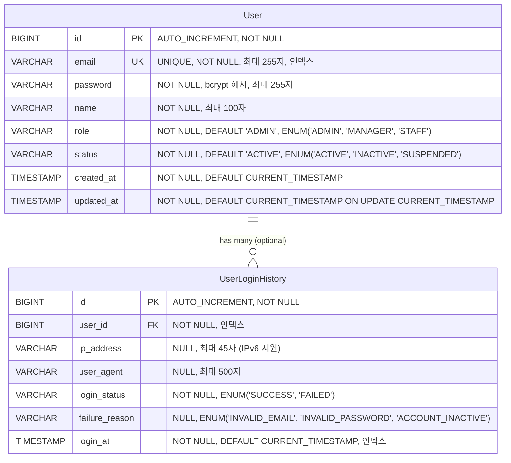
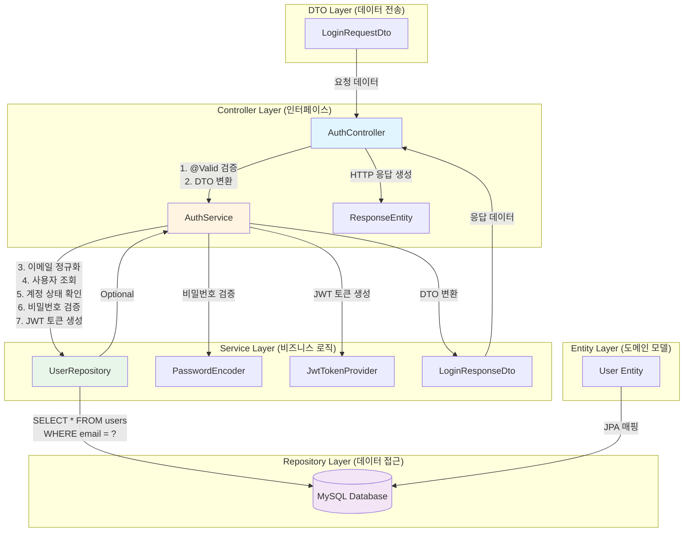

# 사용자 인증 API 구현 - 로그인

- **Type**: Functional
- **Key**: BE-AUTH-001
- **REQ / Epic**: REQ-FUNC-036
- **Service**: ReAcademix Backend
- **Priority**: Medium
- **Dependencies**: BE-INFRA-003

## 📌 Description

사용자 로그인 API를 구현합니다. 이메일과 비밀번호를 받아 인증을 수행하고, JWT 토큰을 발급합니다. 비밀번호는 bcrypt로 암호화하여 저장하고 검증합니다.

## ✅ Acceptance Criteria

- [ ] POST /api/auth/login 엔드포인트 구현
- [ ] LoginRequestDto 클래스 생성 (email, password 필드)
- [ ] LoginResponseDto 클래스 생성 (token, user 필드)
- [ ] AuthController.login() 메서드 구현
- [ ] AuthService.login() 메서드 구현 (이메일/비밀번호 검증, JWT 토큰 생성)
- [ ] 비밀번호 암호화 (bcrypt) 구현
- [ ] JWT 토큰 생성 및 발급 (유효기간 24시간)
- [ ] 인증 실패 시 적절한 에러 응답 (401)
- [ ] 요청 데이터 검증 (이메일 형식, 비밀번호 최소 길이)
- [ ] API 응답 시간 500ms 이내
- [ ] 단위 테스트 작성
- [ ] 통합 테스트 작성

## 🧩 Technical Notes

- Controller 레이어
- DTO 클래스

## 📋 API 명세서

### 1. Endpoint

| 항목 | 내용 |
|------|------|
| **HTTP Method** | `POST` |
| **URI** | `/api/v1/auth/login` |
| **Content-Type** | `application/json` |
| **인증 필요** | ❌ (로그인 API이므로 인증 불필요) |

### 2. Request Body

| 필드명 | 타입 | 필수 여부 | 유효성 검사 조건 | 설명 |
|--------|------|----------|----------------|------|
| `email` | `String` | ✅ 필수 | - `@Email` 어노테이션으로 이메일 형식 검증<br/>- 최대 255자 (`@Size(max = 255)`)<br/>- `@NotBlank` (null, 빈 문자열, 공백 불가) | 사용자 이메일 주소 (로그인 ID) |
| `password` | `String` | ✅ 필수 | - `@NotBlank` (null, 빈 문자열, 공백 불가)<br/>- 최소 8자 이상 (`@Size(min = 8)`)<br/>- 최대 128자 (`@Size(max = 128)`) | 사용자 비밀번호 (평문, 전송 시 HTTPS 필수) |

**Request Body 예시:**
```json
{
  "email": "admin@academy.com",
  "password": "SecurePass123!"
}
```

### 3. Response Body

#### 3.1 성공 응답 (200 OK)

| 필드명 | 타입 | 설명 |
|--------|------|------|
| `success` | `Boolean` | 요청 성공 여부 (항상 `true`) |
| `data` | `Object` | 응답 데이터 객체 |
| `data.token` | `String` | JWT 토큰 (Bearer 토큰) |
| `data.tokenType` | `String` | 토큰 타입 (항상 `"Bearer"`) |
| `data.expiresIn` | `Long` | 토큰 만료 시간 (초 단위, 기본 86400 = 24시간) |
| `data.user` | `Object` | 사용자 정보 객체 |
| `data.user.userId` | `String` | 사용자 고유 ID (UUID 또는 BIGINT) |
| `data.user.email` | `String` | 사용자 이메일 |
| `data.user.name` | `String` | 사용자 이름 |
| `message` | `String` | 성공 메시지 (예: "로그인에 성공했습니다.") |

**성공 응답 예시:**
```json
{
  "success": true,
  "data": {
    "token": "eyJhbGciOiJIUzI1NiIsInR5cCI6IkpXVCJ9...",
    "tokenType": "Bearer",
    "expiresIn": 86400,
    "user": {
      "userId": "usr-001",
      "email": "admin@academy.com",
      "name": "관리자"
    }
  },
  "message": "로그인에 성공했습니다."
}
```

#### 3.2 실패 응답

| HTTP Status | 에러 코드 | 에러 메시지 | 발생 조건 |
|-------------|----------|------------|----------|
| `400 Bad Request` | `VALIDATION_001` | "이메일은 필수입니다." | email 필드가 null, 빈 문자열, 또는 공백 |
| `400 Bad Request` | `VALIDATION_002` | "올바른 이메일 형식이 아닙니다." | email 형식이 올바르지 않음 |
| `400 Bad Request` | `VALIDATION_003` | "비밀번호는 최소 8자 이상이어야 합니다." | password가 8자 미만 |
| `401 Unauthorized` | `AUTH_002` | "이메일 또는 비밀번호가 올바르지 않습니다." | 해당 이메일로 등록된 사용자가 없음 |
| `401 Unauthorized` | `AUTH_003` | "이메일 또는 비밀번호가 올바르지 않습니다." | 비밀번호가 일치하지 않음 |
| `401 Unauthorized` | `AUTH_004` | "계정이 비활성화되었습니다." | 사용자 상태가 INACTIVE 또는 SUSPENDED |
| `500 Internal Server Error` | `SYSTEM_001` | "시스템 오류가 발생했습니다. 잠시 후 다시 시도해주세요." | 데이터베이스 오류 |
| `500 Internal Server Error` | `SYSTEM_003` | "시스템 오류가 발생했습니다. 잠시 후 다시 시도해주세요." | JWT 토큰 생성 실패 |

**에러 응답 예시 (401 - 이메일 없음):**
```json
{
  "success": false,
  "error": {
    "code": "AUTH_002",
    "message": "이메일 또는 비밀번호가 올바르지 않습니다.",
    "details": null
  },
  "timestamp": "2025-12-08T10:30:00Z"
}
```

**에러 응답 예시 (400 - 검증 실패):**
```json
{
  "success": false,
  "error": {
    "code": "VALIDATION_002",
    "message": "올바른 이메일 형식이 아닙니다.",
    "details": {
      "field": "email",
      "rejectedValue": "invalid-email",
      "errors": [
        {
          "field": "email",
          "message": "올바른 이메일 형식이 아닙니다."
        }
      ]
    }
  },
  "timestamp": "2025-12-08T10:30:00Z"
}
```

### 4. Logic Steps (데이터 처리 순서)

| 단계 | 처리 내용 | 구현 위치 | 비고 |
|------|----------|----------|------|
| **1. 요청 검증** | `@Valid` 어노테이션으로 Request DTO 검증<br/>- email: 이메일 형식, NotBlank, Size(max=255)<br/>- password: NotBlank, Size(min=8, max=128) | `AuthController.login()` | Jakarta Bean Validation 사용 |
| **2. 이메일 정규화** | 이메일을 소문자로 변환 (대소문자 구분 없이 처리) | `AuthService.login()` | `email.toLowerCase()` |
| **3. 사용자 조회** | 이메일로 사용자 조회 (`UserRepository.findByEmail()`) | `AuthService.login()` | Optional<User> 반환 |
| **4. 사용자 존재 확인** | 사용자가 없으면 `AUTH_002` 에러 반환 | `AuthService.login()` | `UserNotFoundException` 또는 `InvalidCredentialsException` |
| **5. 계정 상태 확인** | 사용자 상태가 ACTIVE인지 확인<br/>- INACTIVE 또는 SUSPENDED면 `AUTH_004` 에러 반환 | `AuthService.login()` | 비즈니스 로직 검증 |
| **6. 비밀번호 검증** | 입력된 평문 비밀번호와 저장된 bcrypt 해시 비교<br/>- `BCryptPasswordEncoder.matches()` 사용 | `AuthService.login()` | Spring Security BCrypt 사용 |
| **7. 비밀번호 불일치 처리** | 비밀번호가 일치하지 않으면 `AUTH_003` 에러 반환 | `AuthService.login()` | 보안상 이메일/비밀번호 구분 없이 동일 메시지 |
| **8. JWT 토큰 생성** | 사용자 정보를 포함한 JWT 토큰 생성<br/>- Claims: userId, email, role<br/>- 만료 시간: 24시간 (86400초)<br/>- 알고리즘: HS256 | `JwtTokenProvider.generateToken()` | JWT 라이브러리 사용 (jjwt 등) |
| **9. 로그인 이력 저장** | 로그인 성공 이력 저장 (선택적)<br/>- UserLoginHistory 테이블에 기록 | `AuthService.login()` | 향후 확장 기능 |
| **10. 응답 생성** | LoginResponseDto 생성 및 반환<br/>- token, tokenType, expiresIn, user 정보 포함 | `AuthService.login()` | DTO 매핑 |

### 5. Difficulty (예상 구현 난이도)

| 항목 | 난이도 | 이유 |
|------|--------|------|
| **전체 난이도** | **중 (Medium)** | - |
| **요청 검증** | 하 (Low) | Jakarta Bean Validation 표준 어노테이션 사용 |
| **사용자 조회** | 하 (Low) | Spring Data JPA 기본 메서드 사용 |
| **비밀번호 검증** | 하 (Low) | Spring Security BCrypt 표준 사용 |
| **JWT 토큰 생성** | 중 (Medium) | JWT 라이브러리 설정 및 Claims 구성 필요 |
| **에러 처리** | 중 (Medium) | GlobalExceptionHandler와 커스텀 예외 클래스 구현 필요 |
| **보안 고려사항** | 중 (Medium) | - 비밀번호 평문 전송 방지 (HTTPS 필수)<br/>- 로그인 실패 횟수 제한 (향후 확장)<br/>- 토큰 만료 시간 관리 |

### 6. 구현 시 주의사항

| 항목 | 내용 |
|------|------|
| **보안** | - 비밀번호는 절대 평문으로 저장하지 않음<br/>- 로그인 실패 시 구체적인 오류 원인 노출 금지 (보안상 이메일/비밀번호 구분 없이 동일 메시지)<br/>- HTTPS 사용 필수 (비밀번호 평문 전송) |
| **성능** | - API 응답 시간 500ms 이내 목표<br/>- 사용자 조회 시 인덱스 활용 (email 컬럼에 UNIQUE INDEX) |
| **확장성** | - 향후 로그인 이력 저장 기능 고려<br/>- 향후 OAuth2, 소셜 로그인 확장 가능하도록 구조 설계 |
| **테스트** | - 단위 테스트: AuthService.login() 메서드<br/>- 통합 테스트: AuthController.login() 엔드포인트<br/>- 보안 테스트: SQL Injection, XSS 방지 확인 |

---

## 🏗️ 3-Tier 아키텍처 구현 계획

### 구현 순서: Repository → Service → Controller

데이터 흐름을 명확히 하기 위해 **Repository (데이터) → Service (로직) → Controller (인터페이스)** 순서로 구현합니다.

---

## 📊 1. ERD (Entity Relationship Diagram)

**데이터가 어떻게 저장될 것인가?** (데이터베이스 관점)



### 테이블 상세 설계

#### users 테이블 (MVP 필수)

| 컬럼명 | 타입 | 제약조건 | 설명 |
|--------|------|----------|------|
| `id` | BIGINT | PK, AUTO_INCREMENT, NOT NULL | 사용자 고유 ID |
| `email` | VARCHAR(255) | UNIQUE, NOT NULL, INDEX | 사용자 이메일 (로그인 ID) |
| `password` | VARCHAR(255) | NOT NULL | 암호화된 비밀번호 (bcrypt 해시) |
| `name` | VARCHAR(100) | NOT NULL | 사용자 이름 |
| `role` | VARCHAR(20) | NOT NULL, DEFAULT 'ADMIN', INDEX | 사용자 역할 (MVP: 'ADMIN'만 사용) |
| `status` | VARCHAR(20) | NOT NULL, DEFAULT 'ACTIVE', INDEX | 사용자 상태 (ACTIVE, INACTIVE, SUSPENDED) |
| `created_at` | TIMESTAMP | NOT NULL, DEFAULT CURRENT_TIMESTAMP | 계정 생성 시간 |
| `updated_at` | TIMESTAMP | NOT NULL, DEFAULT CURRENT_TIMESTAMP ON UPDATE CURRENT_TIMESTAMP | 계정 정보 수정 시간 |

**인덱스:**
- PRIMARY KEY: `id`
- UNIQUE INDEX: `email` (로그인 조회 최적화)
- INDEX: `status` (활성 사용자 조회 최적화)
- INDEX: `role` (역할별 사용자 조회 최적화)

**비즈니스 규칙:**
- 이메일은 소문자로 정규화하여 저장 (대소문자 구분 없이 처리)
- 비밀번호는 평문 저장 금지 (bcrypt 암호화 필수)
- MVP에서는 role='ADMIN'만 사용, 모든 사용자 동일 권한

#### user_login_history 테이블 (선택적, 향후 확장)

| 컬럼명 | 타입 | 제약조건 | 설명 |
|--------|------|----------|------|
| `id` | BIGINT | PK, AUTO_INCREMENT, NOT NULL | 로그인 이력 고유 ID |
| `user_id` | BIGINT | FK, NOT NULL, INDEX | users.id 참조 |
| `ip_address` | VARCHAR(45) | NULL | 로그인 시도 IP 주소 (IPv6 지원) |
| `user_agent` | VARCHAR(500) | NULL | 브라우저/클라이언트 정보 |
| `login_status` | VARCHAR(20) | NOT NULL, INDEX | 로그인 결과 (SUCCESS, FAILED) |
| `failure_reason` | VARCHAR(50) | NULL | 실패 사유 (INVALID_EMAIL, INVALID_PASSWORD, ACCOUNT_INACTIVE) |
| `login_at` | TIMESTAMP | NOT NULL, DEFAULT CURRENT_TIMESTAMP, INDEX | 로그인 시도 시간 |

---

## 🏛️ 2. CLD (Class/Component Logic Diagram)

**데이터가 어떻게 가공될 것인가?** (백엔드 서버 관점)



### 레이어별 책임 및 데이터 흐름

| 레이어 | 클래스 | 책임 | 주요 메서드 | 데이터 흐름 |
|--------|--------|------|-----------|------------|
| **Controller** | `AuthController` | HTTP 요청/응답 처리, DTO 검증 | `login(LoginRequestDto)` | `LoginRequestDto` → `LoginResponseDto` |
| **Service** | `AuthService` | 비즈니스 로직 처리, 인증 검증 | `login(String email, String password)` | `String` → `User` → `LoginResponseDto` |
| **Repository** | `UserRepository` | 데이터베이스 접근, JPA 쿼리 실행 | `findByEmail(String email)` | `String` → `Optional<User>` |
| **Entity** | `User` | 도메인 모델, 데이터베이스 매핑 | - | JPA 매핑 |
| **DTO** | `LoginRequestDto`<br/>`LoginResponseDto` | 요청/응답 데이터 전송 | - | JSON ↔ Java Object |

### 데이터 처리 흐름 상세

```
1. HTTP Request (JSON)
   ↓
2. AuthController.login()
   - @Valid로 LoginRequestDto 검증
   - email, password 유효성 검사
   ↓
3. AuthService.login()
   - email.toLowerCase() 정규화
   - UserRepository.findByEmail(email) 호출
   ↓
4. UserRepository.findByEmail()
   - SELECT * FROM users WHERE email = ? 실행
   - Optional<User> 반환
   ↓
5. AuthService (계속)
   - User 존재 확인 (없으면 AUTH_002 에러)
   - User.status 확인 (INACTIVE/SUSPENDED면 AUTH_004 에러)
   - PasswordEncoder.matches()로 비밀번호 검증
   - 비밀번호 불일치 시 AUTH_003 에러
   - JwtTokenProvider.generateToken()으로 JWT 생성
   ↓
6. LoginResponseDto 생성
   - token, tokenType, expiresIn, user 정보 포함
   ↓
7. AuthController (계속)
   - ResponseEntity.ok(LoginResponseDto) 반환
   ↓
8. HTTP Response (JSON)
```

---

## 💻 3. ORM 예제 코드

**위 두 가지를 연결하는 실제 코드** (서버가 데이터베이스를 조회하는 연결적 관점)

### 3.1 JPA Entity (User.java)

```java
package com.reacademix.reacademix_backend.domain.user;

import com.reacademix.reacademix_backend.common.BaseTimeEntity;
import jakarta.persistence.*;
import lombok.Builder;
import lombok.Getter;
import lombok.NoArgsConstructor;

/**
 * User 엔티티
 * 사용자 기본 정보를 저장하는 JPA 엔티티
 * 
 * @author Backend Team
 * @version 1.0
 */
@Entity
@Table(name = "users", indexes = {
    @Index(name = "idx_users_email", columnList = "email"),
    @Index(name = "idx_users_status", columnList = "status"),
    @Index(name = "idx_users_role", columnList = "role")
})
@Getter
@NoArgsConstructor
public class User extends BaseTimeEntity {

    @Id
    @GeneratedValue(strategy = GenerationType.IDENTITY)
    private Long id;

    @Column(nullable = false, unique = true, length = 255)
    private String email;

    @Column(nullable = false, length = 255)
    private String password;  // bcrypt 해시

    @Column(nullable = false, length = 100)
    private String name;

    @Enumerated(EnumType.STRING)
    @Column(nullable = false, length = 20)
    private UserRole role = UserRole.ADMIN;

    @Enumerated(EnumType.STRING)
    @Column(nullable = false, length = 20)
    private UserStatus status = UserStatus.ACTIVE;

    @Builder
    public User(String email, String password, String name, UserRole role, UserStatus status) {
        this.email = email != null ? email.toLowerCase() : null;  // 이메일 소문자 정규화
        this.password = password;
        this.name = name;
        this.role = role != null ? role : UserRole.ADMIN;
        this.status = status != null ? status : UserStatus.ACTIVE;
    }
}
```

### 3.2 Enum 클래스 (UserRole.java, UserStatus.java)

```java
package com.reacademix.reacademix_backend.domain.user;

/**
 * 사용자 역할 Enum
 * MVP에서는 ADMIN만 사용하지만, 향후 확장 가능
 */
public enum UserRole {
    ADMIN,      // 관리자 (MVP 기본값)
    MANAGER,    // 관리자 (확장)
    STAFF       // 직원 (확장)
}
```

```java
package com.reacademix.reacademix_backend.domain.user;

/**
 * 사용자 상태 Enum
 * MVP에서는 ACTIVE만 사용하지만, 향후 확장 가능
 */
public enum UserStatus {
    ACTIVE,     // 정상 사용 가능 (MVP 기본값)
    INACTIVE,   // 비활성화
    SUSPENDED   // 일시 정지
}
```

### 3.3 Repository 인터페이스 (UserRepository.java)

```java
package com.reacademix.reacademix_backend.repository;

import com.reacademix.reacademix_backend.domain.user.User;
import org.springframework.data.jpa.repository.JpaRepository;
import org.springframework.stereotype.Repository;

import java.util.Optional;

/**
 * User 엔티티를 위한 Repository 인터페이스
 * Spring Data JPA를 사용하여 데이터베이스 접근
 * 
 * @author Backend Team
 * @version 1.0
 */
@Repository
public interface UserRepository extends JpaRepository<User, Long> {

    /**
     * 이메일로 사용자 조회
     * 
     * @param email 사용자 이메일 (소문자로 정규화되어 저장됨)
     * @return Optional<User> 사용자 정보 (없으면 empty)
     * 
     * SQL: SELECT * FROM users WHERE email = ? LIMIT 1
     */
    Optional<User> findByEmail(String email);

    /**
     * 이메일 존재 여부 확인 (성능 최적화용)
     * 
     * @param email 사용자 이메일
     * @return boolean 이메일 존재 여부
     * 
     * SQL: SELECT EXISTS(SELECT 1 FROM users WHERE email = ?)
     */
    boolean existsByEmail(String email);
}
```

### 3.4 Service 클래스 (AuthService.java)

```java
package com.reacademix.reacademix_backend.service;

import com.reacademix.reacademix_backend.domain.user.User;
import com.reacademix.reacademix_backend.domain.user.UserStatus;
import com.reacademix.reacademix_backend.dto.request.LoginRequestDto;
import com.reacademix.reacademix_backend.dto.response.LoginResponseDto;
import com.reacademix.reacademix_backend.exception.AuthException;
import com.reacademix.reacademix_backend.exception.ErrorCode;
import com.reacademix.reacademix_backend.repository.UserRepository;
import com.reacademix.reacademix_backend.security.JwtTokenProvider;
import lombok.RequiredArgsConstructor;
import lombok.extern.slf4j.Slf4j;
import org.springframework.security.crypto.password.PasswordEncoder;
import org.springframework.stereotype.Service;
import org.springframework.transaction.annotation.Transactional;

/**
 * 인증 관련 비즈니스 로직을 처리하는 Service 클래스
 * 
 * @author Backend Team
 * @version 1.0
 */
@Slf4j
@Service
@RequiredArgsConstructor
@Transactional(readOnly = true)
public class AuthService {

    private final UserRepository userRepository;
    private final PasswordEncoder passwordEncoder;
    private final JwtTokenProvider jwtTokenProvider;

    /**
     * 사용자 로그인 처리
     * 
     * @param request 로그인 요청 DTO (email, password)
     * @return LoginResponseDto 로그인 응답 (token, user 정보)
     * @throws AuthException 인증 실패 시 (AUTH_002, AUTH_003, AUTH_004)
     */
    @Transactional
    public LoginResponseDto login(LoginRequestDto request) {
        // 1. 이메일 정규화 (소문자 변환)
        String email = request.getEmail().toLowerCase().trim();
        
        // 2. 사용자 조회 (Repository Layer 호출)
        User user = userRepository.findByEmail(email)
            .orElseThrow(() -> {
                log.warn("로그인 실패: 이메일 없음 - {}", email);
                return new AuthException(ErrorCode.AUTH_002);
            });
        
        // 3. 계정 상태 확인
        if (user.getStatus() != UserStatus.ACTIVE) {
            log.warn("로그인 실패: 계정 비활성화 - {}", email);
            throw new AuthException(ErrorCode.AUTH_004);
        }
        
        // 4. 비밀번호 검증
        if (!passwordEncoder.matches(request.getPassword(), user.getPassword())) {
            log.warn("로그인 실패: 비밀번호 불일치 - {}", email);
            throw new AuthException(ErrorCode.AUTH_003);
        }
        
        // 5. JWT 토큰 생성
        String token = jwtTokenProvider.generateToken(user);
        
        // 6. 응답 DTO 생성
        return LoginResponseDto.builder()
            .token(token)
            .tokenType("Bearer")
            .expiresIn(86400L)  // 24시간 (초 단위)
            .user(LoginResponseDto.UserInfo.builder()
                .userId(user.getId())
                .email(user.getEmail())
                .name(user.getName())
                .build())
            .build();
    }
}
```

### 3.5 Controller 클래스 (AuthController.java)

```java
package com.reacademix.reacademix_backend.controller;

import com.reacademix.reacademix_backend.dto.request.LoginRequestDto;
import com.reacademix.reacademix_backend.dto.response.LoginResponseDto;
import com.reacademix.reacademix_backend.dto.response.ApiResponse;
import com.reacademix.reacademix_backend.service.AuthService;
import jakarta.validation.Valid;
import lombok.RequiredArgsConstructor;
import lombok.extern.slf4j.Slf4j;
import org.springframework.http.HttpStatus;
import org.springframework.http.ResponseEntity;
import org.springframework.web.bind.annotation.*;

/**
 * 인증 관련 REST API Controller
 * 
 * @author Backend Team
 * @version 1.0
 */
@Slf4j
@RestController
@RequestMapping("/api/v1/auth")
@RequiredArgsConstructor
public class AuthController {

    private final AuthService authService;

    /**
     * 사용자 로그인 API
     * 
     * @param request 로그인 요청 DTO (email, password)
     * @return ResponseEntity<ApiResponse<LoginResponseDto>> 로그인 응답
     */
    @PostMapping("/login")
    public ResponseEntity<ApiResponse<LoginResponseDto>> login(
            @Valid @RequestBody LoginRequestDto request) {
        
        log.info("로그인 요청: {}", request.getEmail());
        
        // Service Layer 호출
        LoginResponseDto response = authService.login(request);
        
        // 표준 응답 포맷으로 래핑
        ApiResponse<LoginResponseDto> apiResponse = ApiResponse.<LoginResponseDto>builder()
            .success(true)
            .data(response)
            .message("로그인에 성공했습니다.")
            .build();
        
        return ResponseEntity.ok(apiResponse);
    }
}
```

### 3.6 DTO 클래스 (LoginRequestDto.java, LoginResponseDto.java)

```java
package com.reacademix.reacademix_backend.dto.request;

import jakarta.validation.constraints.Email;
import jakarta.validation.constraints.NotBlank;
import jakarta.validation.constraints.Size;
import lombok.AllArgsConstructor;
import lombok.Builder;
import lombok.Getter;
import lombok.NoArgsConstructor;

/**
 * 로그인 요청 DTO
 * 
 * @author Backend Team
 * @version 1.0
 */
@Getter
@Builder
@NoArgsConstructor
@AllArgsConstructor
public class LoginRequestDto {

    @NotBlank(message = "이메일은 필수입니다.")
    @Email(message = "올바른 이메일 형식이 아닙니다.")
    @Size(max = 255, message = "이메일은 최대 255자까지 입력 가능합니다.")
    private String email;

    @NotBlank(message = "비밀번호는 필수입니다.")
    @Size(min = 8, max = 128, message = "비밀번호는 8자 이상 128자 이하여야 합니다.")
    private String password;
}
```

```java
package com.reacademix.reacademix_backend.dto.response;

import lombok.AllArgsConstructor;
import lombok.Builder;
import lombok.Getter;
import lombok.NoArgsConstructor;

/**
 * 로그인 응답 DTO
 * 
 * @author Backend Team
 * @version 1.0
 */
@Getter
@Builder
@NoArgsConstructor
@AllArgsConstructor
public class LoginResponseDto {

    private String token;
    private String tokenType;
    private Long expiresIn;
    private UserInfo user;

    @Getter
    @Builder
    @NoArgsConstructor
    @AllArgsConstructor
    public static class UserInfo {
        private Long userId;
        private String email;
        private String name;
    }
}
```

### 3.7 예외 처리 클래스 (AuthException.java, ErrorCode.java)

```java
package com.reacademix.reacademix_backend.exception;

import lombok.Getter;

/**
 * 인증 관련 커스텀 예외
 * 
 * @author Backend Team
 * @version 1.0
 */
@Getter
public class AuthException extends RuntimeException {
    
    private final ErrorCode errorCode;

    public AuthException(ErrorCode errorCode) {
        super(errorCode.getMessage());
        this.errorCode = errorCode;
    }
}
```

```java
package com.reacademix.reacademix_backend.exception;

import lombok.Getter;
import lombok.RequiredArgsConstructor;

/**
 * 에러 코드 Enum
 * 
 * @author Backend Team
 * @version 1.0
 */
@Getter
@RequiredArgsConstructor
public enum ErrorCode {
    
    // 인증 관련 에러 (AUTH_XXX)
    AUTH_002("AUTH_002", "이메일 또는 비밀번호가 올바르지 않습니다."),
    AUTH_003("AUTH_003", "이메일 또는 비밀번호가 올바르지 않습니다."),
    AUTH_004("AUTH_004", "계정이 비활성화되었습니다."),
    
    // 검증 관련 에러 (VALIDATION_XXX)
    VALIDATION_001("VALIDATION_001", "입력 데이터 검증에 실패했습니다."),
    VALIDATION_002("VALIDATION_002", "올바른 이메일 형식이 아닙니다."),
    VALIDATION_003("VALIDATION_003", "비밀번호는 최소 8자 이상이어야 합니다."),
    
    // 시스템 에러 (SYSTEM_XXX)
    SYSTEM_001("SYSTEM_001", "시스템 오류가 발생했습니다. 잠시 후 다시 시도해주세요."),
    SYSTEM_003("SYSTEM_003", "시스템 오류가 발생했습니다. 잠시 후 다시 시도해주세요.");

    private final String code;
    private final String message;
}
```

---

## 📝 구현 체크리스트

### Repository Layer (1단계: 데이터)
- [ ] `UserRepository` 인터페이스 생성
- [ ] `findByEmail(String email)` 메서드 구현
- [ ] `existsByEmail(String email)` 메서드 구현 (선택적)
- [ ] Repository 단위 테스트 작성

### Service Layer (2단계: 로직)
- [ ] `AuthService` 클래스 생성
- [ ] `login(LoginRequestDto)` 메서드 구현
- [ ] 이메일 정규화 로직 구현
- [ ] 사용자 조회 및 존재 확인
- [ ] 계정 상태 확인 로직
- [ ] 비밀번호 검증 로직 (PasswordEncoder 사용)
- [ ] JWT 토큰 생성 로직 (JwtTokenProvider 사용)
- [ ] 예외 처리 (AuthException)
- [ ] Service 단위 테스트 작성

### Controller Layer (3단계: 인터페이스)
- [ ] `AuthController` 클래스 생성
- [ ] `POST /api/v1/auth/login` 엔드포인트 구현
- [ ] `@Valid` 어노테이션으로 DTO 검증
- [ ] 표준 응답 포맷 (`ApiResponse`) 적용
- [ ] Controller 통합 테스트 작성

### DTO Layer
- [ ] `LoginRequestDto` 클래스 생성 (검증 어노테이션 포함)
- [ ] `LoginResponseDto` 클래스 생성
- [ ] `ApiResponse<T>` 제네릭 응답 클래스 생성

### Exception Layer
- [ ] `AuthException` 커스텀 예외 클래스 생성
- [ ] `ErrorCode` Enum 생성
- [ ] `GlobalExceptionHandler`에 AuthException 처리 추가

---

## ⏱ 일정(Timeline)

- **Start**: 2025-12-08
- **End**: 2025-12-11
- **Lane**: Backend Core
## 🔗 Traceability

- Related SRS: REQ-FUNC-036
- Related Epic: Authentication & Authorization
