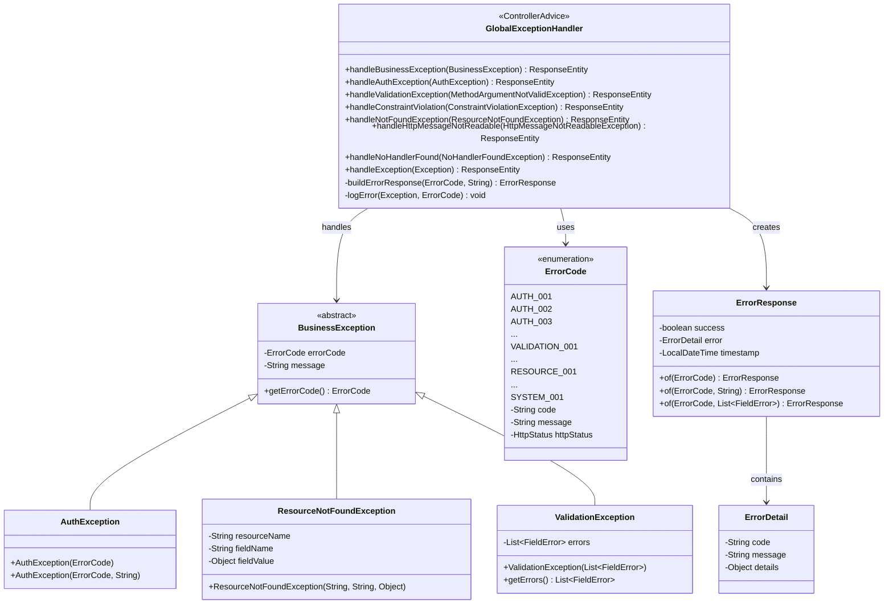
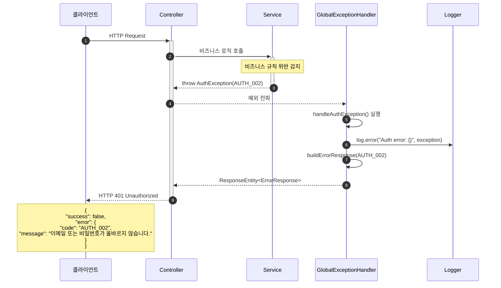
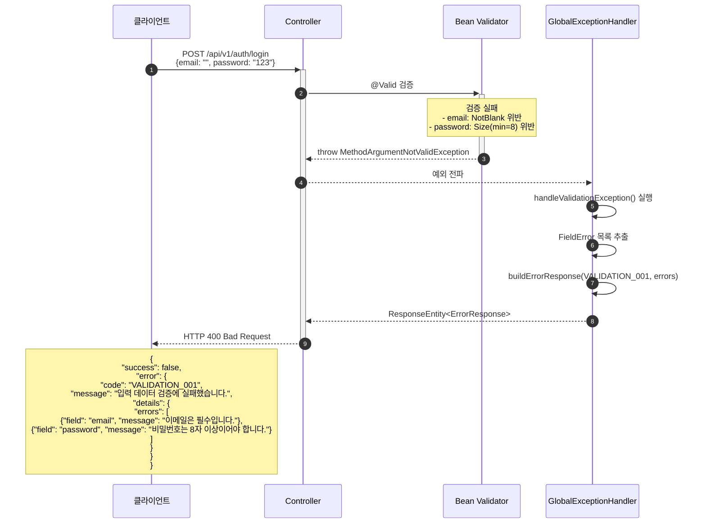

# 전역 에러 핸들링 구현

- **Type**: Non-Functional
- **Key**: BE-COMMON-001
- **REQ / Epic**: REQ-NF-018
- **Service**: ReAcademix Backend
- **Priority**: High
- **Dependencies**: BE-INFRA-001

## 📌 Description

전역 예외 처리 핸들러를 구현하여 일관된 에러 응답 형식을 제공합니다. 모든 API에서 동일한 에러 응답 구조를 반환하고, 사용자 친화적인 에러 메시지를 생성합니다.

## ✅ Acceptance Criteria

### 예외 클래스 생성
- [ ] `BusinessException` 기본 예외 클래스 생성
- [ ] `AuthException` 인증 관련 예외 생성
- [ ] `ResourceNotFoundException` 리소스 없음 예외 생성
- [ ] `ValidationException` 검증 예외 생성

### GlobalExceptionHandler 구현
- [ ] `@ControllerAdvice` 클래스 생성
- [ ] `BusinessException` 처리 핸들러
- [ ] `MethodArgumentNotValidException` 처리 (Bean Validation)
- [ ] `ConstraintViolationException` 처리
- [ ] `HttpMessageNotReadableException` 처리 (JSON 파싱 오류)
- [ ] `NoHandlerFoundException` 처리 (404)
- [ ] `Exception` 처리 (예상치 못한 오류)

### 에러 응답 형식
- [ ] `ErrorResponse` DTO 생성
- [ ] `ErrorCode` Enum 확장
- [ ] 일관된 에러 응답 구조 적용

### 로깅
- [ ] 모든 에러 로깅 (error 레벨)
- [ ] 스택 트레이스 로깅 (개발 환경)
- [ ] 민감 정보 마스킹

### 테스트
- [ ] 단위 테스트 작성
- [ ] 각 예외 타입별 응답 검증

---

## 🏛️ 1. CLD (Class/Component Logic Diagram)



---

## 🔄 2. Sequence Diagram (에러 처리 흐름)

### 2.1 비즈니스 예외 처리



### 2.2 Validation 예외 처리



---

## 💻 3. ORM 예제 코드

### 3.1 ErrorCode.java (확장)

```java
package com.reacademix.reacademix_backend.exception;

import lombok.Getter;
import lombok.RequiredArgsConstructor;
import org.springframework.http.HttpStatus;

/**
 * 에러 코드 Enum
 * 모든 에러 응답에서 사용되는 표준 에러 코드
 * 
 * @author Backend Team
 * @version 1.0
 */
@Getter
@RequiredArgsConstructor
public enum ErrorCode {
    
    // ========================================
    // 인증 관련 에러 (AUTH_XXX)
    // ========================================
    AUTH_001("AUTH_001", "인증 토큰이 필요합니다.", HttpStatus.UNAUTHORIZED),
    AUTH_002("AUTH_002", "이메일 또는 비밀번호가 올바르지 않습니다.", HttpStatus.UNAUTHORIZED),
    AUTH_003("AUTH_003", "이메일 또는 비밀번호가 올바르지 않습니다.", HttpStatus.UNAUTHORIZED),
    AUTH_004("AUTH_004", "계정이 비활성화되었습니다.", HttpStatus.UNAUTHORIZED),
    AUTH_005("AUTH_005", "토큰이 만료되었습니다.", HttpStatus.UNAUTHORIZED),
    AUTH_006("AUTH_006", "유효하지 않은 토큰입니다.", HttpStatus.UNAUTHORIZED),
    AUTH_007("AUTH_007", "사용자 정보를 찾을 수 없습니다.", HttpStatus.UNAUTHORIZED),
    AUTH_008("AUTH_008", "접근 권한이 없습니다.", HttpStatus.FORBIDDEN),
    
    // ========================================
    // 검증 관련 에러 (VALIDATION_XXX)
    // ========================================
    VALIDATION_001("VALIDATION_001", "입력 데이터 검증에 실패했습니다.", HttpStatus.BAD_REQUEST),
    VALIDATION_002("VALIDATION_002", "올바른 이메일 형식이 아닙니다.", HttpStatus.BAD_REQUEST),
    VALIDATION_003("VALIDATION_003", "비밀번호는 최소 8자 이상이어야 합니다.", HttpStatus.BAD_REQUEST),
    VALIDATION_004("VALIDATION_004", "필수 입력 항목이 누락되었습니다.", HttpStatus.BAD_REQUEST),
    VALIDATION_005("VALIDATION_005", "요청 본문을 파싱할 수 없습니다.", HttpStatus.BAD_REQUEST),
    
    // ========================================
    // 리소스 관련 에러 (RESOURCE_XXX)
    // ========================================
    RESOURCE_001("RESOURCE_001", "요청한 리소스를 찾을 수 없습니다.", HttpStatus.NOT_FOUND),
    RESOURCE_002("RESOURCE_002", "학생 정보를 찾을 수 없습니다.", HttpStatus.NOT_FOUND),
    RESOURCE_003("RESOURCE_003", "리포트를 찾을 수 없습니다.", HttpStatus.NOT_FOUND),
    RESOURCE_004("RESOURCE_004", "이미 존재하는 리소스입니다.", HttpStatus.CONFLICT),
    
    // ========================================
    // 비즈니스 로직 에러 (BUSINESS_XXX)
    // ========================================
    BUSINESS_001("BUSINESS_001", "리포트 생성에 실패했습니다.", HttpStatus.INTERNAL_SERVER_ERROR),
    BUSINESS_002("BUSINESS_002", "이메일 전송에 실패했습니다.", HttpStatus.INTERNAL_SERVER_ERROR),
    BUSINESS_003("BUSINESS_003", "파일 업로드에 실패했습니다.", HttpStatus.INTERNAL_SERVER_ERROR),
    BUSINESS_004("BUSINESS_004", "데이터 처리 중 오류가 발생했습니다.", HttpStatus.INTERNAL_SERVER_ERROR),
    
    // ========================================
    // 시스템 에러 (SYSTEM_XXX)
    // ========================================
    SYSTEM_001("SYSTEM_001", "시스템 오류가 발생했습니다. 잠시 후 다시 시도해주세요.", HttpStatus.INTERNAL_SERVER_ERROR),
    SYSTEM_002("SYSTEM_002", "데이터베이스 오류가 발생했습니다.", HttpStatus.INTERNAL_SERVER_ERROR),
    SYSTEM_003("SYSTEM_003", "외부 서비스 연동 오류가 발생했습니다.", HttpStatus.SERVICE_UNAVAILABLE);

    private final String code;
    private final String message;
    private final HttpStatus httpStatus;
}
```

### 3.2 ErrorResponse.java

```java
package com.reacademix.reacademix_backend.dto.response;

import com.fasterxml.jackson.annotation.JsonInclude;
import com.reacademix.reacademix_backend.exception.ErrorCode;
import lombok.AllArgsConstructor;
import lombok.Builder;
import lombok.Getter;
import lombok.NoArgsConstructor;

import java.time.LocalDateTime;
import java.util.List;

/**
 * 에러 응답 DTO
 * 모든 에러 응답의 표준 형식
 * 
 * @author Backend Team
 * @version 1.0
 */
@Getter
@Builder
@NoArgsConstructor
@AllArgsConstructor
@JsonInclude(JsonInclude.Include.NON_NULL)
public class ErrorResponse {

    private boolean success;
    private ErrorDetail error;
    private LocalDateTime timestamp;

    @Getter
    @Builder
    @NoArgsConstructor
    @AllArgsConstructor
    @JsonInclude(JsonInclude.Include.NON_NULL)
    public static class ErrorDetail {
        private String code;
        private String message;
        private Object details;
    }

    @Getter
    @Builder
    @NoArgsConstructor
    @AllArgsConstructor
    public static class FieldError {
        private String field;
        private String message;
        private Object rejectedValue;
    }

    /**
     * ErrorCode로부터 ErrorResponse 생성
     */
    public static ErrorResponse of(ErrorCode errorCode) {
        return ErrorResponse.builder()
            .success(false)
            .error(ErrorDetail.builder()
                .code(errorCode.getCode())
                .message(errorCode.getMessage())
                .build())
            .timestamp(LocalDateTime.now())
            .build();
    }

    /**
     * ErrorCode와 커스텀 메시지로 ErrorResponse 생성
     */
    public static ErrorResponse of(ErrorCode errorCode, String message) {
        return ErrorResponse.builder()
            .success(false)
            .error(ErrorDetail.builder()
                .code(errorCode.getCode())
                .message(message)
                .build())
            .timestamp(LocalDateTime.now())
            .build();
    }

    /**
     * ErrorCode와 상세 정보로 ErrorResponse 생성
     */
    public static ErrorResponse of(ErrorCode errorCode, Object details) {
        return ErrorResponse.builder()
            .success(false)
            .error(ErrorDetail.builder()
                .code(errorCode.getCode())
                .message(errorCode.getMessage())
                .details(details)
                .build())
            .timestamp(LocalDateTime.now())
            .build();
    }

    /**
     * Validation 에러용 ErrorResponse 생성
     */
    public static ErrorResponse ofValidation(List<FieldError> fieldErrors) {
        return ErrorResponse.builder()
            .success(false)
            .error(ErrorDetail.builder()
                .code(ErrorCode.VALIDATION_001.getCode())
                .message(ErrorCode.VALIDATION_001.getMessage())
                .details(ValidationDetail.builder().errors(fieldErrors).build())
                .build())
            .timestamp(LocalDateTime.now())
            .build();
    }

    @Getter
    @Builder
    @NoArgsConstructor
    @AllArgsConstructor
    public static class ValidationDetail {
        private List<FieldError> errors;
    }
}
```

### 3.3 BusinessException.java

```java
package com.reacademix.reacademix_backend.exception;

import lombok.Getter;

/**
 * 비즈니스 예외 기본 클래스
 * 모든 비즈니스 예외의 부모 클래스
 * 
 * @author Backend Team
 * @version 1.0
 */
@Getter
public class BusinessException extends RuntimeException {
    
    private final ErrorCode errorCode;

    public BusinessException(ErrorCode errorCode) {
        super(errorCode.getMessage());
        this.errorCode = errorCode;
    }

    public BusinessException(ErrorCode errorCode, String message) {
        super(message);
        this.errorCode = errorCode;
    }

    public BusinessException(ErrorCode errorCode, String message, Throwable cause) {
        super(message, cause);
        this.errorCode = errorCode;
    }
}
```

### 3.4 AuthException.java

```java
package com.reacademix.reacademix_backend.exception;

/**
 * 인증 관련 예외
 * 
 * @author Backend Team
 * @version 1.0
 */
public class AuthException extends BusinessException {

    public AuthException(ErrorCode errorCode) {
        super(errorCode);
    }

    public AuthException(ErrorCode errorCode, String message) {
        super(errorCode, message);
    }
}
```

### 3.5 ResourceNotFoundException.java

```java
package com.reacademix.reacademix_backend.exception;

import lombok.Getter;

/**
 * 리소스를 찾을 수 없을 때 발생하는 예외
 * 
 * @author Backend Team
 * @version 1.0
 */
@Getter
public class ResourceNotFoundException extends BusinessException {
    
    private final String resourceName;
    private final String fieldName;
    private final Object fieldValue;

    public ResourceNotFoundException(String resourceName, String fieldName, Object fieldValue) {
        super(ErrorCode.RESOURCE_001, 
            String.format("%s을(를) 찾을 수 없습니다. [%s: %s]", resourceName, fieldName, fieldValue));
        this.resourceName = resourceName;
        this.fieldName = fieldName;
        this.fieldValue = fieldValue;
    }

    public ResourceNotFoundException(ErrorCode errorCode, String resourceName, String fieldName, Object fieldValue) {
        super(errorCode, 
            String.format("%s을(를) 찾을 수 없습니다. [%s: %s]", resourceName, fieldName, fieldValue));
        this.resourceName = resourceName;
        this.fieldName = fieldName;
        this.fieldValue = fieldValue;
    }
}
```

### 3.6 GlobalExceptionHandler.java

```java
package com.reacademix.reacademix_backend.exception;

import com.reacademix.reacademix_backend.dto.response.ErrorResponse;
import lombok.extern.slf4j.Slf4j;
import org.springframework.http.HttpStatus;
import org.springframework.http.ResponseEntity;
import org.springframework.http.converter.HttpMessageNotReadableException;
import org.springframework.security.access.AccessDeniedException;
import org.springframework.validation.BindException;
import org.springframework.web.HttpRequestMethodNotSupportedException;
import org.springframework.web.bind.MethodArgumentNotValidException;
import org.springframework.web.bind.MissingServletRequestParameterException;
import org.springframework.web.bind.annotation.ExceptionHandler;
import org.springframework.web.bind.annotation.RestControllerAdvice;
import org.springframework.web.method.annotation.MethodArgumentTypeMismatchException;
import org.springframework.web.servlet.NoHandlerFoundException;

import jakarta.validation.ConstraintViolationException;
import java.util.List;
import java.util.stream.Collectors;

/**
 * 전역 예외 처리 핸들러
 * 모든 컨트롤러에서 발생하는 예외를 일관되게 처리
 * 
 * @author Backend Team
 * @version 1.0
 */
@Slf4j
@RestControllerAdvice
public class GlobalExceptionHandler {

    /**
     * BusinessException 처리
     * 비즈니스 로직에서 발생한 예외
     */
    @ExceptionHandler(BusinessException.class)
    public ResponseEntity<ErrorResponse> handleBusinessException(BusinessException e) {
        log.error("Business Exception: {} - {}", e.getErrorCode().getCode(), e.getMessage());
        
        ErrorResponse response = ErrorResponse.of(e.getErrorCode(), e.getMessage());
        return ResponseEntity
            .status(e.getErrorCode().getHttpStatus())
            .body(response);
    }

    /**
     * AuthException 처리
     * 인증 관련 예외
     */
    @ExceptionHandler(AuthException.class)
    public ResponseEntity<ErrorResponse> handleAuthException(AuthException e) {
        log.error("Auth Exception: {} - {}", e.getErrorCode().getCode(), e.getMessage());
        
        ErrorResponse response = ErrorResponse.of(e.getErrorCode(), e.getMessage());
        return ResponseEntity
            .status(e.getErrorCode().getHttpStatus())
            .body(response);
    }

    /**
     * ResourceNotFoundException 처리
     * 리소스를 찾을 수 없는 경우
     */
    @ExceptionHandler(ResourceNotFoundException.class)
    public ResponseEntity<ErrorResponse> handleResourceNotFoundException(ResourceNotFoundException e) {
        log.error("Resource Not Found: {} - {} = {}", 
            e.getResourceName(), e.getFieldName(), e.getFieldValue());
        
        ErrorResponse response = ErrorResponse.of(e.getErrorCode(), e.getMessage());
        return ResponseEntity
            .status(HttpStatus.NOT_FOUND)
            .body(response);
    }

    /**
     * MethodArgumentNotValidException 처리
     * @Valid 검증 실패
     */
    @ExceptionHandler(MethodArgumentNotValidException.class)
    public ResponseEntity<ErrorResponse> handleMethodArgumentNotValidException(
            MethodArgumentNotValidException e) {
        log.error("Validation Exception: {}", e.getMessage());
        
        List<ErrorResponse.FieldError> fieldErrors = e.getBindingResult()
            .getFieldErrors()
            .stream()
            .map(error -> ErrorResponse.FieldError.builder()
                .field(error.getField())
                .message(error.getDefaultMessage())
                .rejectedValue(error.getRejectedValue())
                .build())
            .collect(Collectors.toList());
        
        ErrorResponse response = ErrorResponse.ofValidation(fieldErrors);
        return ResponseEntity
            .status(HttpStatus.BAD_REQUEST)
            .body(response);
    }

    /**
     * BindException 처리
     * @ModelAttribute 검증 실패
     */
    @ExceptionHandler(BindException.class)
    public ResponseEntity<ErrorResponse> handleBindException(BindException e) {
        log.error("Bind Exception: {}", e.getMessage());
        
        List<ErrorResponse.FieldError> fieldErrors = e.getBindingResult()
            .getFieldErrors()
            .stream()
            .map(error -> ErrorResponse.FieldError.builder()
                .field(error.getField())
                .message(error.getDefaultMessage())
                .rejectedValue(error.getRejectedValue())
                .build())
            .collect(Collectors.toList());
        
        ErrorResponse response = ErrorResponse.ofValidation(fieldErrors);
        return ResponseEntity
            .status(HttpStatus.BAD_REQUEST)
            .body(response);
    }

    /**
     * ConstraintViolationException 처리
     * @Validated 검증 실패 (PathVariable, RequestParam)
     */
    @ExceptionHandler(ConstraintViolationException.class)
    public ResponseEntity<ErrorResponse> handleConstraintViolationException(
            ConstraintViolationException e) {
        log.error("Constraint Violation: {}", e.getMessage());
        
        List<ErrorResponse.FieldError> fieldErrors = e.getConstraintViolations()
            .stream()
            .map(violation -> ErrorResponse.FieldError.builder()
                .field(violation.getPropertyPath().toString())
                .message(violation.getMessage())
                .rejectedValue(violation.getInvalidValue())
                .build())
            .collect(Collectors.toList());
        
        ErrorResponse response = ErrorResponse.ofValidation(fieldErrors);
        return ResponseEntity
            .status(HttpStatus.BAD_REQUEST)
            .body(response);
    }

    /**
     * HttpMessageNotReadableException 처리
     * JSON 파싱 오류
     */
    @ExceptionHandler(HttpMessageNotReadableException.class)
    public ResponseEntity<ErrorResponse> handleHttpMessageNotReadableException(
            HttpMessageNotReadableException e) {
        log.error("JSON Parse Error: {}", e.getMessage());
        
        ErrorResponse response = ErrorResponse.of(ErrorCode.VALIDATION_005);
        return ResponseEntity
            .status(HttpStatus.BAD_REQUEST)
            .body(response);
    }

    /**
     * MissingServletRequestParameterException 처리
     * 필수 요청 파라미터 누락
     */
    @ExceptionHandler(MissingServletRequestParameterException.class)
    public ResponseEntity<ErrorResponse> handleMissingServletRequestParameterException(
            MissingServletRequestParameterException e) {
        log.error("Missing Parameter: {}", e.getParameterName());
        
        ErrorResponse response = ErrorResponse.of(ErrorCode.VALIDATION_004,
            String.format("필수 파라미터 '%s'이(가) 누락되었습니다.", e.getParameterName()));
        return ResponseEntity
            .status(HttpStatus.BAD_REQUEST)
            .body(response);
    }

    /**
     * MethodArgumentTypeMismatchException 처리
     * 파라미터 타입 불일치
     */
    @ExceptionHandler(MethodArgumentTypeMismatchException.class)
    public ResponseEntity<ErrorResponse> handleMethodArgumentTypeMismatchException(
            MethodArgumentTypeMismatchException e) {
        log.error("Type Mismatch: {} = {}", e.getName(), e.getValue());
        
        ErrorResponse response = ErrorResponse.of(ErrorCode.VALIDATION_001,
            String.format("파라미터 '%s'의 타입이 올바르지 않습니다.", e.getName()));
        return ResponseEntity
            .status(HttpStatus.BAD_REQUEST)
            .body(response);
    }

    /**
     * NoHandlerFoundException 처리
     * 404 Not Found
     */
    @ExceptionHandler(NoHandlerFoundException.class)
    public ResponseEntity<ErrorResponse> handleNoHandlerFoundException(
            NoHandlerFoundException e) {
        log.error("No Handler Found: {} {}", e.getHttpMethod(), e.getRequestURL());
        
        ErrorResponse response = ErrorResponse.of(ErrorCode.RESOURCE_001,
            String.format("요청한 리소스를 찾을 수 없습니다: %s", e.getRequestURL()));
        return ResponseEntity
            .status(HttpStatus.NOT_FOUND)
            .body(response);
    }

    /**
     * HttpRequestMethodNotSupportedException 처리
     * 지원하지 않는 HTTP 메서드
     */
    @ExceptionHandler(HttpRequestMethodNotSupportedException.class)
    public ResponseEntity<ErrorResponse> handleHttpRequestMethodNotSupportedException(
            HttpRequestMethodNotSupportedException e) {
        log.error("Method Not Supported: {}", e.getMethod());
        
        ErrorResponse response = ErrorResponse.of(ErrorCode.VALIDATION_001,
            String.format("지원하지 않는 HTTP 메서드입니다: %s", e.getMethod()));
        return ResponseEntity
            .status(HttpStatus.METHOD_NOT_ALLOWED)
            .body(response);
    }

    /**
     * AccessDeniedException 처리
     * 접근 권한 없음
     */
    @ExceptionHandler(AccessDeniedException.class)
    public ResponseEntity<ErrorResponse> handleAccessDeniedException(AccessDeniedException e) {
        log.error("Access Denied: {}", e.getMessage());
        
        ErrorResponse response = ErrorResponse.of(ErrorCode.AUTH_008);
        return ResponseEntity
            .status(HttpStatus.FORBIDDEN)
            .body(response);
    }

    /**
     * Exception 처리
     * 예상치 못한 모든 예외
     */
    @ExceptionHandler(Exception.class)
    public ResponseEntity<ErrorResponse> handleException(Exception e) {
        log.error("Unexpected Exception: ", e);
        
        ErrorResponse response = ErrorResponse.of(ErrorCode.SYSTEM_001);
        return ResponseEntity
            .status(HttpStatus.INTERNAL_SERVER_ERROR)
            .body(response);
    }
}
```

---

## 📝 구현 체크리스트

### 1단계: 예외 클래스 생성
- [ ] `ErrorCode` Enum 확장
- [ ] `BusinessException` 기본 클래스
- [ ] `AuthException`
- [ ] `ResourceNotFoundException`

### 2단계: 응답 DTO 생성
- [ ] `ErrorResponse` DTO
- [ ] `ErrorDetail` 내부 클래스
- [ ] `FieldError` 내부 클래스

### 3단계: GlobalExceptionHandler 구현
- [ ] `@RestControllerAdvice` 클래스 생성
- [ ] 각 예외 타입별 핸들러 구현
- [ ] 로깅 추가

### 4단계: 테스트
- [ ] 단위 테스트 작성
- [ ] 각 예외 타입별 응답 검증

---

## ⏱ 일정(Timeline)

- **Start**: 2025-11-30
- **End**: 2025-12-02
- **Lane**: Prerequisites

## 🔗 Traceability

- Related SRS: REQ-NF-018
- Related Epic: Common Infrastructure
- Next Tasks: BE-AUTH-001, BE-STUDENT-001
