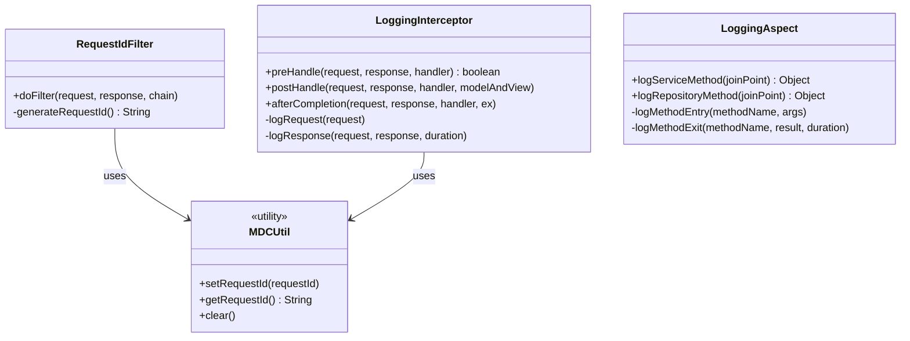
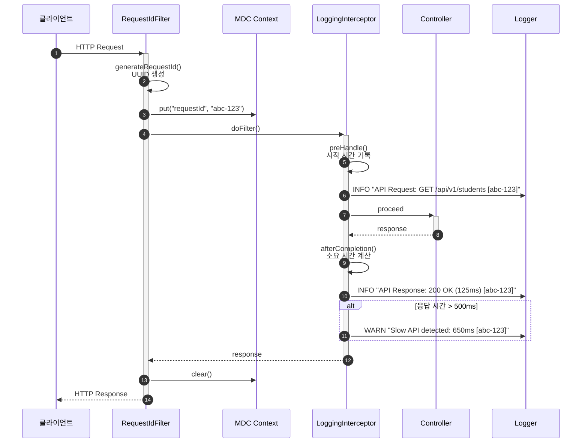

# 로깅 및 모니터링 설정

- **Type**: Non-Functional
- **Key**: BE-COMMON-002
- **REQ / Epic**: REQ-NF-020
- **Service**: ReAcademix Backend
- **Priority**: High
- **Dependencies**: BE-INFRA-001

## 📌 Description

모든 주요 이벤트를 로깅하고 모니터링하는 기능을 구현합니다. SLF4J + Logback을 사용하여 구조화된 로깅을 설정하고, 요청 추적을 위한 Correlation ID를 구현합니다.

## ✅ Acceptance Criteria

### Logback 설정
- [ ] `logback-spring.xml` 설정 파일 생성
- [ ] 환경별 로그 레벨 설정 (dev: DEBUG, prod: INFO)
- [ ] 콘솔 및 파일 Appender 설정
- [ ] 로그 파일 롤링 정책 설정 (일별, 크기별)
- [ ] JSON 형식 로깅 설정 (운영 환경)

### 요청 추적
- [ ] Correlation ID (Request ID) Filter 구현
- [ ] MDC (Mapped Diagnostic Context)에 Request ID 저장
- [ ] 모든 로그에 Request ID 포함

### API 모니터링
- [ ] 요청/응답 로깅 Interceptor 구현
- [ ] API 응답 시간 측정 및 로깅
- [ ] 느린 API 경고 (500ms 초과 시)

### 비즈니스 이벤트 로깅
- [ ] 리포트 생성 이벤트 로깅
- [ ] 데이터 업로드 이벤트 로깅
- [ ] 인증 이벤트 로깅 (로그인/로그아웃)

### 테스트
- [ ] 로깅 검증 테스트 작성

---

## 🏛️ CLD (Class Diagram)



---

## 🔄 Sequence Diagram (로깅 흐름)



---

## 💻 구현 코드

### logback-spring.xml

```xml
<?xml version="1.0" encoding="UTF-8"?>
<configuration scan="true" scanPeriod="30 seconds">
    
    <!-- 변수 정의 -->
    <property name="LOG_DIR" value="./logs"/>
    <property name="LOG_FILE" value="reacademix"/>
    <property name="LOG_PATTERN" value="%d{yyyy-MM-dd HH:mm:ss.SSS} [%thread] [%X{requestId}] %-5level %logger{36} - %msg%n"/>
    
    <!-- 콘솔 Appender -->
    <appender name="CONSOLE" class="ch.qos.logback.core.ConsoleAppender">
        <encoder>
            <pattern>${LOG_PATTERN}</pattern>
            <charset>UTF-8</charset>
        </encoder>
    </appender>
    
    <!-- 파일 Appender (일별 롤링) -->
    <appender name="FILE" class="ch.qos.logback.core.rolling.RollingFileAppender">
        <file>${LOG_DIR}/${LOG_FILE}.log</file>
        <encoder>
            <pattern>${LOG_PATTERN}</pattern>
            <charset>UTF-8</charset>
        </encoder>
        <rollingPolicy class="ch.qos.logback.core.rolling.TimeBasedRollingPolicy">
            <fileNamePattern>${LOG_DIR}/${LOG_FILE}.%d{yyyy-MM-dd}.%i.log.gz</fileNamePattern>
            <timeBasedFileNamingAndTriggeringPolicy class="ch.qos.logback.core.rolling.SizeAndTimeBasedFNATP">
                <maxFileSize>100MB</maxFileSize>
            </timeBasedFileNamingAndTriggeringPolicy>
            <maxHistory>30</maxHistory>
            <totalSizeCap>3GB</totalSizeCap>
        </rollingPolicy>
    </appender>
    
    <!-- 에러 전용 Appender -->
    <appender name="ERROR_FILE" class="ch.qos.logback.core.rolling.RollingFileAppender">
        <file>${LOG_DIR}/${LOG_FILE}-error.log</file>
        <filter class="ch.qos.logback.classic.filter.ThresholdFilter">
            <level>ERROR</level>
        </filter>
        <encoder>
            <pattern>${LOG_PATTERN}</pattern>
            <charset>UTF-8</charset>
        </encoder>
        <rollingPolicy class="ch.qos.logback.core.rolling.TimeBasedRollingPolicy">
            <fileNamePattern>${LOG_DIR}/${LOG_FILE}-error.%d{yyyy-MM-dd}.log.gz</fileNamePattern>
            <maxHistory>30</maxHistory>
        </rollingPolicy>
    </appender>
    
    <!-- 개발 환경 설정 -->
    <springProfile name="dev">
        <logger name="com.reacademix" level="DEBUG"/>
        <logger name="org.springframework.web" level="DEBUG"/>
        <logger name="org.hibernate.SQL" level="DEBUG"/>
        <logger name="org.hibernate.type.descriptor.sql.BasicBinder" level="TRACE"/>
        
        <root level="INFO">
            <appender-ref ref="CONSOLE"/>
            <appender-ref ref="FILE"/>
            <appender-ref ref="ERROR_FILE"/>
        </root>
    </springProfile>
    
    <!-- 운영 환경 설정 -->
    <springProfile name="prod">
        <logger name="com.reacademix" level="INFO"/>
        <logger name="org.springframework" level="WARN"/>
        <logger name="org.hibernate" level="WARN"/>
        
        <root level="WARN">
            <appender-ref ref="FILE"/>
            <appender-ref ref="ERROR_FILE"/>
        </root>
    </springProfile>
</configuration>
```

### RequestIdFilter.java

```java
package com.reacademix.reacademix_backend.config;

import jakarta.servlet.*;
import jakarta.servlet.http.HttpServletRequest;
import jakarta.servlet.http.HttpServletResponse;
import org.slf4j.MDC;
import org.springframework.core.Ordered;
import org.springframework.core.annotation.Order;
import org.springframework.stereotype.Component;

import java.io.IOException;
import java.util.UUID;

/**
 * 요청 ID 필터
 * 모든 요청에 고유한 Request ID를 생성하여 MDC에 저장
 */
@Component
@Order(Ordered.HIGHEST_PRECEDENCE)
public class RequestIdFilter implements Filter {

    private static final String REQUEST_ID_HEADER = "X-Request-ID";
    private static final String REQUEST_ID_MDC_KEY = "requestId";

    @Override
    public void doFilter(ServletRequest request, ServletResponse response, FilterChain chain)
            throws IOException, ServletException {
        
        HttpServletRequest httpRequest = (HttpServletRequest) request;
        HttpServletResponse httpResponse = (HttpServletResponse) response;
        
        try {
            // 클라이언트가 보낸 Request ID가 있으면 사용, 없으면 생성
            String requestId = httpRequest.getHeader(REQUEST_ID_HEADER);
            if (requestId == null || requestId.isEmpty()) {
                requestId = generateRequestId();
            }
            
            // MDC에 저장
            MDC.put(REQUEST_ID_MDC_KEY, requestId);
            
            // 응답 헤더에도 추가
            httpResponse.setHeader(REQUEST_ID_HEADER, requestId);
            
            chain.doFilter(request, response);
            
        } finally {
            // 요청 완료 후 MDC 정리
            MDC.clear();
        }
    }

    private String generateRequestId() {
        return UUID.randomUUID().toString().substring(0, 8);
    }
}
```

### LoggingInterceptor.java

```java
package com.reacademix.reacademix_backend.config;

import jakarta.servlet.http.HttpServletRequest;
import jakarta.servlet.http.HttpServletResponse;
import lombok.extern.slf4j.Slf4j;
import org.springframework.stereotype.Component;
import org.springframework.web.servlet.HandlerInterceptor;

/**
 * API 요청/응답 로깅 인터셉터
 * 모든 API 호출의 요청/응답을 로깅하고 응답 시간 측정
 */
@Slf4j
@Component
public class LoggingInterceptor implements HandlerInterceptor {

    private static final String START_TIME_ATTR = "startTime";
    private static final long SLOW_API_THRESHOLD_MS = 500;

    @Override
    public boolean preHandle(HttpServletRequest request, HttpServletResponse response, Object handler) {
        request.setAttribute(START_TIME_ATTR, System.currentTimeMillis());
        
        log.info("API Request: {} {} - Client: {}", 
            request.getMethod(), 
            request.getRequestURI(),
            request.getRemoteAddr());
        
        return true;
    }

    @Override
    public void afterCompletion(HttpServletRequest request, HttpServletResponse response, 
                                Object handler, Exception ex) {
        long startTime = (Long) request.getAttribute(START_TIME_ATTR);
        long duration = System.currentTimeMillis() - startTime;
        
        log.info("API Response: {} {} - Status: {} - Duration: {}ms", 
            request.getMethod(),
            request.getRequestURI(),
            response.getStatus(),
            duration);
        
        // 느린 API 경고
        if (duration > SLOW_API_THRESHOLD_MS) {
            log.warn("Slow API detected: {} {} - Duration: {}ms (threshold: {}ms)",
                request.getMethod(),
                request.getRequestURI(),
                duration,
                SLOW_API_THRESHOLD_MS);
        }
        
        // 에러 발생 시
        if (ex != null) {
            log.error("API Error: {} {} - Exception: {}",
                request.getMethod(),
                request.getRequestURI(),
                ex.getMessage());
        }
    }
}
```

### WebMvcConfig.java (인터셉터 등록)

```java
package com.reacademix.reacademix_backend.config;

import lombok.RequiredArgsConstructor;
import org.springframework.context.annotation.Configuration;
import org.springframework.web.servlet.config.annotation.InterceptorRegistry;
import org.springframework.web.servlet.config.annotation.WebMvcConfigurer;

/**
 * Web MVC 설정
 * 인터셉터 등록
 */
@Configuration
@RequiredArgsConstructor
public class WebMvcConfig implements WebMvcConfigurer {

    private final LoggingInterceptor loggingInterceptor;

    @Override
    public void addInterceptors(InterceptorRegistry registry) {
        registry.addInterceptor(loggingInterceptor)
            .addPathPatterns("/api/**")
            .excludePathPatterns("/swagger-ui/**", "/v3/api-docs/**");
    }
}
```

---

## 📝 구현 체크리스트

### 1단계: Logback 설정
- [ ] `logback-spring.xml` 생성
- [ ] 환경별 프로파일 설정

### 2단계: 요청 추적
- [ ] `RequestIdFilter` 구현
- [ ] MDC 설정

### 3단계: 로깅 인터셉터
- [ ] `LoggingInterceptor` 구현
- [ ] `WebMvcConfig`에 등록

### 4단계: 테스트
- [ ] 로그 출력 확인
- [ ] Request ID 추적 확인

---

## ⏱ 일정(Timeline)

- **Start**: 2025-11-30
- **End**: 2025-12-03
- **Lane**: Prerequisites

## 🔗 Traceability

- Related SRS: REQ-NF-020
- Related Epic: Common Infrastructure
