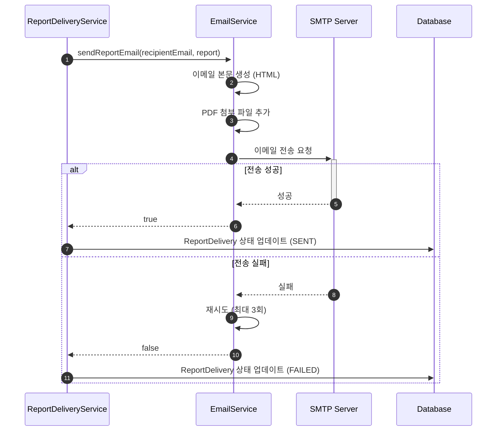

# 이메일 전송 서비스 구현

- **Type**: Functional
- **Key**: BE-EMAIL-001
- **REQ / Epic**: REQ-FUNC-041
- **Service**: ReAcademix Backend
- **Priority**: High
- **Dependencies**: BE-REPORT-002

## 📌 Description

리포트 PDF를 이메일로 전송하는 서비스를 구현합니다. Spring Mail을 사용하여 SMTP로 이메일을 전송하고, PDF 파일을 첨부합니다.

## ✅ Acceptance Criteria

### 의존성 및 설정
- [ ] Spring Mail 의존성 추가
- [ ] SMTP 설정 (Gmail, Naver 등)
- [ ] 이메일 템플릿 설정

### Service 구현
- [ ] `EmailService` 클래스 생성
- [ ] `sendReportEmail(to, report)` 메서드 구현
- [ ] PDF 파일 첨부 기능
- [ ] HTML 이메일 본문 지원

### 에러 처리
- [ ] 이메일 전송 실패 시 재시도
- [ ] 실패 로깅 및 상태 업데이트

### 성능 및 테스트
- [ ] 전송 처리 시간 5초 이내
- [ ] 단위 테스트 작성

---

## 🔄 Sequence Diagram



---

## 💻 구현 코드

### application.properties

```properties
# Email Configuration (Gmail SMTP)
spring.mail.host=smtp.gmail.com
spring.mail.port=587
spring.mail.username=${MAIL_USERNAME}
spring.mail.password=${MAIL_PASSWORD}
spring.mail.properties.mail.smtp.auth=true
spring.mail.properties.mail.smtp.starttls.enable=true
spring.mail.properties.mail.smtp.timeout=5000

# Email Template
email.from=noreply@reacademix.com
email.from-name=ReAcademix
```

### EmailService.java

```java
package com.reacademix.reacademix_backend.service;

import com.reacademix.reacademix_backend.domain.report.Report;
import com.reacademix.reacademix_backend.exception.BusinessException;
import com.reacademix.reacademix_backend.exception.ErrorCode;
import jakarta.mail.MessagingException;
import jakarta.mail.internet.MimeMessage;
import lombok.RequiredArgsConstructor;
import lombok.extern.slf4j.Slf4j;
import org.springframework.beans.factory.annotation.Value;
import org.springframework.core.io.FileSystemResource;
import org.springframework.mail.javamail.JavaMailSender;
import org.springframework.mail.javamail.MimeMessageHelper;
import org.springframework.retry.annotation.Backoff;
import org.springframework.retry.annotation.Retryable;
import org.springframework.stereotype.Service;

import java.io.File;

@Slf4j
@Service
@RequiredArgsConstructor
public class EmailService {

    private final JavaMailSender mailSender;

    @Value("${email.from}")
    private String fromEmail;

    @Value("${email.from-name}")
    private String fromName;

    /**
     * 리포트 이메일 전송
     * 실패 시 최대 3회 재시도
     */
    @Retryable(value = MessagingException.class, maxAttempts = 3, backoff = @Backoff(delay = 1000))
    public void sendReportEmail(String recipientEmail, Report report) {
        log.info("리포트 이메일 전송 시작: to={}, reportId={}", recipientEmail, report.getId());

        try {
            MimeMessage message = mailSender.createMimeMessage();
            MimeMessageHelper helper = new MimeMessageHelper(message, true, "UTF-8");

            helper.setFrom(fromEmail, fromName);
            helper.setTo(recipientEmail);
            helper.setSubject(buildSubject(report));
            helper.setText(buildEmailBody(report), true); // HTML

            // PDF 첨부
            if (report.getFilePath() != null) {
                File pdfFile = new File(report.getFilePath());
                if (pdfFile.exists()) {
                    FileSystemResource file = new FileSystemResource(pdfFile);
                    helper.addAttachment(buildFileName(report), file);
                }
            }

            mailSender.send(message);
            log.info("리포트 이메일 전송 완료: to={}", recipientEmail);

        } catch (Exception e) {
            log.error("이메일 전송 실패: to={}, error={}", recipientEmail, e.getMessage());
            throw new BusinessException(ErrorCode.BUSINESS_002, "이메일 전송에 실패했습니다.");
        }
    }

    private String buildSubject(Report report) {
        return String.format("[ReAcademix] %s 학생 성과 리포트 (%s ~ %s)",
            report.getStudent().getName(),
            report.getReportStartDate(),
            report.getReportEndDate());
    }

    private String buildEmailBody(Report report) {
        return String.format("""
            <html>
            <body style="font-family: 'Noto Sans KR', sans-serif;">
                <h2>📊 학생 성과 리포트</h2>
                <p>안녕하세요, <strong>%s</strong> 학생의 성과 리포트를 전달드립니다.</p>
                <ul>
                    <li>학생명: %s</li>
                    <li>기간: %s ~ %s</li>
                </ul>
                <p>첨부된 PDF 파일을 확인해 주세요.</p>
                <hr/>
                <p style="color: #666; font-size: 12px;">
                    본 메일은 ReAcademix 시스템에서 자동 발송되었습니다.
                </p>
            </body>
            </html>
            """,
            report.getStudent().getName(),
            report.getStudent().getName(),
            report.getReportStartDate(),
            report.getReportEndDate());
    }

    private String buildFileName(Report report) {
        return String.format("%s_리포트_%s.pdf",
            report.getStudent().getName(),
            report.getReportEndDate());
    }
}
```

---

## 📝 구현 체크리스트

- [ ] Spring Mail 의존성 추가
- [ ] SMTP 설정
- [ ] `EmailService` 구현
- [ ] 재시도 로직 추가
- [ ] 테스트 작성

---

## ⏱ 일정(Timeline)

- **Start**: 2025-12-09
- **End**: 2025-12-12
- **Lane**: Backend Core

## 🔗 Traceability

- Related SRS: REQ-FUNC-041
- Related Epic: Report Delivery
