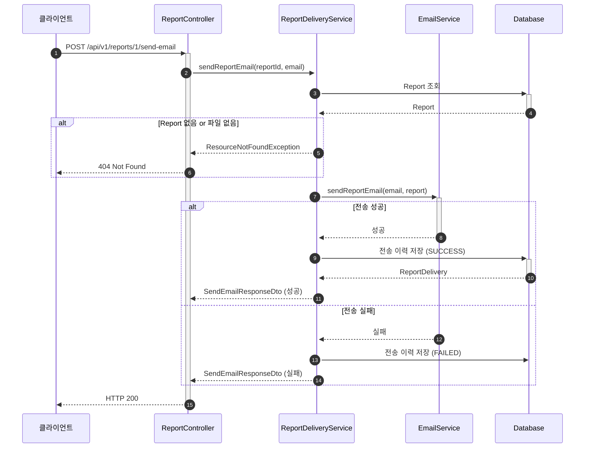

# 수동 리포트 이메일 전송 API 구현

- **Type**: Functional
- **Key**: BE-EMAIL-002
- **REQ / Epic**: REQ-FUNC-041
- **Service**: ReAcademix Backend
- **Priority**: High
- **Dependencies**: BE-AUTH-002, BE-EMAIL-001, BE-REPORT-003, BE-DELIVERY-001

## 📌 Description

리포트 생성 후 수동으로 이메일 전송을 수행하는 API를 구현합니다.

## ✅ Acceptance Criteria

### API 구현
- [ ] `POST /api/v1/reports/{reportId}/send-email` 엔드포인트 구현
- [ ] Request/Response DTO 생성
- [ ] 이메일 전송 및 이력 저장

### 에러 처리
- [ ] 존재하지 않는 reportId → 404
- [ ] 리포트 파일 없음 → 404
- [ ] 이메일 형식 오류 → 400

### 테스트
- [ ] 단위 테스트 작성

---

## 📋 API 명세서

| 항목 | 내용 |
|------|------|
| **HTTP Method** | `POST` |
| **URI** | `/api/v1/reports/{reportId}/send-email` |
| **Content-Type** | `application/json` |
| **인증 필요** | ✅ |

### Request Body

```json
{
  "recipientEmail": "parent@example.com"
}
```

### Response Body (200 OK)

```json
{
  "success": true,
  "data": {
    "deliveryId": 1,
    "status": "SENT",
    "message": "이메일이 전송되었습니다."
  }
}
```

---

## 🔄 Sequence Diagram



---

## 💻 구현 코드

### SendEmailRequestDto.java

```java
@Getter
@Builder
public class SendEmailRequestDto {
    @NotBlank(message = "수신자 이메일은 필수입니다.")
    @Email(message = "올바른 이메일 형식이 아닙니다.")
    private String recipientEmail;
}
```

### SendEmailResponseDto.java

```java
@Getter
@Builder
public class SendEmailResponseDto {
    private Long deliveryId;
    private String status;
    private String message;
}
```

### ReportController.java

```java
@PostMapping("/{reportId}/send-email")
@Operation(summary = "리포트 이메일 전송", description = "리포트를 지정된 이메일로 전송합니다.")
public ResponseEntity<ApiResponse<SendEmailResponseDto>> sendReportEmail(
        @PathVariable Long reportId,
        @Valid @RequestBody SendEmailRequestDto request) {
    
    log.info("리포트 이메일 전송 요청: reportId={}, email={}", reportId, request.getRecipientEmail());
    
    SendEmailResponseDto response = reportDeliveryService.sendReportEmail(
        reportId, request.getRecipientEmail());
    
    return ResponseEntity.ok(ApiResponse.success(response));
}
```

### ReportDeliveryService.java

```java
@Transactional
public SendEmailResponseDto sendReportEmail(Long reportId, String recipientEmail) {
    Report report = reportRepository.findById(reportId)
        .orElseThrow(() -> new ResourceNotFoundException("Report", "id", reportId));

    if (report.getFilePath() == null || !Files.exists(Paths.get(report.getFilePath()))) {
        throw new ResourceNotFoundException("Report file", "reportId", reportId);
    }

    try {
        emailService.sendReportEmail(recipientEmail, report);
        
        ReportDelivery delivery = saveDeliveryHistory(report, recipientEmail, true, null);
        
        return SendEmailResponseDto.builder()
            .deliveryId(delivery.getId())
            .status("SENT")
            .message("이메일이 전송되었습니다.")
            .build();
            
    } catch (Exception e) {
        log.error("이메일 전송 실패: {}", e.getMessage());
        
        saveDeliveryHistory(report, recipientEmail, false, e.getMessage());
        
        return SendEmailResponseDto.builder()
            .status("FAILED")
            .message("이메일 전송에 실패했습니다: " + e.getMessage())
            .build();
    }
}
```

---

## ⏱ 일정(Timeline)

- **Start**: 2025-12-25
- **End**: 2025-12-28
- **Lane**: Backend Core

## 🔗 Traceability

- Related SRS: REQ-FUNC-041
- Related Epic: Report Delivery
