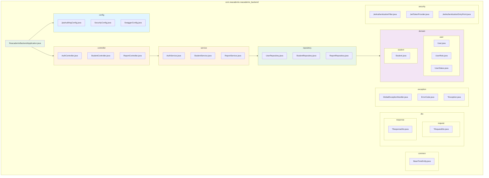

# 프로젝트 기본 설정 및 의존성 구성

- **Type**: Infrastructure
- **Key**: BE-INFRA-001
- **REQ / Epic**: Infrastructure Setup
- **Service**: ReAcademix Backend
- **Priority**: High (최우선)
- **Dependencies**: None (첫 번째 작업)

## 📌 Description

Spring Boot 프로젝트의 기본 설정을 구성합니다. Spring Boot 4.0, Java 21 기반으로 Web, JPA, Security, Validation 등의 필수 의존성을 추가하고, 계층별 패키지 구조를 설정합니다.

## ✅ Acceptance Criteria

### 의존성 추가
- [ ] Spring Boot Web Starter 의존성 추가
- [ ] Spring Data JPA 의존성 추가
- [ ] Spring Security 의존성 추가
- [ ] Spring Validation 의존성 추가
- [ ] MySQL Connector 의존성 추가
- [ ] Lombok 의존성 추가
- [ ] JWT (jjwt) 의존성 추가
- [ ] SpringDoc OpenAPI 의존성 추가

### 프로젝트 구조
- [ ] 패키지 구조 생성 (controller, service, repository, entity, dto, config, security, exception, util)
- [ ] BaseTimeEntity 클래스 생성
- [ ] JpaAuditingConfig 설정 클래스 생성

### 설정 파일
- [ ] application.properties 기본 설정
- [ ] application-dev.properties 개발 환경 설정
- [ ] application-prod.properties 운영 환경 설정

### 검증
- [ ] 프로젝트 빌드 성공 (`./gradlew build`)
- [ ] 애플리케이션 실행 성공 (`./gradlew bootRun`)

---

## 🧩 Technical Notes

### 기술 스택

| 항목 | 버전 | 비고 |
|------|------|------|
| **Java** | 21 | LTS 버전 |
| **Spring Boot** | 4.0.0 | 최신 버전 |
| **Spring Security** | 7.x | Spring Boot 4.0 내장 |
| **Spring Data JPA** | 3.x | Spring Boot 4.0 내장 |
| **MySQL** | 8.x | InnoDB, utf8mb4 |
| **Build Tool** | Gradle | Kotlin DSL 또는 Groovy |

---

## 🏗️ 1. 프로젝트 구조 (Package Structure)



### 패키지별 역할

| 패키지 | 역할 | 주요 클래스 |
|--------|------|-----------|
| `common` | 공통 클래스 | `BaseTimeEntity` |
| `config` | 설정 클래스 | `SecurityConfig`, `JpaAuditingConfig`, `SwaggerConfig` |
| `controller` | REST API 엔드포인트 | `AuthController`, `StudentController`, `ReportController` |
| `service` | 비즈니스 로직 | `AuthService`, `StudentService`, `ReportService` |
| `repository` | 데이터 접근 | `UserRepository`, `StudentRepository`, `ReportRepository` |
| `domain` | JPA 엔티티 | `User`, `Student`, `Report`, `Attendance` 등 |
| `dto.request` | 요청 DTO | `LoginRequestDto`, `StudentSearchRequestDto` 등 |
| `dto.response` | 응답 DTO | `LoginResponseDto`, `ApiResponse`, `ErrorResponse` 등 |
| `exception` | 예외 처리 | `GlobalExceptionHandler`, `ErrorCode`, `AuthException` 등 |
| `security` | 보안 컴포넌트 | `JwtTokenProvider`, `JwtAuthenticationFilter` 등 |

---

## 💻 2. 구현 코드

### 2.1 build.gradle

```gradle
plugins {
    id 'java'
    id 'org.springframework.boot' version '4.0.0'
    id 'io.spring.dependency-management' version '1.1.7'
}

group = 'com.reacademix'
version = '0.0.1-SNAPSHOT'
description = 'ReAcademix Backend API Server'

java {
    toolchain {
        languageVersion = JavaLanguageVersion.of(21)
    }
}

configurations {
    compileOnly {
        extendsFrom annotationProcessor
    }
}

repositories {
    mavenCentral()
}

dependencies {
    // Spring Boot Starters
    implementation 'org.springframework.boot:spring-boot-starter-web'
    implementation 'org.springframework.boot:spring-boot-starter-data-jpa'
    implementation 'org.springframework.boot:spring-boot-starter-security'
    implementation 'org.springframework.boot:spring-boot-starter-validation'
    implementation 'org.springframework.boot:spring-boot-starter-actuator'
    
    // Database
    runtimeOnly 'com.mysql:mysql-connector-j'
    
    // JWT
    implementation 'io.jsonwebtoken:jjwt-api:0.12.6'
    runtimeOnly 'io.jsonwebtoken:jjwt-impl:0.12.6'
    runtimeOnly 'io.jsonwebtoken:jjwt-jackson:0.12.6'
    
    // API Documentation
    implementation 'org.springdoc:springdoc-openapi-starter-webmvc-ui:2.6.0'
    
    // Lombok
    compileOnly 'org.projectlombok:lombok'
    annotationProcessor 'org.projectlombok:lombok'
    
    // Test
    testImplementation 'org.springframework.boot:spring-boot-starter-test'
    testImplementation 'org.springframework.security:spring-security-test'
    testRuntimeOnly 'org.junit.platform:junit-platform-launcher'
    
    // H2 Database for Testing
    testRuntimeOnly 'com.h2database:h2'
}

tasks.named('test') {
    useJUnitPlatform()
}

// Encoding 설정
tasks.withType(JavaCompile) {
    options.encoding = 'UTF-8'
}
```

### 2.2 application.properties

```properties
# Application
spring.application.name=reacademix-backend

# Profile
spring.profiles.active=dev

# Server
server.port=8080
server.servlet.encoding.charset=UTF-8
server.servlet.encoding.force=true
```

### 2.3 application-dev.properties

```properties
# Database Configuration (Development)
spring.datasource.url=jdbc:mysql://localhost:3306/reacademix_dev?useSSL=false&serverTimezone=Asia/Seoul&characterEncoding=UTF-8&allowPublicKeyRetrieval=true
spring.datasource.username=root
spring.datasource.password=root
spring.datasource.driver-class-name=com.mysql.cj.jdbc.Driver

# HikariCP Connection Pool
spring.datasource.hikari.maximum-pool-size=10
spring.datasource.hikari.minimum-idle=5
spring.datasource.hikari.connection-timeout=30000
spring.datasource.hikari.idle-timeout=600000
spring.datasource.hikari.max-lifetime=1800000

# JPA Configuration
spring.jpa.hibernate.ddl-auto=validate
spring.jpa.show-sql=true
spring.jpa.properties.hibernate.format_sql=true
spring.jpa.properties.hibernate.dialect=org.hibernate.dialect.MySQLDialect
spring.jpa.open-in-view=false

# JWT Configuration
jwt.secret=dev-secret-key-must-be-at-least-32-characters-long-for-security
jwt.expiration=86400000

# Logging
logging.level.root=INFO
logging.level.com.reacademix=DEBUG
logging.level.org.springframework.security=DEBUG
logging.level.org.hibernate.SQL=DEBUG
logging.level.org.hibernate.type.descriptor.sql.BasicBinder=TRACE

# Swagger
springdoc.api-docs.path=/v3/api-docs
springdoc.swagger-ui.path=/swagger-ui.html
springdoc.swagger-ui.enabled=true
```

### 2.4 application-prod.properties

```properties
# Database Configuration (Production)
spring.datasource.url=${DATABASE_URL}
spring.datasource.username=${DATABASE_USERNAME}
spring.datasource.password=${DATABASE_PASSWORD}
spring.datasource.driver-class-name=com.mysql.cj.jdbc.Driver

# HikariCP Connection Pool (Production)
spring.datasource.hikari.maximum-pool-size=20
spring.datasource.hikari.minimum-idle=10
spring.datasource.hikari.connection-timeout=30000
spring.datasource.hikari.idle-timeout=600000
spring.datasource.hikari.max-lifetime=1800000

# JPA Configuration
spring.jpa.hibernate.ddl-auto=validate
spring.jpa.show-sql=false
spring.jpa.properties.hibernate.dialect=org.hibernate.dialect.MySQLDialect
spring.jpa.open-in-view=false

# JWT Configuration (Production - 환경변수 사용)
jwt.secret=${JWT_SECRET}
jwt.expiration=86400000

# Logging (Production)
logging.level.root=WARN
logging.level.com.reacademix=INFO

# Swagger (Production - 비활성화)
springdoc.swagger-ui.enabled=false
```

### 2.5 BaseTimeEntity.java

```java
package com.reacademix.reacademix_backend.common;

import jakarta.persistence.Column;
import jakarta.persistence.EntityListeners;
import jakarta.persistence.MappedSuperclass;
import lombok.Getter;
import org.springframework.data.annotation.CreatedDate;
import org.springframework.data.annotation.LastModifiedDate;
import org.springframework.data.jpa.domain.support.AuditingEntityListener;

import java.time.LocalDateTime;

/**
 * JPA Auditing을 위한 기본 시간 엔티티
 * 모든 엔티티에서 상속받아 createdAt, updatedAt 자동 관리
 * 
 * @author Backend Team
 * @version 1.0
 */
@Getter
@MappedSuperclass
@EntityListeners(AuditingEntityListener.class)
public abstract class BaseTimeEntity {

    /**
     * 생성 일시 (최초 저장 시 자동 설정, 이후 변경 불가)
     */
    @CreatedDate
    @Column(name = "created_at", nullable = false, updatable = false)
    private LocalDateTime createdAt;

    /**
     * 수정 일시 (저장/수정 시 자동 갱신)
     */
    @LastModifiedDate
    @Column(name = "updated_at", nullable = false)
    private LocalDateTime updatedAt;
}
```

### 2.6 JpaAuditingConfig.java

```java
package com.reacademix.reacademix_backend.config;

import org.springframework.context.annotation.Configuration;
import org.springframework.data.jpa.repository.config.EnableJpaAuditing;

/**
 * JPA Auditing 설정
 * @CreatedDate, @LastModifiedDate 어노테이션 활성화
 * 
 * @author Backend Team
 * @version 1.0
 */
@Configuration
@EnableJpaAuditing
public class JpaAuditingConfig {
    // JPA Auditing 활성화를 위한 설정 클래스
    // BaseTimeEntity의 @CreatedDate, @LastModifiedDate가 동작하도록 함
}
```

### 2.7 SwaggerConfig.java

```java
package com.reacademix.reacademix_backend.config;

import io.swagger.v3.oas.models.Components;
import io.swagger.v3.oas.models.OpenAPI;
import io.swagger.v3.oas.models.info.Contact;
import io.swagger.v3.oas.models.info.Info;
import io.swagger.v3.oas.models.info.License;
import io.swagger.v3.oas.models.security.SecurityRequirement;
import io.swagger.v3.oas.models.security.SecurityScheme;
import org.springframework.context.annotation.Bean;
import org.springframework.context.annotation.Configuration;

/**
 * Swagger/OpenAPI 설정
 * API 문서 자동 생성 및 JWT 인증 설정
 * 
 * @author Backend Team
 * @version 1.0
 */
@Configuration
public class SwaggerConfig {

    private static final String SECURITY_SCHEME_NAME = "bearerAuth";

    @Bean
    public OpenAPI openAPI() {
        return new OpenAPI()
            .info(apiInfo())
            .addSecurityItem(new SecurityRequirement().addList(SECURITY_SCHEME_NAME))
            .components(new Components()
                .addSecuritySchemes(SECURITY_SCHEME_NAME, securityScheme()));
    }

    private Info apiInfo() {
        return new Info()
            .title("ReAcademix Backend API")
            .description("도심형 통학 관리형 재수 학원을 위한 성과 리포트 자동화 SaaS 백엔드 API")
            .version("v1.0.0")
            .contact(new Contact()
                .name("ReAcademix Backend Team")
                .email("backend@reacademix.com"))
            .license(new License()
                .name("Private License")
                .url("https://reacademix.com"));
    }

    private SecurityScheme securityScheme() {
        return new SecurityScheme()
            .type(SecurityScheme.Type.HTTP)
            .scheme("bearer")
            .bearerFormat("JWT")
            .in(SecurityScheme.In.HEADER)
            .name("Authorization")
            .description("JWT 토큰을 입력하세요. 'Bearer ' 접두사는 자동으로 추가됩니다.");
    }
}
```

### 2.8 ReacademixBackendApplication.java

```java
package com.reacademix.reacademix_backend;

import org.springframework.boot.SpringApplication;
import org.springframework.boot.autoconfigure.SpringBootApplication;

/**
 * ReAcademix Backend API Server 메인 클래스
 * Spring Boot 애플리케이션 진입점
 * 
 * @author Backend Team
 * @version 1.0
 */
@SpringBootApplication
public class ReacademixBackendApplication {

    public static void main(String[] args) {
        SpringApplication.run(ReacademixBackendApplication.class, args);
    }
}
```

### 2.9 ApiResponse.java (공통 응답 DTO)

```java
package com.reacademix.reacademix_backend.dto.response;

import com.fasterxml.jackson.annotation.JsonInclude;
import lombok.AllArgsConstructor;
import lombok.Builder;
import lombok.Getter;
import lombok.NoArgsConstructor;

/**
 * API 공통 응답 DTO
 * 모든 API 응답의 표준 형식을 정의
 * 
 * @author Backend Team
 * @version 1.0
 */
@Getter
@Builder
@NoArgsConstructor
@AllArgsConstructor
@JsonInclude(JsonInclude.Include.NON_NULL)
public class ApiResponse<T> {

    /**
     * 요청 성공 여부
     */
    private boolean success;

    /**
     * 응답 데이터 (성공 시)
     */
    private T data;

    /**
     * 응답 메시지
     */
    private String message;

    /**
     * 성공 응답 생성 (데이터 + 메시지)
     */
    public static <T> ApiResponse<T> success(T data, String message) {
        return ApiResponse.<T>builder()
            .success(true)
            .data(data)
            .message(message)
            .build();
    }

    /**
     * 성공 응답 생성 (데이터만)
     */
    public static <T> ApiResponse<T> success(T data) {
        return ApiResponse.<T>builder()
            .success(true)
            .data(data)
            .build();
    }

    /**
     * 성공 응답 생성 (메시지만)
     */
    public static <T> ApiResponse<T> success(String message) {
        return ApiResponse.<T>builder()
            .success(true)
            .message(message)
            .build();
    }
}
```

---

## 📝 구현 체크리스트

### 1단계: Gradle 설정
- [ ] `build.gradle` 의존성 추가
- [ ] `./gradlew build` 성공 확인

### 2단계: 설정 파일
- [ ] `application.properties` 생성
- [ ] `application-dev.properties` 생성
- [ ] `application-prod.properties` 생성

### 3단계: 패키지 구조
- [ ] `common` 패키지 생성
- [ ] `config` 패키지 생성
- [ ] `controller` 패키지 생성
- [ ] `service` 패키지 생성
- [ ] `repository` 패키지 생성
- [ ] `domain` 패키지 생성
- [ ] `dto.request` 패키지 생성
- [ ] `dto.response` 패키지 생성
- [ ] `exception` 패키지 생성
- [ ] `security` 패키지 생성

### 4단계: 공통 클래스
- [ ] `BaseTimeEntity.java` 생성
- [ ] `JpaAuditingConfig.java` 생성
- [ ] `SwaggerConfig.java` 생성
- [ ] `ApiResponse.java` 생성

### 5단계: 검증
- [ ] `./gradlew bootRun` 실행 성공
- [ ] `http://localhost:8080/swagger-ui.html` 접근 확인
- [ ] `http://localhost:8080/actuator/health` 헬스 체크

---

## ⏱ 일정(Timeline)

- **Start**: 2025-11-27
- **End**: 2025-11-29
- **Lane**: Prerequisites

## 🔗 Traceability

- Related SRS: N/A (Infrastructure)
- Related Epic: Infrastructure Setup
- Next Tasks: BE-INFRA-002, BE-COMMON-001
