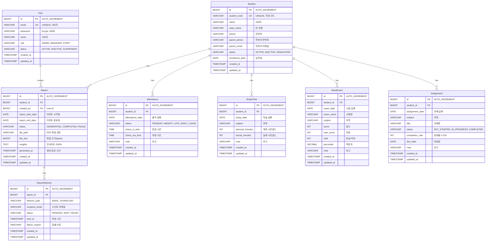
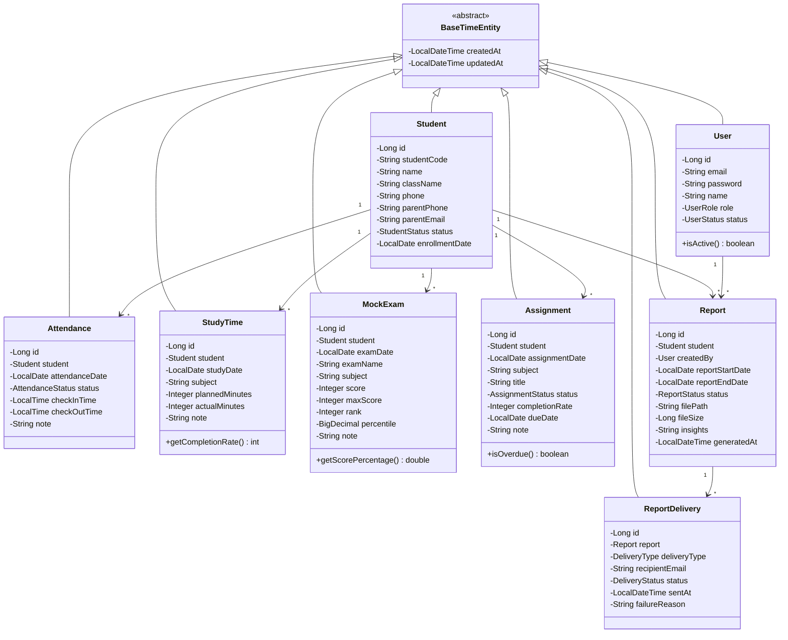

# 데이터베이스 연결 설정 및 JPA 엔티티 기본 구조

- **Type**: Infrastructure
- **Key**: BE-INFRA-002
- **REQ / Epic**: Infrastructure Setup
- **Service**: ReAcademix Backend
- **Priority**: High
- **Dependencies**: BE-INFRA-001

## 📌 Description

MySQL 8.x 데이터베이스 연결을 설정하고, JPA 엔티티의 기본 구조를 생성합니다. 모든 도메인 엔티티 클래스와 Repository 인터페이스를 구현합니다.

## ✅ Acceptance Criteria

### 데이터베이스 설정
- [ ] MySQL 8.x 데이터베이스 생성 (`reacademix_dev`)
- [ ] 데이터베이스 연결 테스트 성공
- [ ] HikariCP 커넥션 풀 설정

### JPA 엔티티 생성
- [ ] `User` 엔티티 생성
- [ ] `Student` 엔티티 생성
- [ ] `Attendance` 엔티티 생성
- [ ] `StudyTime` 엔티티 생성
- [ ] `MockExam` 엔티티 생성
- [ ] `Assignment` 엔티티 생성
- [ ] `Report` 엔티티 생성
- [ ] `ReportDelivery` 엔티티 생성

### Repository 생성
- [ ] `UserRepository` 인터페이스 생성
- [ ] `StudentRepository` 인터페이스 생성
- [ ] `AttendanceRepository` 인터페이스 생성
- [ ] `StudyTimeRepository` 인터페이스 생성
- [ ] `MockExamRepository` 인터페이스 생성
- [ ] `AssignmentRepository` 인터페이스 생성
- [ ] `ReportRepository` 인터페이스 생성
- [ ] `ReportDeliveryRepository` 인터페이스 생성

---

## 📊 1. ERD (Entity Relationship Diagram)

**전체 데이터 모델** (데이터베이스 관점)



### 테이블 관계 요약

| 관계 | 설명 |
|------|------|
| `User` → `Report` | 1:N (사용자가 리포트 생성) |
| `Student` → `Report` | 1:N (학생별 리포트) |
| `Student` → `Attendance` | 1:N (학생별 출석 기록) |
| `Student` → `StudyTime` | 1:N (학생별 학습 시간) |
| `Student` → `MockExam` | 1:N (학생별 모의고사 성적) |
| `Student` → `Assignment` | 1:N (학생별 과제) |
| `Report` → `ReportDelivery` | 1:N (리포트별 전송 이력) |

---

## 🏛️ 2. CLD (Class Diagram)



---

## 💻 3. ORM 예제 코드

### 3.1 Enum 클래스들

```java
package com.reacademix.reacademix_backend.domain.user;

/**
 * 사용자 역할
 */
public enum UserRole {
    ADMIN,      // 관리자
    MANAGER,    // 학사 관리자
    STAFF       // 운영 관리자
}
```

```java
package com.reacademix.reacademix_backend.domain.user;

/**
 * 사용자 상태
 */
public enum UserStatus {
    ACTIVE,     // 활성
    INACTIVE,   // 비활성
    SUSPENDED   // 정지
}
```

```java
package com.reacademix.reacademix_backend.domain.student;

/**
 * 학생 상태
 */
public enum StudentStatus {
    ACTIVE,     // 재원
    INACTIVE,   // 휴원
    GRADUATED   // 졸업/퇴원
}
```

```java
package com.reacademix.reacademix_backend.domain.attendance;

/**
 * 출석 상태
 */
public enum AttendanceStatus {
    PRESENT,    // 출석
    ABSENT,     // 결석
    LATE,       // 지각
    EARLY_LEAVE // 조퇴
}
```

```java
package com.reacademix.reacademix_backend.domain.assignment;

/**
 * 과제 상태
 */
public enum AssignmentStatus {
    NOT_STARTED,  // 미시작
    IN_PROGRESS,  // 진행중
    COMPLETED     // 완료
}
```

```java
package com.reacademix.reacademix_backend.domain.report;

/**
 * 리포트 생성 상태
 */
public enum ReportStatus {
    GENERATING, // 생성중
    COMPLETED,  // 완료
    FAILED      // 실패
}
```

```java
package com.reacademix.reacademix_backend.domain.delivery;

/**
 * 리포트 전송 타입
 */
public enum DeliveryType {
    EMAIL,      // 이메일 전송
    DOWNLOAD    // 다운로드
}
```

```java
package com.reacademix.reacademix_backend.domain.delivery;

/**
 * 전송 상태
 */
public enum DeliveryStatus {
    PENDING,    // 대기중
    SENT,       // 전송완료
    FAILED      // 전송실패
}
```

### 3.2 User Entity

```java
package com.reacademix.reacademix_backend.domain.user;

import com.reacademix.reacademix_backend.common.BaseTimeEntity;
import jakarta.persistence.*;
import lombok.Builder;
import lombok.Getter;
import lombok.NoArgsConstructor;

/**
 * 사용자 엔티티
 * 시스템 사용자 (관리자, 학사 관리자, 운영 관리자)
 */
@Entity
@Table(name = "users", indexes = {
    @Index(name = "idx_users_email", columnList = "email"),
    @Index(name = "idx_users_status", columnList = "status")
})
@Getter
@NoArgsConstructor
public class User extends BaseTimeEntity {

    @Id
    @GeneratedValue(strategy = GenerationType.IDENTITY)
    private Long id;

    @Column(nullable = false, unique = true, length = 255)
    private String email;

    @Column(nullable = false, length = 255)
    private String password;

    @Column(nullable = false, length = 100)
    private String name;

    @Enumerated(EnumType.STRING)
    @Column(nullable = false, length = 20)
    private UserRole role = UserRole.ADMIN;

    @Enumerated(EnumType.STRING)
    @Column(nullable = false, length = 20)
    private UserStatus status = UserStatus.ACTIVE;

    @Builder
    public User(String email, String password, String name, UserRole role, UserStatus status) {
        this.email = email != null ? email.toLowerCase().trim() : null;
        this.password = password;
        this.name = name;
        this.role = role != null ? role : UserRole.ADMIN;
        this.status = status != null ? status : UserStatus.ACTIVE;
    }

    public boolean isActive() {
        return this.status == UserStatus.ACTIVE;
    }
}
```

### 3.3 Student Entity

```java
package com.reacademix.reacademix_backend.domain.student;

import com.reacademix.reacademix_backend.common.BaseTimeEntity;
import jakarta.persistence.*;
import lombok.Builder;
import lombok.Getter;
import lombok.NoArgsConstructor;

import java.time.LocalDate;

/**
 * 학생 엔티티
 * 학원 재원생 정보
 */
@Entity
@Table(name = "students", indexes = {
    @Index(name = "idx_students_student_code", columnList = "student_code"),
    @Index(name = "idx_students_name", columnList = "name"),
    @Index(name = "idx_students_class_name", columnList = "class_name"),
    @Index(name = "idx_students_status", columnList = "status")
})
@Getter
@NoArgsConstructor
public class Student extends BaseTimeEntity {

    @Id
    @GeneratedValue(strategy = GenerationType.IDENTITY)
    private Long id;

    @Column(name = "student_code", nullable = false, unique = true, length = 50)
    private String studentCode;

    @Column(nullable = false, length = 100)
    private String name;

    @Column(name = "class_name", length = 50)
    private String className;

    @Column(length = 20)
    private String phone;

    @Column(name = "parent_phone", length = 20)
    private String parentPhone;

    @Column(name = "parent_email", length = 255)
    private String parentEmail;

    @Enumerated(EnumType.STRING)
    @Column(nullable = false, length = 20)
    private StudentStatus status = StudentStatus.ACTIVE;

    @Column(name = "enrollment_date")
    private LocalDate enrollmentDate;

    @Builder
    public Student(String studentCode, String name, String className, String phone,
                   String parentPhone, String parentEmail, StudentStatus status,
                   LocalDate enrollmentDate) {
        this.studentCode = studentCode;
        this.name = name;
        this.className = className;
        this.phone = phone;
        this.parentPhone = parentPhone;
        this.parentEmail = parentEmail;
        this.status = status != null ? status : StudentStatus.ACTIVE;
        this.enrollmentDate = enrollmentDate;
    }

    public boolean isActive() {
        return this.status == StudentStatus.ACTIVE;
    }
}
```

### 3.4 Attendance Entity

```java
package com.reacademix.reacademix_backend.domain.attendance;

import com.reacademix.reacademix_backend.common.BaseTimeEntity;
import com.reacademix.reacademix_backend.domain.student.Student;
import jakarta.persistence.*;
import lombok.Builder;
import lombok.Getter;
import lombok.NoArgsConstructor;

import java.time.LocalDate;
import java.time.LocalTime;

/**
 * 출석 엔티티
 * 학생 출결 기록
 */
@Entity
@Table(name = "attendance", indexes = {
    @Index(name = "idx_attendance_student_id", columnList = "student_id"),
    @Index(name = "idx_attendance_date", columnList = "attendance_date"),
    @Index(name = "idx_attendance_student_date", columnList = "student_id, attendance_date")
})
@Getter
@NoArgsConstructor
public class Attendance extends BaseTimeEntity {

    @Id
    @GeneratedValue(strategy = GenerationType.IDENTITY)
    private Long id;

    @ManyToOne(fetch = FetchType.LAZY)
    @JoinColumn(name = "student_id", nullable = false)
    private Student student;

    @Column(name = "attendance_date", nullable = false)
    private LocalDate attendanceDate;

    @Enumerated(EnumType.STRING)
    @Column(nullable = false, length = 20)
    private AttendanceStatus status = AttendanceStatus.PRESENT;

    @Column(name = "check_in_time")
    private LocalTime checkInTime;

    @Column(name = "check_out_time")
    private LocalTime checkOutTime;

    @Column(length = 500)
    private String note;

    @Builder
    public Attendance(Student student, LocalDate attendanceDate, AttendanceStatus status,
                      LocalTime checkInTime, LocalTime checkOutTime, String note) {
        this.student = student;
        this.attendanceDate = attendanceDate;
        this.status = status != null ? status : AttendanceStatus.PRESENT;
        this.checkInTime = checkInTime;
        this.checkOutTime = checkOutTime;
        this.note = note;
    }
}
```

### 3.5 StudyTime Entity

```java
package com.reacademix.reacademix_backend.domain.studytime;

import com.reacademix.reacademix_backend.common.BaseTimeEntity;
import com.reacademix.reacademix_backend.domain.student.Student;
import jakarta.persistence.*;
import lombok.Builder;
import lombok.Getter;
import lombok.NoArgsConstructor;

import java.time.LocalDate;

/**
 * 학습 시간 엔티티
 * 과목별 학습 시간 기록
 */
@Entity
@Table(name = "study_time", indexes = {
    @Index(name = "idx_study_time_student_id", columnList = "student_id"),
    @Index(name = "idx_study_time_date", columnList = "study_date"),
    @Index(name = "idx_study_time_subject", columnList = "subject")
})
@Getter
@NoArgsConstructor
public class StudyTime extends BaseTimeEntity {

    @Id
    @GeneratedValue(strategy = GenerationType.IDENTITY)
    private Long id;

    @ManyToOne(fetch = FetchType.LAZY)
    @JoinColumn(name = "student_id", nullable = false)
    private Student student;

    @Column(name = "study_date", nullable = false)
    private LocalDate studyDate;

    @Column(nullable = false, length = 50)
    private String subject;

    @Column(name = "planned_minutes")
    private Integer plannedMinutes;

    @Column(name = "actual_minutes")
    private Integer actualMinutes;

    @Column(length = 500)
    private String note;

    @Builder
    public StudyTime(Student student, LocalDate studyDate, String subject,
                     Integer plannedMinutes, Integer actualMinutes, String note) {
        this.student = student;
        this.studyDate = studyDate;
        this.subject = subject;
        this.plannedMinutes = plannedMinutes;
        this.actualMinutes = actualMinutes;
        this.note = note;
    }

    /**
     * 학습 시간 달성률 계산 (%)
     */
    public int getCompletionRate() {
        if (plannedMinutes == null || plannedMinutes == 0) {
            return 0;
        }
        if (actualMinutes == null) {
            return 0;
        }
        return Math.min(100, (actualMinutes * 100) / plannedMinutes);
    }
}
```

### 3.6 MockExam Entity

```java
package com.reacademix.reacademix_backend.domain.mockexam;

import com.reacademix.reacademix_backend.common.BaseTimeEntity;
import com.reacademix.reacademix_backend.domain.student.Student;
import jakarta.persistence.*;
import lombok.Builder;
import lombok.Getter;
import lombok.NoArgsConstructor;

import java.math.BigDecimal;
import java.time.LocalDate;

/**
 * 모의고사 성적 엔티티
 */
@Entity
@Table(name = "mock_exam", indexes = {
    @Index(name = "idx_mock_exam_student_id", columnList = "student_id"),
    @Index(name = "idx_mock_exam_date", columnList = "exam_date"),
    @Index(name = "idx_mock_exam_subject", columnList = "subject")
})
@Getter
@NoArgsConstructor
public class MockExam extends BaseTimeEntity {

    @Id
    @GeneratedValue(strategy = GenerationType.IDENTITY)
    private Long id;

    @ManyToOne(fetch = FetchType.LAZY)
    @JoinColumn(name = "student_id", nullable = false)
    private Student student;

    @Column(name = "exam_date", nullable = false)
    private LocalDate examDate;

    @Column(name = "exam_name", nullable = false, length = 100)
    private String examName;

    @Column(nullable = false, length = 50)
    private String subject;

    @Column(nullable = false)
    private Integer score;

    @Column(name = "max_score", nullable = false)
    private Integer maxScore;

    @Column(name = "exam_rank")
    private Integer rank;

    @Column(precision = 5, scale = 2)
    private BigDecimal percentile;

    @Column(length = 500)
    private String note;

    @Builder
    public MockExam(Student student, LocalDate examDate, String examName, String subject,
                    Integer score, Integer maxScore, Integer rank, BigDecimal percentile, String note) {
        this.student = student;
        this.examDate = examDate;
        this.examName = examName;
        this.subject = subject;
        this.score = score;
        this.maxScore = maxScore;
        this.rank = rank;
        this.percentile = percentile;
        this.note = note;
    }

    /**
     * 득점률 계산 (%)
     */
    public double getScorePercentage() {
        if (maxScore == null || maxScore == 0) {
            return 0.0;
        }
        return (score * 100.0) / maxScore;
    }
}
```

### 3.7 Assignment Entity

```java
package com.reacademix.reacademix_backend.domain.assignment;

import com.reacademix.reacademix_backend.common.BaseTimeEntity;
import com.reacademix.reacademix_backend.domain.student.Student;
import jakarta.persistence.*;
import lombok.Builder;
import lombok.Getter;
import lombok.NoArgsConstructor;

import java.time.LocalDate;

/**
 * 과제 엔티티
 */
@Entity
@Table(name = "assignments", indexes = {
    @Index(name = "idx_assignments_student_id", columnList = "student_id"),
    @Index(name = "idx_assignments_date", columnList = "assignment_date"),
    @Index(name = "idx_assignments_subject", columnList = "subject"),
    @Index(name = "idx_assignments_status", columnList = "status")
})
@Getter
@NoArgsConstructor
public class Assignment extends BaseTimeEntity {

    @Id
    @GeneratedValue(strategy = GenerationType.IDENTITY)
    private Long id;

    @ManyToOne(fetch = FetchType.LAZY)
    @JoinColumn(name = "student_id", nullable = false)
    private Student student;

    @Column(name = "assignment_date", nullable = false)
    private LocalDate assignmentDate;

    @Column(nullable = false, length = 50)
    private String subject;

    @Column(nullable = false, length = 200)
    private String title;

    @Enumerated(EnumType.STRING)
    @Column(nullable = false, length = 20)
    private AssignmentStatus status = AssignmentStatus.NOT_STARTED;

    @Column(name = "completion_rate")
    private Integer completionRate = 0;

    @Column(name = "due_date")
    private LocalDate dueDate;

    @Column(length = 500)
    private String note;

    @Builder
    public Assignment(Student student, LocalDate assignmentDate, String subject, String title,
                      AssignmentStatus status, Integer completionRate, LocalDate dueDate, String note) {
        this.student = student;
        this.assignmentDate = assignmentDate;
        this.subject = subject;
        this.title = title;
        this.status = status != null ? status : AssignmentStatus.NOT_STARTED;
        this.completionRate = completionRate != null ? completionRate : 0;
        this.dueDate = dueDate;
        this.note = note;
    }

    /**
     * 마감 기한 초과 여부
     */
    public boolean isOverdue() {
        if (dueDate == null) {
            return false;
        }
        return LocalDate.now().isAfter(dueDate) && status != AssignmentStatus.COMPLETED;
    }
}
```

### 3.8 Report Entity

```java
package com.reacademix.reacademix_backend.domain.report;

import com.reacademix.reacademix_backend.common.BaseTimeEntity;
import com.reacademix.reacademix_backend.domain.student.Student;
import com.reacademix.reacademix_backend.domain.user.User;
import jakarta.persistence.*;
import lombok.Builder;
import lombok.Getter;
import lombok.NoArgsConstructor;

import java.time.LocalDate;
import java.time.LocalDateTime;

/**
 * 리포트 엔티티
 * 학생 성과 리포트
 */
@Entity
@Table(name = "reports", indexes = {
    @Index(name = "idx_reports_student_id", columnList = "student_id"),
    @Index(name = "idx_reports_created_by", columnList = "created_by"),
    @Index(name = "idx_reports_status", columnList = "status"),
    @Index(name = "idx_reports_date_range", columnList = "report_start_date, report_end_date")
})
@Getter
@NoArgsConstructor
public class Report extends BaseTimeEntity {

    @Id
    @GeneratedValue(strategy = GenerationType.IDENTITY)
    private Long id;

    @ManyToOne(fetch = FetchType.LAZY)
    @JoinColumn(name = "student_id", nullable = false)
    private Student student;

    @ManyToOne(fetch = FetchType.LAZY)
    @JoinColumn(name = "created_by", nullable = false)
    private User createdBy;

    @Column(name = "report_start_date", nullable = false)
    private LocalDate reportStartDate;

    @Column(name = "report_end_date", nullable = false)
    private LocalDate reportEndDate;

    @Enumerated(EnumType.STRING)
    @Column(nullable = false, length = 20)
    private ReportStatus status = ReportStatus.GENERATING;

    @Column(name = "file_path", length = 500)
    private String filePath;

    @Column(name = "file_size")
    private Long fileSize;

    @Column(columnDefinition = "TEXT")
    private String insights;

    @Column(name = "generated_at")
    private LocalDateTime generatedAt;

    @Builder
    public Report(Student student, User createdBy, LocalDate reportStartDate, LocalDate reportEndDate,
                  ReportStatus status, String filePath, Long fileSize, String insights, LocalDateTime generatedAt) {
        this.student = student;
        this.createdBy = createdBy;
        this.reportStartDate = reportStartDate;
        this.reportEndDate = reportEndDate;
        this.status = status != null ? status : ReportStatus.GENERATING;
        this.filePath = filePath;
        this.fileSize = fileSize;
        this.insights = insights;
        this.generatedAt = generatedAt;
    }

    public void markAsCompleted(String filePath, Long fileSize, String insights) {
        this.status = ReportStatus.COMPLETED;
        this.filePath = filePath;
        this.fileSize = fileSize;
        this.insights = insights;
        this.generatedAt = LocalDateTime.now();
    }

    public void markAsFailed() {
        this.status = ReportStatus.FAILED;
    }
}
```

### 3.9 ReportDelivery Entity

```java
package com.reacademix.reacademix_backend.domain.delivery;

import com.reacademix.reacademix_backend.common.BaseTimeEntity;
import com.reacademix.reacademix_backend.domain.report.Report;
import jakarta.persistence.*;
import lombok.Builder;
import lombok.Getter;
import lombok.NoArgsConstructor;

import java.time.LocalDateTime;

/**
 * 리포트 전송 이력 엔티티
 */
@Entity
@Table(name = "report_delivery", indexes = {
    @Index(name = "idx_report_delivery_report_id", columnList = "report_id"),
    @Index(name = "idx_report_delivery_status", columnList = "status"),
    @Index(name = "idx_report_delivery_sent_at", columnList = "sent_at")
})
@Getter
@NoArgsConstructor
public class ReportDelivery extends BaseTimeEntity {

    @Id
    @GeneratedValue(strategy = GenerationType.IDENTITY)
    private Long id;

    @ManyToOne(fetch = FetchType.LAZY)
    @JoinColumn(name = "report_id", nullable = false)
    private Report report;

    @Enumerated(EnumType.STRING)
    @Column(name = "delivery_type", nullable = false, length = 20)
    private DeliveryType deliveryType;

    @Column(name = "recipient_email", length = 255)
    private String recipientEmail;

    @Enumerated(EnumType.STRING)
    @Column(nullable = false, length = 20)
    private DeliveryStatus status = DeliveryStatus.PENDING;

    @Column(name = "sent_at")
    private LocalDateTime sentAt;

    @Column(name = "failure_reason", length = 500)
    private String failureReason;

    @Builder
    public ReportDelivery(Report report, DeliveryType deliveryType, String recipientEmail,
                          DeliveryStatus status, LocalDateTime sentAt, String failureReason) {
        this.report = report;
        this.deliveryType = deliveryType;
        this.recipientEmail = recipientEmail;
        this.status = status != null ? status : DeliveryStatus.PENDING;
        this.sentAt = sentAt;
        this.failureReason = failureReason;
    }

    public void markAsSent() {
        this.status = DeliveryStatus.SENT;
        this.sentAt = LocalDateTime.now();
    }

    public void markAsFailed(String reason) {
        this.status = DeliveryStatus.FAILED;
        this.failureReason = reason;
    }
}
```

### 3.10 Repository 인터페이스

```java
// UserRepository.java
package com.reacademix.reacademix_backend.repository;

import com.reacademix.reacademix_backend.domain.user.User;
import com.reacademix.reacademix_backend.domain.user.UserStatus;
import org.springframework.data.jpa.repository.JpaRepository;
import org.springframework.stereotype.Repository;
import java.util.Optional;

@Repository
public interface UserRepository extends JpaRepository<User, Long> {
    Optional<User> findByEmail(String email);
    Optional<User> findByIdAndStatus(Long id, UserStatus status);
    boolean existsByEmail(String email);
}
```

```java
// StudentRepository.java
package com.reacademix.reacademix_backend.repository;

import com.reacademix.reacademix_backend.domain.student.Student;
import com.reacademix.reacademix_backend.domain.student.StudentStatus;
import org.springframework.data.domain.Page;
import org.springframework.data.domain.Pageable;
import org.springframework.data.jpa.repository.JpaRepository;
import org.springframework.data.jpa.repository.Query;
import org.springframework.data.repository.query.Param;
import org.springframework.stereotype.Repository;
import java.util.List;
import java.util.Optional;

@Repository
public interface StudentRepository extends JpaRepository<Student, Long> {
    Optional<Student> findByStudentCode(String studentCode);
    
    @Query("SELECT s FROM Student s WHERE s.name LIKE %:keyword% OR s.studentCode LIKE %:keyword%")
    Page<Student> searchByKeyword(@Param("keyword") String keyword, Pageable pageable);
    
    List<Student> findByClassName(String className);
    List<Student> findByStatus(StudentStatus status);
}
```

```java
// AttendanceRepository.java
package com.reacademix.reacademix_backend.repository;

import com.reacademix.reacademix_backend.domain.attendance.Attendance;
import org.springframework.data.jpa.repository.JpaRepository;
import org.springframework.data.jpa.repository.Query;
import org.springframework.data.repository.query.Param;
import org.springframework.stereotype.Repository;
import java.time.LocalDate;
import java.util.List;

@Repository
public interface AttendanceRepository extends JpaRepository<Attendance, Long> {
    List<Attendance> findByStudentIdAndAttendanceDateBetween(Long studentId, LocalDate startDate, LocalDate endDate);
    
    @Query("SELECT COUNT(a) FROM Attendance a WHERE a.student.id = :studentId AND a.status = 'PRESENT' AND a.attendanceDate BETWEEN :startDate AND :endDate")
    long countPresentDays(@Param("studentId") Long studentId, @Param("startDate") LocalDate startDate, @Param("endDate") LocalDate endDate);
}
```

```java
// ReportRepository.java
package com.reacademix.reacademix_backend.repository;

import com.reacademix.reacademix_backend.domain.report.Report;
import com.reacademix.reacademix_backend.domain.report.ReportStatus;
import org.springframework.data.domain.Page;
import org.springframework.data.domain.Pageable;
import org.springframework.data.jpa.repository.JpaRepository;
import org.springframework.stereotype.Repository;
import java.util.List;

@Repository
public interface ReportRepository extends JpaRepository<Report, Long> {
    Page<Report> findByStudentId(Long studentId, Pageable pageable);
    List<Report> findByStatus(ReportStatus status);
    Page<Report> findByCreatedById(Long userId, Pageable pageable);
}
```

---

## 📝 구현 체크리스트

### 1단계: 데이터베이스 설정
- [ ] MySQL 데이터베이스 생성 (`CREATE DATABASE reacademix_dev;`)
- [ ] 사용자 권한 설정
- [ ] 연결 테스트

### 2단계: Enum 클래스 생성
- [ ] `UserRole`, `UserStatus`
- [ ] `StudentStatus`
- [ ] `AttendanceStatus`
- [ ] `AssignmentStatus`
- [ ] `ReportStatus`
- [ ] `DeliveryType`, `DeliveryStatus`

### 3단계: Entity 클래스 생성
- [ ] `User`
- [ ] `Student`
- [ ] `Attendance`
- [ ] `StudyTime`
- [ ] `MockExam`
- [ ] `Assignment`
- [ ] `Report`
- [ ] `ReportDelivery`

### 4단계: Repository 인터페이스 생성
- [ ] `UserRepository`
- [ ] `StudentRepository`
- [ ] `AttendanceRepository`
- [ ] `StudyTimeRepository`
- [ ] `MockExamRepository`
- [ ] `AssignmentRepository`
- [ ] `ReportRepository`
- [ ] `ReportDeliveryRepository`

### 5단계: 검증
- [ ] 애플리케이션 실행 성공
- [ ] JPA 엔티티 매핑 확인 (로그)

---

## ⏱ 일정(Timeline)

- **Start**: 2025-11-30
- **End**: 2025-12-03
- **Lane**: Prerequisites

## 🔗 Traceability

- Related SRS: Data Model
- Related Epic: Infrastructure Setup
- Next Tasks: BE-INFRA-003
