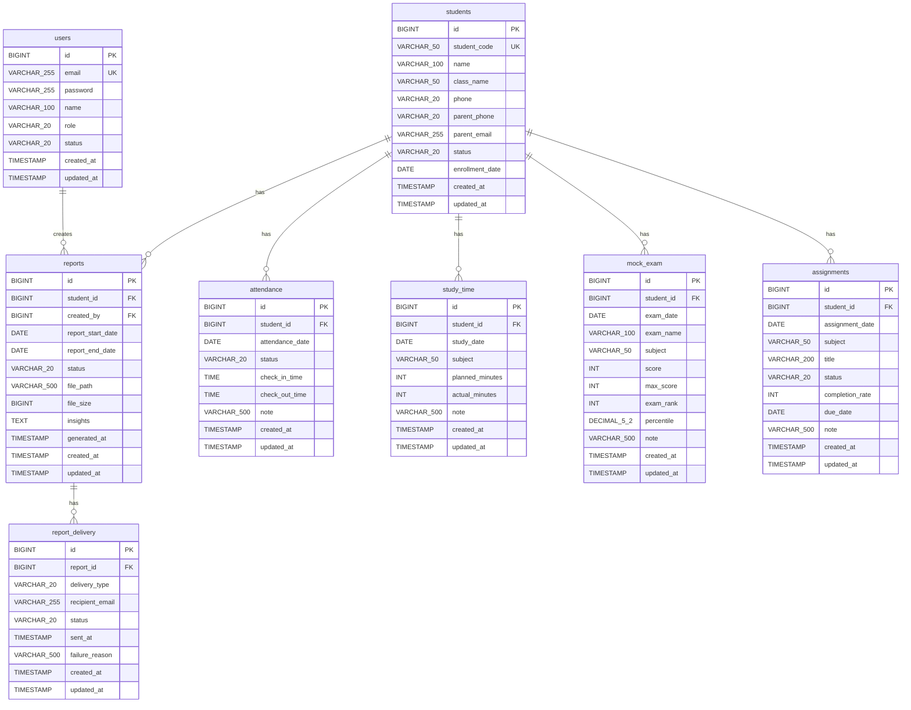
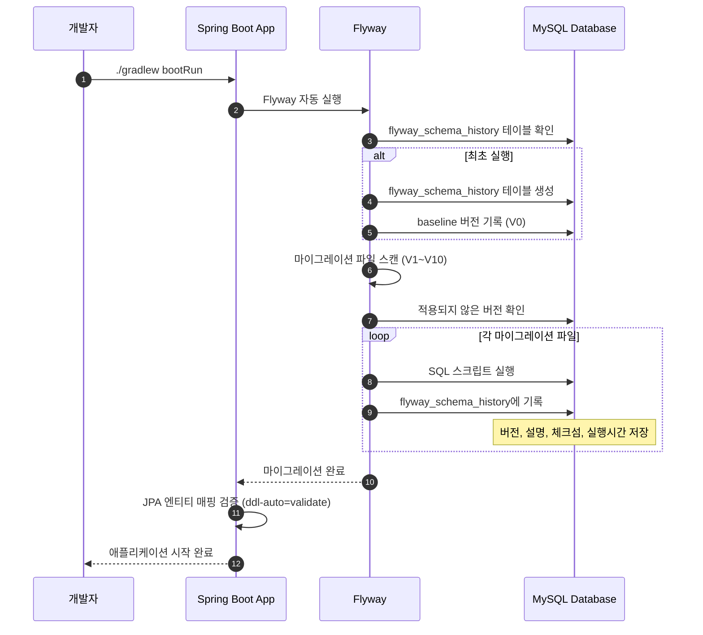

# 데이터베이스 스키마 생성 및 마이그레이션

- **Type**: Infrastructure
- **Key**: BE-INFRA-003
- **REQ / Epic**: Infrastructure Setup
- **Service**: ReAcademix Backend
- **Priority**: High
- **Dependencies**: BE-INFRA-002

## 📌 Description

SRS 문서의 데이터 모델을 기반으로 데이터베이스 스키마를 생성합니다. Flyway를 사용하여 버전 관리되는 마이그레이션 스크립트를 작성하고 실행합니다.

## ✅ Acceptance Criteria

### Flyway 설정
- [ ] Flyway 의존성 추가 (`build.gradle`)
- [ ] Flyway 설정 (`application.properties`)
- [ ] 마이그레이션 폴더 구조 생성 (`src/main/resources/db/migration`)

### 테이블 생성 스크립트
- [ ] `V1__Create_users_table.sql`
- [ ] `V2__Create_students_table.sql`
- [ ] `V3__Create_attendance_table.sql`
- [ ] `V4__Create_study_time_table.sql`
- [ ] `V5__Create_mock_exam_table.sql`
- [ ] `V6__Create_assignments_table.sql`
- [ ] `V7__Create_reports_table.sql`
- [ ] `V8__Create_report_delivery_table.sql`
- [ ] `V9__Create_indexes.sql`

### 초기 데이터
- [ ] `V10__Insert_initial_admin_user.sql`

### 검증
- [ ] 마이그레이션 실행 성공
- [ ] 모든 테이블 생성 확인
- [ ] 인덱스 생성 확인

---

## 🧩 Technical Notes

### Flyway 버전 관리 규칙

| 버전 형식 | 설명 | 예시 |
|----------|------|------|
| `V{버전}__설명.sql` | 버전 마이그레이션 | `V1__Create_users_table.sql` |
| `R__설명.sql` | 반복 가능한 마이그레이션 | `R__Create_views.sql` |
| 버전 번호 | 순차적 증가 | V1, V2, V3... |

### 네이밍 컨벤션

- 테이블명: 소문자, 복수형, snake_case (예: `users`, `mock_exam`)
- 컬럼명: 소문자, snake_case (예: `created_at`, `student_id`)
- 인덱스명: `idx_{테이블}_{컬럼}` (예: `idx_users_email`)
- 외래키명: `fk_{테이블}_{참조테이블}` (예: `fk_attendance_student`)

---

## 📊 1. ERD (전체 스키마)



---

## 💻 2. Flyway 설정

### 2.1 build.gradle 의존성 추가

```gradle
dependencies {
    // ... 기존 의존성
    
    // Flyway
    implementation 'org.flywaydb:flyway-core'
    implementation 'org.flywaydb:flyway-mysql'
}
```

### 2.2 application.properties Flyway 설정

```properties
# Flyway Configuration
spring.flyway.enabled=true
spring.flyway.locations=classpath:db/migration
spring.flyway.baseline-on-migrate=true
spring.flyway.baseline-version=0
spring.flyway.validate-on-migrate=true

# JPA ddl-auto는 validate로 설정 (Flyway가 스키마 관리)
spring.jpa.hibernate.ddl-auto=validate
```

### 2.3 폴더 구조

```
src/main/resources/
└── db/
    └── migration/
        ├── V1__Create_users_table.sql
        ├── V2__Create_students_table.sql
        ├── V3__Create_attendance_table.sql
        ├── V4__Create_study_time_table.sql
        ├── V5__Create_mock_exam_table.sql
        ├── V6__Create_assignments_table.sql
        ├── V7__Create_reports_table.sql
        ├── V8__Create_report_delivery_table.sql
        ├── V9__Create_indexes.sql
        └── V10__Insert_initial_admin_user.sql
```

---

## 📝 3. 마이그레이션 SQL 스크립트

### V1__Create_users_table.sql

```sql
-- =============================================
-- V1: users 테이블 생성
-- 시스템 사용자 (관리자, 학사관리자, 운영관리자)
-- =============================================

CREATE TABLE IF NOT EXISTS users (
    id BIGINT NOT NULL AUTO_INCREMENT,
    email VARCHAR(255) NOT NULL,
    password VARCHAR(255) NOT NULL COMMENT 'bcrypt 암호화',
    name VARCHAR(100) NOT NULL,
    role VARCHAR(20) NOT NULL DEFAULT 'ADMIN' COMMENT 'ADMIN, MANAGER, STAFF',
    status VARCHAR(20) NOT NULL DEFAULT 'ACTIVE' COMMENT 'ACTIVE, INACTIVE, SUSPENDED',
    created_at TIMESTAMP NOT NULL DEFAULT CURRENT_TIMESTAMP,
    updated_at TIMESTAMP NOT NULL DEFAULT CURRENT_TIMESTAMP ON UPDATE CURRENT_TIMESTAMP,
    
    PRIMARY KEY (id),
    UNIQUE KEY uk_users_email (email)
) ENGINE=InnoDB DEFAULT CHARSET=utf8mb4 COLLATE=utf8mb4_unicode_ci
COMMENT='시스템 사용자';
```

### V2__Create_students_table.sql

```sql
-- =============================================
-- V2: students 테이블 생성
-- 학원 재원생 정보
-- =============================================

CREATE TABLE IF NOT EXISTS students (
    id BIGINT NOT NULL AUTO_INCREMENT,
    student_code VARCHAR(50) NOT NULL COMMENT '학생 코드',
    name VARCHAR(100) NOT NULL,
    class_name VARCHAR(50) NULL COMMENT '반 이름',
    phone VARCHAR(20) NULL COMMENT '학생 연락처',
    parent_phone VARCHAR(20) NULL COMMENT '학부모 연락처',
    parent_email VARCHAR(255) NULL COMMENT '학부모 이메일 (리포트 전송용)',
    status VARCHAR(20) NOT NULL DEFAULT 'ACTIVE' COMMENT 'ACTIVE, INACTIVE, GRADUATED',
    enrollment_date DATE NULL COMMENT '입학일',
    created_at TIMESTAMP NOT NULL DEFAULT CURRENT_TIMESTAMP,
    updated_at TIMESTAMP NOT NULL DEFAULT CURRENT_TIMESTAMP ON UPDATE CURRENT_TIMESTAMP,
    
    PRIMARY KEY (id),
    UNIQUE KEY uk_students_student_code (student_code)
) ENGINE=InnoDB DEFAULT CHARSET=utf8mb4 COLLATE=utf8mb4_unicode_ci
COMMENT='학생 정보';
```

### V3__Create_attendance_table.sql

```sql
-- =============================================
-- V3: attendance 테이블 생성
-- 학생 출결 기록
-- =============================================

CREATE TABLE IF NOT EXISTS attendance (
    id BIGINT NOT NULL AUTO_INCREMENT,
    student_id BIGINT NOT NULL,
    attendance_date DATE NOT NULL COMMENT '출석 날짜',
    status VARCHAR(20) NOT NULL DEFAULT 'PRESENT' COMMENT 'PRESENT, ABSENT, LATE, EARLY_LEAVE',
    check_in_time TIME NULL COMMENT '등원 시간',
    check_out_time TIME NULL COMMENT '하원 시간',
    note VARCHAR(500) NULL COMMENT '비고',
    created_at TIMESTAMP NOT NULL DEFAULT CURRENT_TIMESTAMP,
    updated_at TIMESTAMP NOT NULL DEFAULT CURRENT_TIMESTAMP ON UPDATE CURRENT_TIMESTAMP,
    
    PRIMARY KEY (id),
    CONSTRAINT fk_attendance_student FOREIGN KEY (student_id) 
        REFERENCES students(id) ON DELETE CASCADE ON UPDATE CASCADE
) ENGINE=InnoDB DEFAULT CHARSET=utf8mb4 COLLATE=utf8mb4_unicode_ci
COMMENT='출결 기록';
```

### V4__Create_study_time_table.sql

```sql
-- =============================================
-- V4: study_time 테이블 생성
-- 과목별 학습 시간 기록
-- =============================================

CREATE TABLE IF NOT EXISTS study_time (
    id BIGINT NOT NULL AUTO_INCREMENT,
    student_id BIGINT NOT NULL,
    study_date DATE NOT NULL COMMENT '학습 날짜',
    subject VARCHAR(50) NOT NULL COMMENT '과목',
    planned_minutes INT NULL COMMENT '계획 시간(분)',
    actual_minutes INT NULL COMMENT '실제 시간(분)',
    note VARCHAR(500) NULL COMMENT '비고',
    created_at TIMESTAMP NOT NULL DEFAULT CURRENT_TIMESTAMP,
    updated_at TIMESTAMP NOT NULL DEFAULT CURRENT_TIMESTAMP ON UPDATE CURRENT_TIMESTAMP,
    
    PRIMARY KEY (id),
    CONSTRAINT fk_study_time_student FOREIGN KEY (student_id) 
        REFERENCES students(id) ON DELETE CASCADE ON UPDATE CASCADE
) ENGINE=InnoDB DEFAULT CHARSET=utf8mb4 COLLATE=utf8mb4_unicode_ci
COMMENT='학습 시간 기록';
```

### V5__Create_mock_exam_table.sql

```sql
-- =============================================
-- V5: mock_exam 테이블 생성
-- 모의고사 성적 기록
-- =============================================

CREATE TABLE IF NOT EXISTS mock_exam (
    id BIGINT NOT NULL AUTO_INCREMENT,
    student_id BIGINT NOT NULL,
    exam_date DATE NOT NULL COMMENT '시험 날짜',
    exam_name VARCHAR(100) NOT NULL COMMENT '시험명',
    subject VARCHAR(50) NOT NULL COMMENT '과목',
    score INT NOT NULL COMMENT '득점',
    max_score INT NOT NULL COMMENT '만점',
    exam_rank INT NULL COMMENT '등급/석차',
    percentile DECIMAL(5,2) NULL COMMENT '백분위',
    note VARCHAR(500) NULL COMMENT '비고',
    created_at TIMESTAMP NOT NULL DEFAULT CURRENT_TIMESTAMP,
    updated_at TIMESTAMP NOT NULL DEFAULT CURRENT_TIMESTAMP ON UPDATE CURRENT_TIMESTAMP,
    
    PRIMARY KEY (id),
    CONSTRAINT fk_mock_exam_student FOREIGN KEY (student_id) 
        REFERENCES students(id) ON DELETE CASCADE ON UPDATE CASCADE
) ENGINE=InnoDB DEFAULT CHARSET=utf8mb4 COLLATE=utf8mb4_unicode_ci
COMMENT='모의고사 성적';
```

### V6__Create_assignments_table.sql

```sql
-- =============================================
-- V6: assignments 테이블 생성
-- 과제 현황 기록
-- =============================================

CREATE TABLE IF NOT EXISTS assignments (
    id BIGINT NOT NULL AUTO_INCREMENT,
    student_id BIGINT NOT NULL,
    assignment_date DATE NOT NULL COMMENT '과제 날짜',
    subject VARCHAR(50) NOT NULL COMMENT '과목',
    title VARCHAR(200) NOT NULL COMMENT '과제명',
    status VARCHAR(20) NOT NULL DEFAULT 'NOT_STARTED' COMMENT 'NOT_STARTED, IN_PROGRESS, COMPLETED',
    completion_rate INT NULL DEFAULT 0 COMMENT '완료율 0-100',
    due_date DATE NULL COMMENT '마감일',
    note VARCHAR(500) NULL COMMENT '비고',
    created_at TIMESTAMP NOT NULL DEFAULT CURRENT_TIMESTAMP,
    updated_at TIMESTAMP NOT NULL DEFAULT CURRENT_TIMESTAMP ON UPDATE CURRENT_TIMESTAMP,
    
    PRIMARY KEY (id),
    CONSTRAINT fk_assignments_student FOREIGN KEY (student_id) 
        REFERENCES students(id) ON DELETE CASCADE ON UPDATE CASCADE
) ENGINE=InnoDB DEFAULT CHARSET=utf8mb4 COLLATE=utf8mb4_unicode_ci
COMMENT='과제 현황';
```

### V7__Create_reports_table.sql

```sql
-- =============================================
-- V7: reports 테이블 생성
-- 학생 성과 리포트
-- =============================================

CREATE TABLE IF NOT EXISTS reports (
    id BIGINT NOT NULL AUTO_INCREMENT,
    student_id BIGINT NOT NULL,
    created_by BIGINT NOT NULL COMMENT '생성자 (User.id)',
    report_start_date DATE NOT NULL COMMENT '리포트 시작일',
    report_end_date DATE NOT NULL COMMENT '리포트 종료일',
    status VARCHAR(20) NOT NULL DEFAULT 'GENERATING' COMMENT 'GENERATING, COMPLETED, FAILED',
    file_path VARCHAR(500) NULL COMMENT 'PDF 파일 경로',
    file_size BIGINT NULL COMMENT '파일 크기(bytes)',
    insights TEXT NULL COMMENT '인사이트 JSON',
    generated_at TIMESTAMP NULL COMMENT '생성 완료 시간',
    created_at TIMESTAMP NOT NULL DEFAULT CURRENT_TIMESTAMP,
    updated_at TIMESTAMP NOT NULL DEFAULT CURRENT_TIMESTAMP ON UPDATE CURRENT_TIMESTAMP,
    
    PRIMARY KEY (id),
    CONSTRAINT fk_reports_student FOREIGN KEY (student_id) 
        REFERENCES students(id) ON DELETE CASCADE ON UPDATE CASCADE,
    CONSTRAINT fk_reports_user FOREIGN KEY (created_by) 
        REFERENCES users(id) ON DELETE RESTRICT ON UPDATE CASCADE
) ENGINE=InnoDB DEFAULT CHARSET=utf8mb4 COLLATE=utf8mb4_unicode_ci
COMMENT='학생 성과 리포트';
```

### V8__Create_report_delivery_table.sql

```sql
-- =============================================
-- V8: report_delivery 테이블 생성
-- 리포트 전송 이력
-- =============================================

CREATE TABLE IF NOT EXISTS report_delivery (
    id BIGINT NOT NULL AUTO_INCREMENT,
    report_id BIGINT NOT NULL,
    delivery_type VARCHAR(20) NOT NULL COMMENT 'EMAIL, DOWNLOAD',
    recipient_email VARCHAR(255) NULL COMMENT '수신자 이메일',
    status VARCHAR(20) NOT NULL DEFAULT 'PENDING' COMMENT 'PENDING, SENT, FAILED',
    sent_at TIMESTAMP NULL COMMENT '전송 시간',
    failure_reason VARCHAR(500) NULL COMMENT '실패 사유',
    created_at TIMESTAMP NOT NULL DEFAULT CURRENT_TIMESTAMP,
    updated_at TIMESTAMP NOT NULL DEFAULT CURRENT_TIMESTAMP ON UPDATE CURRENT_TIMESTAMP,
    
    PRIMARY KEY (id),
    CONSTRAINT fk_report_delivery_report FOREIGN KEY (report_id) 
        REFERENCES reports(id) ON DELETE CASCADE ON UPDATE CASCADE
) ENGINE=InnoDB DEFAULT CHARSET=utf8mb4 COLLATE=utf8mb4_unicode_ci
COMMENT='리포트 전송 이력';
```

### V9__Create_indexes.sql

```sql
-- =============================================
-- V9: 인덱스 생성
-- 조회 성능 최적화를 위한 인덱스
-- =============================================

-- users 테이블 인덱스
CREATE INDEX idx_users_status ON users(status);
CREATE INDEX idx_users_role ON users(role);

-- students 테이블 인덱스
CREATE INDEX idx_students_name ON students(name);
CREATE INDEX idx_students_class_name ON students(class_name);
CREATE INDEX idx_students_status ON students(status);

-- attendance 테이블 인덱스
CREATE INDEX idx_attendance_student_id ON attendance(student_id);
CREATE INDEX idx_attendance_date ON attendance(attendance_date);
CREATE INDEX idx_attendance_student_date ON attendance(student_id, attendance_date);
CREATE INDEX idx_attendance_status ON attendance(status);

-- study_time 테이블 인덱스
CREATE INDEX idx_study_time_student_id ON study_time(student_id);
CREATE INDEX idx_study_time_date ON study_time(study_date);
CREATE INDEX idx_study_time_subject ON study_time(subject);
CREATE INDEX idx_study_time_student_date ON study_time(student_id, study_date);

-- mock_exam 테이블 인덱스
CREATE INDEX idx_mock_exam_student_id ON mock_exam(student_id);
CREATE INDEX idx_mock_exam_date ON mock_exam(exam_date);
CREATE INDEX idx_mock_exam_subject ON mock_exam(subject);
CREATE INDEX idx_mock_exam_student_date ON mock_exam(student_id, exam_date);

-- assignments 테이블 인덱스
CREATE INDEX idx_assignments_student_id ON assignments(student_id);
CREATE INDEX idx_assignments_date ON assignments(assignment_date);
CREATE INDEX idx_assignments_subject ON assignments(subject);
CREATE INDEX idx_assignments_status ON assignments(status);
CREATE INDEX idx_assignments_due_date ON assignments(due_date);

-- reports 테이블 인덱스
CREATE INDEX idx_reports_student_id ON reports(student_id);
CREATE INDEX idx_reports_created_by ON reports(created_by);
CREATE INDEX idx_reports_status ON reports(status);
CREATE INDEX idx_reports_date_range ON reports(report_start_date, report_end_date);
CREATE INDEX idx_reports_generated_at ON reports(generated_at);

-- report_delivery 테이블 인덱스
CREATE INDEX idx_report_delivery_report_id ON report_delivery(report_id);
CREATE INDEX idx_report_delivery_status ON report_delivery(status);
CREATE INDEX idx_report_delivery_sent_at ON report_delivery(sent_at);
```

### V10__Insert_initial_admin_user.sql

```sql
-- =============================================
-- V10: 초기 관리자 계정 생성
-- 비밀번호: Admin123! (bcrypt 해시)
-- =============================================

INSERT INTO users (email, password, name, role, status)
VALUES (
    'admin@reacademix.com',
    '$2a$10$N9qo8uLOickgx2ZMRZoMyeIjZRGdjGj/nMp2.Z0zYJ7k7.g7TqGle',  -- Admin123!
    '시스템 관리자',
    'ADMIN',
    'ACTIVE'
);

-- 테스트용 학생 데이터 (개발 환경용)
INSERT INTO students (student_code, name, class_name, phone, parent_phone, parent_email, status, enrollment_date)
VALUES 
    ('STU-2025-001', '김철수', '수능반A', '010-1234-5678', '010-8765-4321', 'parent1@test.com', 'ACTIVE', '2025-03-01'),
    ('STU-2025-002', '이영희', '수능반A', '010-2345-6789', '010-9876-5432', 'parent2@test.com', 'ACTIVE', '2025-03-01'),
    ('STU-2025-003', '박민수', '수능반B', '010-3456-7890', '010-0987-6543', 'parent3@test.com', 'ACTIVE', '2025-03-01');
```

---

## 🔄 4. 마이그레이션 실행 흐름



---

## 📝 구현 체크리스트

### 1단계: Flyway 설정
- [ ] `build.gradle`에 Flyway 의존성 추가
- [ ] `application.properties`에 Flyway 설정 추가
- [ ] `src/main/resources/db/migration` 폴더 생성

### 2단계: 마이그레이션 스크립트 작성
- [ ] `V1__Create_users_table.sql`
- [ ] `V2__Create_students_table.sql`
- [ ] `V3__Create_attendance_table.sql`
- [ ] `V4__Create_study_time_table.sql`
- [ ] `V5__Create_mock_exam_table.sql`
- [ ] `V6__Create_assignments_table.sql`
- [ ] `V7__Create_reports_table.sql`
- [ ] `V8__Create_report_delivery_table.sql`
- [ ] `V9__Create_indexes.sql`
- [ ] `V10__Insert_initial_admin_user.sql`

### 3단계: 검증
- [ ] 애플리케이션 실행
- [ ] `flyway_schema_history` 테이블 확인
- [ ] 모든 테이블 생성 확인
- [ ] 인덱스 생성 확인
- [ ] 초기 데이터 확인

---

## ⏱ 일정(Timeline)

- **Start**: 2025-12-04
- **End**: 2025-12-07
- **Lane**: Prerequisites

## 🔗 Traceability

- Related SRS: Data Model
- Related Epic: Infrastructure Setup
- Next Tasks: BE-AUTH-001, BE-COMMON-001
