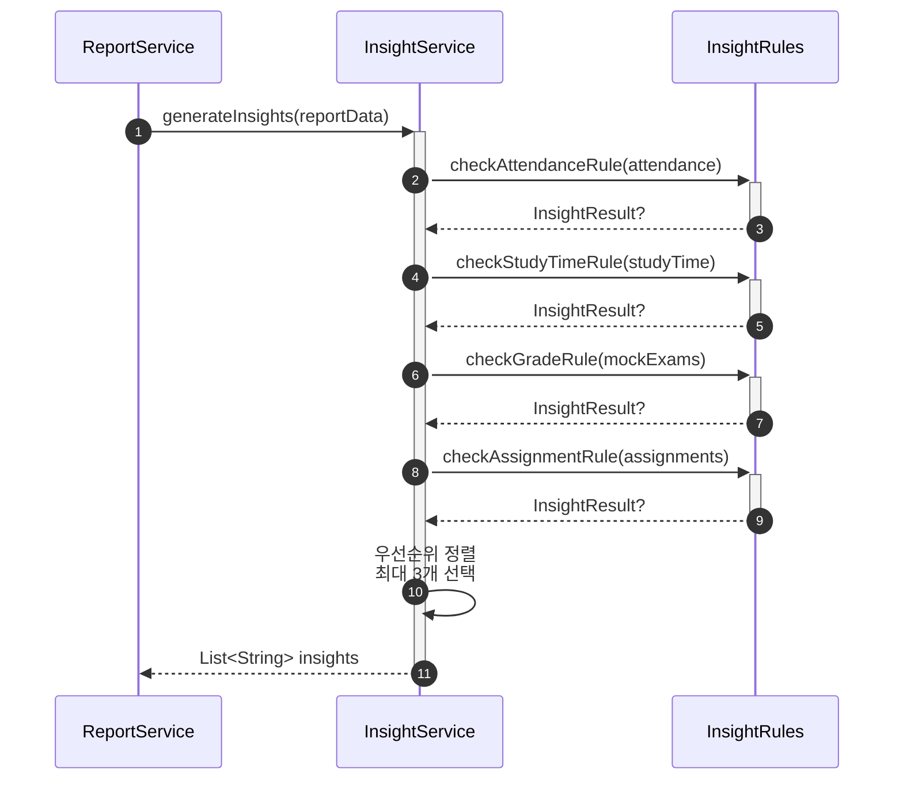

# 인사이트 자동 생성 서비스 구현

- **Type**: Functional
- **Key**: BE-INSIGHT-001
- **REQ / Epic**: REQ-FUNC-008
- **Service**: ReAcademix Backend
- **Priority**: High
- **Dependencies**: BE-DATA-001, BE-DATA-002, BE-DATA-003, BE-DATA-004

## 📌 Description

템플릿 기반 규칙 엔진을 사용하여 인사이트를 자동 생성하는 서비스를 구현합니다. LLM 없이 규칙 기반으로 최대 3개의 인사이트를 생성합니다.

## ✅ Acceptance Criteria

### Service 구현
- [ ] `InsightService` 클래스 생성
- [ ] `generateInsights(reportData)` 메서드 구현

### 규칙 엔진
- [ ] 출석률 인사이트 규칙
- [ ] 학습 시간 인사이트 규칙
- [ ] 성적 추이 인사이트 규칙
- [ ] 과제 완료도 인사이트 규칙

### 성능 및 테스트
- [ ] 처리 시간 1초 이내
- [ ] 최대 3개 인사이트 반환
- [ ] 단위 테스트 작성

---

## 🔄 Sequence Diagram



---

## 💻 구현 코드

### InsightService.java

```java
package com.reacademix.reacademix_backend.service;

import com.reacademix.reacademix_backend.dto.report.ReportDataDto;
import lombok.extern.slf4j.Slf4j;
import org.springframework.stereotype.Service;

import java.util.ArrayList;
import java.util.Comparator;
import java.util.List;
import java.util.Optional;

@Slf4j
@Service
public class InsightService {

    private static final int MAX_INSIGHTS = 3;

    /**
     * 템플릿 기반 인사이트 생성
     */
    public List<String> generateInsights(ReportDataDto reportData) {
        log.info("인사이트 생성 시작: student={}", reportData.getStudentName());

        List<InsightResult> candidates = new ArrayList<>();

        // 1. 출석률 인사이트
        checkAttendanceInsight(reportData.getAttendance()).ifPresent(candidates::add);

        // 2. 학습 시간 인사이트
        checkStudyTimeInsight(reportData.getStudyTime()).ifPresent(candidates::add);

        // 3. 성적 인사이트
        checkGradeInsight(reportData.getMockExams()).ifPresent(candidates::add);

        // 4. 과제 완료도 인사이트
        checkAssignmentInsight(reportData.getAssignment()).ifPresent(candidates::add);

        // 우선순위 정렬 후 최대 3개 선택
        List<String> insights = candidates.stream()
            .sorted(Comparator.comparingInt(InsightResult::priority).reversed())
            .limit(MAX_INSIGHTS)
            .map(InsightResult::message)
            .toList();

        log.info("인사이트 생성 완료: count={}", insights.size());
        return insights;
    }

    private Optional<InsightResult> checkAttendanceInsight(ReportDataDto.AttendanceSummary attendance) {
        if (attendance == null) return Optional.empty();

        double rate = attendance.getAttendanceRate();

        if (rate >= 95) {
            return Optional.of(new InsightResult(
                "🎉 출석률이 " + rate + "%로 매우 우수합니다! 꾸준한 학습 습관을 유지하세요.",
                90
            ));
        } else if (rate >= 80) {
            return Optional.of(new InsightResult(
                "📅 출석률이 " + rate + "%입니다. 조금만 더 노력하면 출석 우수자가 될 수 있어요!",
                60
            ));
        } else if (rate < 70) {
            return Optional.of(new InsightResult(
                "⚠️ 출석률이 " + rate + "%로 낮습니다. 규칙적인 등원이 학습 효과를 높이는 첫걸음입니다.",
                100
            ));
        }
        return Optional.empty();
    }

    private Optional<InsightResult> checkStudyTimeInsight(ReportDataDto.StudyTimeSummary studyTime) {
        if (studyTime == null) return Optional.empty();

        double completionRate = studyTime.getCompletionRate();

        if (completionRate >= 100) {
            return Optional.of(new InsightResult(
                "📚 학습 시간 목표를 " + (int)(completionRate) + "% 달성했습니다! 훌륭해요!",
                85
            ));
        } else if (completionRate >= 80) {
            return Optional.of(new InsightResult(
                "📖 학습 시간 달성률이 " + (int)(completionRate) + "%입니다. 조금만 더 집중해보세요!",
                50
            ));
        } else if (completionRate < 50) {
            return Optional.of(new InsightResult(
                "⏰ 학습 시간 달성률이 " + (int)(completionRate) + "%로 목표에 미치지 못했습니다. 학습 계획을 재점검해보세요.",
                95
            ));
        }
        return Optional.empty();
    }

    private Optional<InsightResult> checkGradeInsight(List<ReportDataDto.MockExamResult> exams) {
        if (exams == null || exams.size() < 2) return Optional.empty();

        // 최근 시험과 이전 시험 비교
        ReportDataDto.MockExamResult latest = exams.get(0);
        ReportDataDto.MockExamResult previous = exams.get(1);

        double diff = latest.getScoreRate() - previous.getScoreRate();

        if (diff >= 10) {
            return Optional.of(new InsightResult(
                "📈 최근 모의고사에서 성적이 크게 향상되었습니다! (+%d점) 이 기세를 유지하세요!".formatted((int)diff),
                88
            ));
        } else if (diff <= -10) {
            return Optional.of(new InsightResult(
                "📉 최근 모의고사 성적이 다소 하락했습니다. 취약 과목을 집중적으로 보강해보세요.",
                92
            ));
        }
        return Optional.empty();
    }

    private Optional<InsightResult> checkAssignmentInsight(ReportDataDto.AssignmentSummary assignment) {
        if (assignment == null) return Optional.empty();

        double completionRate = assignment.getCompletionRate();

        if (completionRate >= 90) {
            return Optional.of(new InsightResult(
                "✅ 과제 완료율이 " + (int)(completionRate) + "%로 매우 성실합니다!",
                80
            ));
        } else if (completionRate < 50) {
            return Optional.of(new InsightResult(
                "📝 과제 완료율이 " + (int)(completionRate) + "%입니다. 과제를 통한 복습이 실력 향상의 지름길입니다.",
                85
            ));
        }
        return Optional.empty();
    }

    /**
     * 인사이트 결과 (메시지 + 우선순위)
     */
    private record InsightResult(String message, int priority) {}
}
```

---

## 📝 인사이트 규칙 목록

| 조건 | 인사이트 메시지 | 우선순위 |
|------|----------------|---------|
| 출석률 ≥ 95% | 출석률 우수 칭찬 | 90 |
| 출석률 < 70% | 출석률 개선 권고 | 100 |
| 학습시간 달성률 ≥ 100% | 목표 달성 칭찬 | 85 |
| 학습시간 달성률 < 50% | 학습 계획 재점검 권고 | 95 |
| 성적 10점 이상 상승 | 성적 향상 칭찬 | 88 |
| 성적 10점 이상 하락 | 취약 과목 보강 권고 | 92 |
| 과제 완료율 ≥ 90% | 성실함 칭찬 | 80 |
| 과제 완료율 < 50% | 과제 완료 권고 | 85 |

---

## ⏱ 일정(Timeline)

- **Start**: 2025-12-12
- **End**: 2025-12-16
- **Lane**: AI Engine

## 🔗 Traceability

- Related SRS: REQ-FUNC-008
- Related Epic: Report Generation
