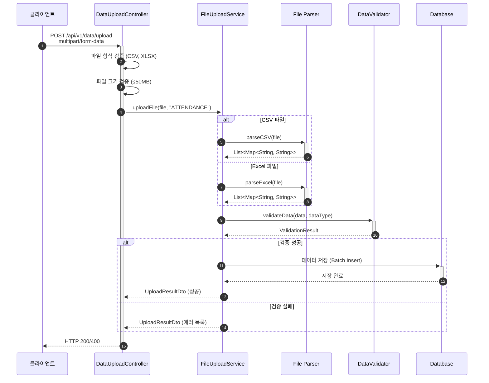

# 파일 업로드 처리 서비스 구현

- **Type**: Functional
- **Key**: BE-INTEGRATION-001
- **REQ / Epic**: REQ-FUNC-015
- **Service**: ReAcademix Backend
- **Priority**: High
- **Dependencies**: BE-INFRA-001

## 📌 Description

CSV/Excel 파일을 업로드받아 파싱하는 서비스를 구현합니다. 출석, 학습시간, 모의고사 성적 등의 데이터를 파일로 일괄 업로드할 수 있습니다.

## ✅ Acceptance Criteria

### 의존성 추가
- [ ] Apache POI 의존성 (Excel 파싱)
- [ ] OpenCSV 의존성 (CSV 파싱)

### Service 구현
- [ ] `FileUploadService` 클래스 생성
- [ ] `uploadFile(file, dataType)` 메서드 구현
- [ ] CSV 파일 파싱
- [ ] Excel 파일 파싱 (.xlsx, .xls)

### 검증 및 에러 처리
- [ ] 파일 형식 검증
- [ ] 파일 크기 검증 (최대 50MB)
- [ ] 데이터 형식 검증

### 성능 및 테스트
- [ ] 처리 시간 10초 이내 (50MB 기준)
- [ ] 단위 테스트 작성

---

## 🔄 Sequence Diagram



---

## 💻 구현 코드

### build.gradle 의존성

```gradle
dependencies {
    // File Parsing
    implementation 'org.apache.poi:poi-ooxml:5.2.5'
    implementation 'com.opencsv:opencsv:5.9'
}
```

### FileUploadService.java

```java
package com.reacademix.reacademix_backend.service;

import com.opencsv.CSVReader;
import com.opencsv.CSVReaderBuilder;
import com.reacademix.reacademix_backend.exception.BusinessException;
import com.reacademix.reacademix_backend.exception.ErrorCode;
import lombok.RequiredArgsConstructor;
import lombok.extern.slf4j.Slf4j;
import org.apache.poi.ss.usermodel.*;
import org.apache.poi.xssf.usermodel.XSSFWorkbook;
import org.springframework.stereotype.Service;
import org.springframework.web.multipart.MultipartFile;

import java.io.*;
import java.util.*;

@Slf4j
@Service
@RequiredArgsConstructor
public class FileUploadService {

    private static final long MAX_FILE_SIZE = 50 * 1024 * 1024; // 50MB
    private static final Set<String> ALLOWED_EXTENSIONS = Set.of("csv", "xlsx", "xls");

    /**
     * 파일 업로드 및 파싱
     */
    public UploadResult uploadFile(MultipartFile file, String dataType) {
        log.info("파일 업로드 시작: name={}, size={}, type={}", 
            file.getOriginalFilename(), file.getSize(), dataType);

        // 1. 파일 검증
        validateFile(file);

        // 2. 파일 파싱
        List<Map<String, String>> data = parseFile(file);
        
        log.info("파일 파싱 완료: rows={}", data.size());

        // 3. 데이터 타입별 처리
        return processData(data, dataType);
    }

    private void validateFile(MultipartFile file) {
        if (file.isEmpty()) {
            throw new BusinessException(ErrorCode.VALIDATION_001, "파일이 비어있습니다.");
        }

        if (file.getSize() > MAX_FILE_SIZE) {
            throw new BusinessException(ErrorCode.VALIDATION_001, "파일 크기가 50MB를 초과합니다.");
        }

        String extension = getFileExtension(file.getOriginalFilename());
        if (!ALLOWED_EXTENSIONS.contains(extension.toLowerCase())) {
            throw new BusinessException(ErrorCode.VALIDATION_001, "지원하지 않는 파일 형식입니다.");
        }
    }

    private List<Map<String, String>> parseFile(MultipartFile file) {
        String extension = getFileExtension(file.getOriginalFilename());
        
        try {
            if ("csv".equalsIgnoreCase(extension)) {
                return parseCSV(file);
            } else {
                return parseExcel(file);
            }
        } catch (Exception e) {
            log.error("파일 파싱 실패: {}", e.getMessage());
            throw new BusinessException(ErrorCode.BUSINESS_003, "파일 파싱에 실패했습니다.");
        }
    }

    private List<Map<String, String>> parseCSV(MultipartFile file) throws Exception {
        List<Map<String, String>> result = new ArrayList<>();
        
        try (Reader reader = new InputStreamReader(file.getInputStream(), "UTF-8");
             CSVReader csvReader = new CSVReaderBuilder(reader).build()) {
            
            String[] headers = csvReader.readNext();
            if (headers == null) return result;

            String[] row;
            while ((row = csvReader.readNext()) != null) {
                Map<String, String> rowData = new LinkedHashMap<>();
                for (int i = 0; i < headers.length && i < row.length; i++) {
                    rowData.put(headers[i].trim(), row[i].trim());
                }
                result.add(rowData);
            }
        }
        return result;
    }

    private List<Map<String, String>> parseExcel(MultipartFile file) throws Exception {
        List<Map<String, String>> result = new ArrayList<>();
        
        try (Workbook workbook = new XSSFWorkbook(file.getInputStream())) {
            Sheet sheet = workbook.getSheetAt(0);
            
            Row headerRow = sheet.getRow(0);
            if (headerRow == null) return result;

            List<String> headers = new ArrayList<>();
            for (Cell cell : headerRow) {
                headers.add(getCellValue(cell));
            }

            for (int i = 1; i <= sheet.getLastRowNum(); i++) {
                Row row = sheet.getRow(i);
                if (row == null) continue;

                Map<String, String> rowData = new LinkedHashMap<>();
                for (int j = 0; j < headers.size(); j++) {
                    Cell cell = row.getCell(j);
                    rowData.put(headers.get(j), cell != null ? getCellValue(cell) : "");
                }
                result.add(rowData);
            }
        }
        return result;
    }

    private String getCellValue(Cell cell) {
        return switch (cell.getCellType()) {
            case STRING -> cell.getStringCellValue();
            case NUMERIC -> String.valueOf((long) cell.getNumericCellValue());
            case BOOLEAN -> String.valueOf(cell.getBooleanCellValue());
            default -> "";
        };
    }

    private String getFileExtension(String filename) {
        if (filename == null) return "";
        int dotIndex = filename.lastIndexOf('.');
        return dotIndex > 0 ? filename.substring(dotIndex + 1) : "";
    }

    private UploadResult processData(List<Map<String, String>> data, String dataType) {
        // 데이터 타입별 처리 로직
        // BE-INTEGRATION-002 (검증)에서 상세 구현
        return UploadResult.builder()
            .success(true)
            .totalRows(data.size())
            .processedRows(data.size())
            .build();
    }

    @lombok.Getter
    @lombok.Builder
    public static class UploadResult {
        private boolean success;
        private int totalRows;
        private int processedRows;
        private List<String> errors;
    }
}
```

---

## 📝 구현 체크리스트

- [ ] 의존성 추가 (POI, OpenCSV)
- [ ] `FileUploadService` 구현
- [ ] CSV 파싱 구현
- [ ] Excel 파싱 구현
- [ ] 파일 검증 구현
- [ ] 테스트 작성

---

## ⏱ 일정(Timeline)

- **Start**: 2025-11-30
- **End**: 2025-12-04
- **Lane**: Backend Core

## 🔗 Traceability

- Related SRS: REQ-FUNC-015
- Related Epic: Data Integration
