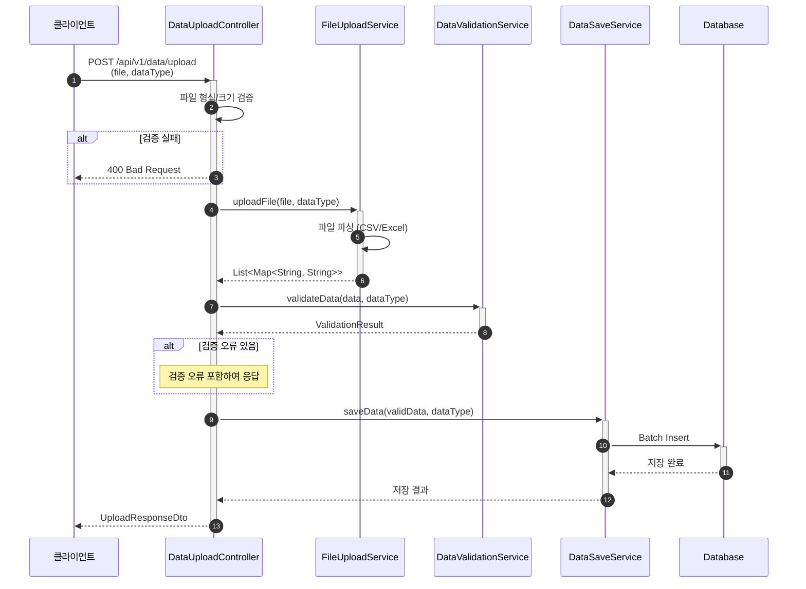

# 파일 업로드 데이터 수집 API 구현

- **Type**: Functional
- **Key**: BE-INTEGRATION-003
- **REQ / Epic**: REQ-FUNC-015
- **Service**: ReAcademix Backend
- **Priority**: High
- **Dependencies**: BE-AUTH-002, BE-INTEGRATION-001, BE-INTEGRATION-002

## 📌 Description

CSV/Excel 파일을 업로드하여 데이터를 수집하는 API를 구현합니다. 출석, 학습시간, 성적 등의 데이터를 파일로 일괄 등록할 수 있습니다.

## ✅ Acceptance Criteria

### API 구현
- [ ] `POST /api/v1/data/upload` 엔드포인트 구현
- [ ] `multipart/form-data` 요청 처리
- [ ] 파일 형식 및 크기 검증

### 처리 로직
- [ ] 파일 파싱 → 데이터 검증 → 저장
- [ ] 검증 오류 상세 반환
- [ ] 부분 성공 처리 (일부 행만 성공)

### 테스트
- [ ] 단위 테스트 작성
- [ ] 통합 테스트 작성

---

## 📋 API 명세서

| 항목 | 내용 |
|------|------|
| **HTTP Method** | `POST` |
| **URI** | `/api/v1/data/upload` |
| **Content-Type** | `multipart/form-data` |
| **인증 필요** | ✅ |

### Request (Form Data)

| 파라미터 | 타입 | 필수 | 설명 |
|---------|------|------|------|
| file | File | ✅ | CSV/Excel 파일 |
| dataType | String | ✅ | 데이터 타입 (ATTENDANCE, STUDY_TIME, MOCK_EXAM, ASSIGNMENT) |

### Response Body (200 OK)

```json
{
  "success": true,
  "data": {
    "uploadId": "upload-abc123",
    "status": "COMPLETED",
    "totalRows": 100,
    "validRows": 98,
    "invalidRows": 2,
    "errors": [
      {
        "rowNumber": 15,
        "field": "score",
        "value": "abc",
        "message": "점수는 숫자여야 합니다."
      }
    ]
  }
}
```

---

## 🔄 Sequence Diagram



---

## 💻 구현 코드

### DataUploadController.java

```java
@Tag(name = "Data", description = "데이터 수집 API")
@RestController
@RequestMapping("/api/v1/data")
@RequiredArgsConstructor
@Slf4j
public class DataUploadController {

    private final FileUploadService fileUploadService;
    private final DataValidationService validationService;
    private final DataSaveService dataSaveService;

    @PostMapping(value = "/upload", consumes = MediaType.MULTIPART_FORM_DATA_VALUE)
    @Operation(summary = "파일 업로드", description = "CSV/Excel 파일로 데이터를 업로드합니다.")
    public ResponseEntity<ApiResponse<UploadResponseDto>> uploadFile(
            @RequestParam("file") MultipartFile file,
            @RequestParam("dataType") String dataType) {

        log.info("파일 업로드 요청: name={}, size={}, type={}",
            file.getOriginalFilename(), file.getSize(), dataType);

        // 1. 파일 파싱
        List<Map<String, String>> data = fileUploadService.parseFile(file);

        // 2. 데이터 검증
        ValidationResult validation = validationService.validateData(data, dataType);

        // 3. 유효한 데이터 저장
        int savedCount = 0;
        if (validation.getValidRows() > 0) {
            savedCount = dataSaveService.saveData(
                filterValidRows(data, validation), dataType);
        }

        // 4. 응답 생성
        UploadResponseDto response = UploadResponseDto.builder()
            .uploadId(UUID.randomUUID().toString())
            .status(validation.isValid() ? "COMPLETED" : "COMPLETED_WITH_ERRORS")
            .totalRows(validation.getTotalRows())
            .validRows(validation.getValidRows())
            .invalidRows(validation.getInvalidRows())
            .savedRows(savedCount)
            .errors(validation.getErrors().stream()
                .map(this::toErrorDto)
                .collect(Collectors.toList()))
            .build();

        return ResponseEntity.ok(ApiResponse.success(response));
    }
}
```

### UploadResponseDto.java

```java
@Getter
@Builder
public class UploadResponseDto {
    private String uploadId;
    private String status;
    private int totalRows;
    private int validRows;
    private int invalidRows;
    private int savedRows;
    private List<UploadErrorDto> errors;

    @Getter
    @Builder
    public static class UploadErrorDto {
        private int rowNumber;
        private String field;
        private String value;
        private String message;
    }
}
```

---

## ⏱ 일정(Timeline)

- **Start**: 2025-12-15
- **End**: 2025-12-18
- **Lane**: Backend Core

## 🔗 Traceability

- Related SRS: REQ-FUNC-015
- Related Epic: Data Integration
