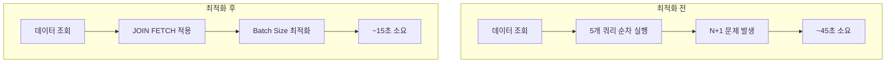

# 리포트 생성 성능 최적화

- **Type**: Non-Functional
- **Key**: BE-PERF-001
- **REQ / Epic**: REQ-NF-001
- **Service**: ReAcademix Backend
- **Priority**: High
- **Dependencies**: BE-REPORT-003

## 📌 Description

리포트 생성 성능을 최적화하여 30초 이내에 완료되도록 합니다. 비동기 처리와 쿼리 최적화를 적용합니다.

## ✅ Acceptance Criteria

### 성능 모니터링
- [ ] 리포트 생성 시간 측정 및 로깅
- [ ] 단계별 소요 시간 측정

### 쿼리 최적화
- [ ] N+1 쿼리 문제 해결
- [ ] Batch Fetch Size 설정
- [ ] 필요한 필드만 조회 (Projection)

### 비동기 처리
- [ ] `@Async` 적용
- [ ] ThreadPool 설정

### 목표 달성
- [ ] 리포트 생성 30초 이내
- [ ] 95% 이상 성공률

---

## 🔄 성능 개선 포인트



---

## 💻 구현 코드

### AsyncConfig.java

```java
package com.reacademix.reacademix_backend.config;

import org.springframework.context.annotation.Bean;
import org.springframework.context.annotation.Configuration;
import org.springframework.scheduling.annotation.EnableAsync;
import org.springframework.scheduling.concurrent.ThreadPoolTaskExecutor;

import java.util.concurrent.Executor;

@Configuration
@EnableAsync
public class AsyncConfig {

    @Bean(name = "reportGenerationExecutor")
    public Executor reportGenerationExecutor() {
        ThreadPoolTaskExecutor executor = new ThreadPoolTaskExecutor();
        executor.setCorePoolSize(5);
        executor.setMaxPoolSize(10);
        executor.setQueueCapacity(25);
        executor.setThreadNamePrefix("ReportGen-");
        executor.initialize();
        return executor;
    }
}
```

### application.properties (JPA 최적화)

```properties
# JPA Performance
spring.jpa.properties.hibernate.default_batch_fetch_size=100
spring.jpa.properties.hibernate.jdbc.batch_size=50
spring.jpa.properties.hibernate.order_inserts=true
spring.jpa.properties.hibernate.order_updates=true
```

### ReportService.java (최적화)

```java
@Async("reportGenerationExecutor")
@Transactional
public void generateReportAsync(Long reportId) {
    log.info("비동기 리포트 생성 시작: reportId={}", reportId);
    
    StopWatch stopWatch = new StopWatch();
    stopWatch.start("데이터 수집");

    Report report = reportRepository.findByIdWithStudent(reportId)
        .orElseThrow();

    // 병렬 데이터 수집
    CompletableFuture<AttendanceDataDto> attendanceFuture = 
        CompletableFuture.supplyAsync(() -> 
            attendanceService.getAttendanceData(studentId, startDate, endDate));
    
    CompletableFuture<StudyTimeDataDto> studyTimeFuture = 
        CompletableFuture.supplyAsync(() -> 
            studyTimeService.getStudyTimeData(studentId, startDate, endDate));

    // 모든 데이터 수집 완료 대기
    CompletableFuture.allOf(attendanceFuture, studyTimeFuture).join();

    stopWatch.stop();
    log.info("데이터 수집 완료: {}ms", stopWatch.getLastTaskTimeMillis());

    // ... 나머지 처리
}
```

---

## 📊 성능 목표

| 항목 | 목표 | 측정 방법 |
|------|------|----------|
| 리포트 생성 시간 | ≤ 30초 | 로그 타임스탬프 |
| 성공률 | ≥ 95% | 성공/실패 카운트 |
| 데이터 조회 | ≤ 5초 | StopWatch |
| PDF 생성 | ≤ 20초 | StopWatch |

---

## ⏱ 일정(Timeline)

- **Start**: 2025-12-25
- **End**: 2025-12-29
- **Lane**: NFR

## 🔗 Traceability

- Related SRS: REQ-NF-001
- Related Epic: Performance
