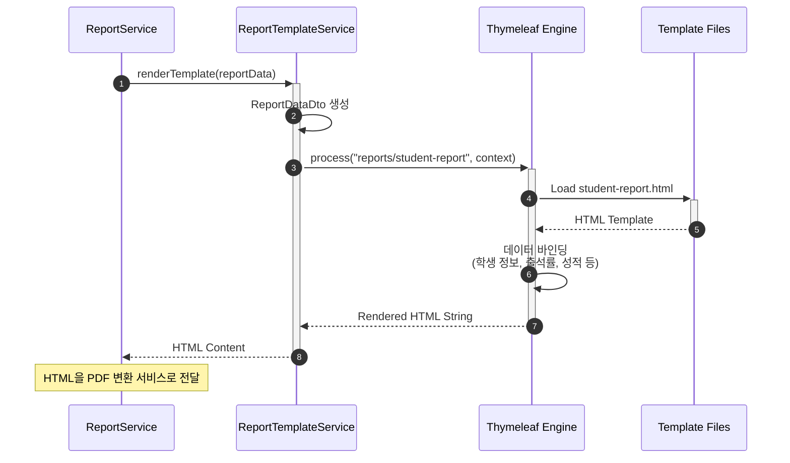

# 리포트 템플릿 기본 설정 및 렌더링

- **Type**: Functional
- **Key**: BE-REPORT-001
- **REQ / Epic**: REQ-FUNC-038
- **Service**: ReAcademix Backend
- **Priority**: High
- **Dependencies**: BE-INFRA-001

## 📌 Description

리포트 템플릿을 로드하고 데이터를 적용하여 HTML을 렌더링하는 서비스를 구현합니다. Thymeleaf 템플릿 엔진을 사용하여 학생 성과 리포트 HTML을 생성합니다.

## ✅ Acceptance Criteria

### 템플릿 설정
- [ ] Thymeleaf 의존성 추가
- [ ] 템플릿 폴더 구조 생성 (`src/main/resources/templates/reports`)
- [ ] 리포트 기본 템플릿 파일 생성 (`student-report.html`)
- [ ] 리포트 스타일 CSS 생성 (`report-style.css`)

### 템플릿 렌더링 서비스
- [ ] `ReportTemplateService` 클래스 생성
- [ ] `renderTemplate(ReportData)` 메서드 구현
- [ ] 리포트 데이터 모델 정의 (`ReportDataDto`)

### 에러 처리
- [ ] 템플릿 파일 없을 시 에러 반환
- [ ] 데이터 바인딩 오류 시 에러 반환

### 성능 및 테스트
- [ ] 템플릿 렌더링 시간 1초 이내
- [ ] 단위 테스트 작성

---

## 🔄 Sequence Diagram



---

## 💻 구현 코드

### build.gradle 의존성

```gradle
dependencies {
    // Thymeleaf
    implementation 'org.springframework.boot:spring-boot-starter-thymeleaf'
}
```

### ReportDataDto.java

```java
package com.reacademix.reacademix_backend.dto.report;

import lombok.AllArgsConstructor;
import lombok.Builder;
import lombok.Getter;
import lombok.NoArgsConstructor;

import java.time.LocalDate;
import java.util.List;

/**
 * 리포트 데이터 DTO
 * 템플릿에 바인딩될 모든 데이터를 담는 객체
 */
@Getter
@Builder
@NoArgsConstructor
@AllArgsConstructor
public class ReportDataDto {

    // 기본 정보
    private String studentName;
    private String studentCode;
    private String className;
    private LocalDate reportStartDate;
    private LocalDate reportEndDate;
    private LocalDate generatedDate;

    // 출석 정보
    private AttendanceSummary attendance;

    // 학습 시간
    private StudyTimeSummary studyTime;

    // 모의고사 성적
    private List<MockExamResult> mockExams;

    // 과제 현황
    private AssignmentSummary assignment;

    // 인사이트
    private List<String> insights;

    @Getter
    @Builder
    public static class AttendanceSummary {
        private int totalDays;
        private int presentDays;
        private int absentDays;
        private int lateDays;
        private double attendanceRate;
    }

    @Getter
    @Builder
    public static class StudyTimeSummary {
        private int totalPlannedMinutes;
        private int totalActualMinutes;
        private double completionRate;
        private List<SubjectStudyTime> bySubject;
    }

    @Getter
    @Builder
    public static class SubjectStudyTime {
        private String subject;
        private int plannedMinutes;
        private int actualMinutes;
    }

    @Getter
    @Builder
    public static class MockExamResult {
        private LocalDate examDate;
        private String examName;
        private String subject;
        private int score;
        private int maxScore;
        private Integer rank;
        private double scoreRate;
    }

    @Getter
    @Builder
    public static class AssignmentSummary {
        private int totalCount;
        private int completedCount;
        private int inProgressCount;
        private int notStartedCount;
        private double completionRate;
    }
}
```

### ReportTemplateService.java

```java
package com.reacademix.reacademix_backend.service;

import com.reacademix.reacademix_backend.dto.report.ReportDataDto;
import com.reacademix.reacademix_backend.exception.BusinessException;
import com.reacademix.reacademix_backend.exception.ErrorCode;
import lombok.RequiredArgsConstructor;
import lombok.extern.slf4j.Slf4j;
import org.springframework.stereotype.Service;
import org.thymeleaf.TemplateEngine;
import org.thymeleaf.context.Context;

import java.util.Locale;

/**
 * 리포트 템플릿 렌더링 서비스
 */
@Slf4j
@Service
@RequiredArgsConstructor
public class ReportTemplateService {

    private final TemplateEngine templateEngine;
    
    private static final String STUDENT_REPORT_TEMPLATE = "reports/student-report";

    /**
     * 리포트 HTML 렌더링
     * 
     * @param reportData 리포트 데이터
     * @return 렌더링된 HTML 문자열
     */
    public String renderTemplate(ReportDataDto reportData) {
        log.info("리포트 템플릿 렌더링 시작: student={}", reportData.getStudentName());
        
        long startTime = System.currentTimeMillis();
        
        try {
            Context context = new Context(Locale.KOREA);
            context.setVariable("report", reportData);
            
            String html = templateEngine.process(STUDENT_REPORT_TEMPLATE, context);
            
            long duration = System.currentTimeMillis() - startTime;
            log.info("리포트 템플릿 렌더링 완료: {}ms", duration);
            
            if (duration > 1000) {
                log.warn("템플릿 렌더링 시간 초과: {}ms (목표: 1000ms)", duration);
            }
            
            return html;
            
        } catch (Exception e) {
            log.error("템플릿 렌더링 실패: {}", e.getMessage(), e);
            throw new BusinessException(ErrorCode.BUSINESS_001, "리포트 템플릿 렌더링에 실패했습니다.");
        }
    }
}
```

### student-report.html (템플릿)

```html
<!DOCTYPE html>
<html xmlns:th="http://www.thymeleaf.org" lang="ko">
<head>
    <meta charset="UTF-8"/>
    <title>학생 성과 리포트</title>
    <style th:inline="text">
        /* PDF 변환을 위한 인라인 스타일 */
        body { font-family: 'Noto Sans KR', sans-serif; margin: 0; padding: 20px; }
        .header { text-align: center; border-bottom: 2px solid #333; padding-bottom: 20px; }
        .section { margin: 30px 0; }
        .section-title { font-size: 18px; font-weight: bold; color: #2c3e50; border-left: 4px solid #3498db; padding-left: 10px; }
        .summary-box { background: #f8f9fa; padding: 15px; border-radius: 8px; margin: 15px 0; }
        .stat-item { display: inline-block; width: 23%; text-align: center; padding: 10px; }
        .stat-value { font-size: 24px; font-weight: bold; color: #3498db; }
        .stat-label { font-size: 12px; color: #666; }
        table { width: 100%; border-collapse: collapse; margin: 15px 0; }
        th, td { border: 1px solid #ddd; padding: 10px; text-align: left; }
        th { background: #3498db; color: white; }
        .insight-box { background: #e8f4fd; padding: 15px; border-radius: 8px; margin: 10px 0; }
        .insight-item { margin: 10px 0; padding-left: 20px; position: relative; }
        .insight-item::before { content: "💡"; position: absolute; left: 0; }
    </style>
</head>
<body>
    <!-- 헤더 -->
    <div class="header">
        <h1>학생 성과 리포트</h1>
        <p th:text="${report.studentName} + ' (' + ${report.studentCode} + ')'">김철수 (STU-2025-001)</p>
        <p th:text="${report.className}">수능반A</p>
        <p th:text="'기간: ' + ${#temporals.format(report.reportStartDate, 'yyyy.MM.dd')} + ' ~ ' + ${#temporals.format(report.reportEndDate, 'yyyy.MM.dd')}">
            기간: 2025.01.01 ~ 2025.01.31
        </p>
    </div>

    <!-- 출석 현황 -->
    <div class="section">
        <h2 class="section-title">📅 출석 현황</h2>
        <div class="summary-box">
            <div class="stat-item">
                <div class="stat-value" th:text="${report.attendance.attendanceRate} + '%'">95%</div>
                <div class="stat-label">출석률</div>
            </div>
            <div class="stat-item">
                <div class="stat-value" th:text="${report.attendance.presentDays}">19</div>
                <div class="stat-label">출석일</div>
            </div>
            <div class="stat-item">
                <div class="stat-value" th:text="${report.attendance.absentDays}">1</div>
                <div class="stat-label">결석일</div>
            </div>
            <div class="stat-item">
                <div class="stat-value" th:text="${report.attendance.lateDays}">0</div>
                <div class="stat-label">지각</div>
            </div>
        </div>
    </div>

    <!-- 학습 시간 -->
    <div class="section">
        <h2 class="section-title">⏱️ 학습 시간</h2>
        <div class="summary-box">
            <p>계획 대비 달성률: <strong th:text="${report.studyTime.completionRate} + '%'">85%</strong></p>
        </div>
        <table>
            <thead>
                <tr>
                    <th>과목</th>
                    <th>계획 시간</th>
                    <th>실제 시간</th>
                    <th>달성률</th>
                </tr>
            </thead>
            <tbody>
                <tr th:each="subject : ${report.studyTime.bySubject}">
                    <td th:text="${subject.subject}">국어</td>
                    <td th:text="${subject.plannedMinutes / 60} + '시간'">10시간</td>
                    <td th:text="${subject.actualMinutes / 60} + '시간'">9시간</td>
                    <td th:text="${subject.plannedMinutes > 0 ? (subject.actualMinutes * 100 / subject.plannedMinutes) : 0} + '%'">90%</td>
                </tr>
            </tbody>
        </table>
    </div>

    <!-- 모의고사 성적 -->
    <div class="section" th:if="${not #lists.isEmpty(report.mockExams)}">
        <h2 class="section-title">📊 모의고사 성적</h2>
        <table>
            <thead>
                <tr>
                    <th>시험명</th>
                    <th>과목</th>
                    <th>점수</th>
                    <th>등급</th>
                </tr>
            </thead>
            <tbody>
                <tr th:each="exam : ${report.mockExams}">
                    <td th:text="${exam.examName}">3월 모의고사</td>
                    <td th:text="${exam.subject}">국어</td>
                    <td th:text="${exam.score} + '/' + ${exam.maxScore}">85/100</td>
                    <td th:text="${exam.rank != null ? exam.rank + '등급' : '-'}">2등급</td>
                </tr>
            </tbody>
        </table>
    </div>

    <!-- 과제 현황 -->
    <div class="section">
        <h2 class="section-title">📝 과제 현황</h2>
        <div class="summary-box">
            <p>과제 완료율: <strong th:text="${report.assignment.completionRate} + '%'">80%</strong></p>
            <p>총 <span th:text="${report.assignment.totalCount}">10</span>개 중 
               <span th:text="${report.assignment.completedCount}">8</span>개 완료</p>
        </div>
    </div>

    <!-- 인사이트 -->
    <div class="section" th:if="${not #lists.isEmpty(report.insights)}">
        <h2 class="section-title">💡 AI 인사이트</h2>
        <div class="insight-box">
            <div class="insight-item" th:each="insight : ${report.insights}" th:text="${insight}">
                출석률이 우수합니다. 꾸준한 학습 습관을 유지하세요.
            </div>
        </div>
    </div>

    <!-- 푸터 -->
    <div style="margin-top: 50px; text-align: center; color: #666; font-size: 12px;">
        <p>본 리포트는 ReAcademix 시스템에서 자동 생성되었습니다.</p>
        <p th:text="'생성일: ' + ${#temporals.format(report.generatedDate, 'yyyy년 MM월 dd일')}">생성일: 2025년 01월 31일</p>
    </div>
</body>
</html>
```

---

## 📝 구현 체크리스트

### 1단계: 의존성 및 설정
- [ ] Thymeleaf 의존성 추가
- [ ] 템플릿 폴더 구조 생성

### 2단계: DTO 생성
- [ ] `ReportDataDto` 생성
- [ ] 내부 클래스들 생성

### 3단계: Service 구현
- [ ] `ReportTemplateService` 구현
- [ ] 에러 처리 구현

### 4단계: 템플릿 작성
- [ ] `student-report.html` 작성
- [ ] 스타일 적용

### 5단계: 테스트
- [ ] 단위 테스트
- [ ] 렌더링 시간 측정

---

## ⏱ 일정(Timeline)

- **Start**: 2025-11-30
- **End**: 2025-12-03
- **Lane**: Backend Core

## 🔗 Traceability

- Related SRS: REQ-FUNC-038
- Related Epic: Report Generation
- Next: BE-REPORT-002 (PDF 생성)
