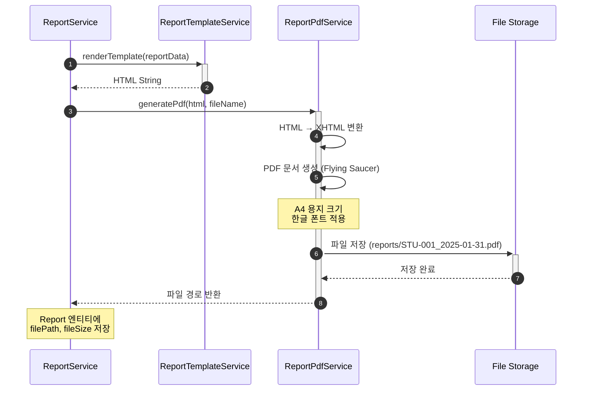

# 리포트 PDF 생성 서비스 구현

- **Type**: Functional
- **Key**: BE-REPORT-002
- **REQ / Epic**: REQ-FUNC-009
- **Service**: ReAcademix Backend
- **Priority**: High
- **Dependencies**: BE-REPORT-001

## 📌 Description

렌더링된 HTML을 PDF로 변환하는 서비스를 구현합니다. Flying Saucer + OpenPDF 라이브러리를 사용하여 HTML을 PDF로 변환하고, 파일 저장소에 저장합니다.

## ✅ Acceptance Criteria

### PDF 생성
- [ ] Flying Saucer + OpenPDF 의존성 추가
- [ ] `ReportPdfService` 클래스 생성
- [ ] `generatePdf(html)` 메서드 구현
- [ ] A4 용지 기준 PDF 생성
- [ ] 한글 폰트 지원

### 파일 저장
- [ ] PDF 파일 저장 경로 설정
- [ ] 파일명 생성 규칙 정의 (학생코드_날짜.pdf)
- [ ] 파일 저장 및 경로 반환

### 성능 및 에러 처리
- [ ] PDF 생성 시간 30초 이내
- [ ] 생성 실패 시 에러 반환
- [ ] 단위 테스트 작성

---

## 🔄 Sequence Diagram



---

## 💻 구현 코드

### build.gradle 의존성

```gradle
dependencies {
    // PDF Generation (Flying Saucer + OpenPDF)
    implementation 'org.xhtmlrenderer:flying-saucer-pdf-openpdf:9.3.1'
    implementation 'com.openpdf:openpdf:1.3.34'
    
    // JSoup (HTML 정리용)
    implementation 'org.jsoup:jsoup:1.17.2'
}
```

### application.properties 설정

```properties
# PDF Storage
report.storage.path=./reports
report.storage.url-prefix=/api/v1/reports/download/

# PDF Generation
report.pdf.timeout-seconds=30
```

### ReportPdfService.java

```java
package com.reacademix.reacademix_backend.service;

import com.lowagie.text.DocumentException;
import com.lowagie.text.pdf.BaseFont;
import com.reacademix.reacademix_backend.exception.BusinessException;
import com.reacademix.reacademix_backend.exception.ErrorCode;
import lombok.extern.slf4j.Slf4j;
import org.jsoup.Jsoup;
import org.jsoup.nodes.Document;
import org.springframework.beans.factory.annotation.Value;
import org.springframework.stereotype.Service;
import org.xhtmlrenderer.pdf.ITextFontResolver;
import org.xhtmlrenderer.pdf.ITextRenderer;

import java.io.*;
import java.nio.file.Files;
import java.nio.file.Path;
import java.nio.file.Paths;
import java.time.LocalDate;
import java.time.format.DateTimeFormatter;

/**
 * PDF 생성 서비스
 * HTML을 PDF로 변환하고 파일로 저장
 */
@Slf4j
@Service
public class ReportPdfService {

    @Value("${report.storage.path:./reports}")
    private String storagePath;

    @Value("${report.pdf.timeout-seconds:30}")
    private int timeoutSeconds;

    private static final DateTimeFormatter DATE_FORMAT = DateTimeFormatter.ofPattern("yyyy-MM-dd");

    /**
     * HTML을 PDF로 변환하고 파일로 저장
     * 
     * @param html 렌더링된 HTML
     * @param studentCode 학생 코드 (파일명용)
     * @return 저장된 파일 경로
     */
    public PdfGenerationResult generatePdf(String html, String studentCode) {
        log.info("PDF 생성 시작: student={}", studentCode);
        long startTime = System.currentTimeMillis();

        String fileName = generateFileName(studentCode);
        Path filePath = Paths.get(storagePath, fileName);

        try {
            // 저장 디렉토리 생성
            Files.createDirectories(filePath.getParent());

            // HTML → XHTML 변환 (Flying Saucer는 XHTML 필요)
            String xhtml = convertToXhtml(html);

            // PDF 생성
            try (OutputStream os = new FileOutputStream(filePath.toFile())) {
                ITextRenderer renderer = new ITextRenderer();
                
                // 한글 폰트 설정
                setupFonts(renderer);
                
                renderer.setDocumentFromString(xhtml);
                renderer.layout();
                renderer.createPDF(os);
            }

            long duration = System.currentTimeMillis() - startTime;
            long fileSize = Files.size(filePath);

            log.info("PDF 생성 완료: file={}, size={}bytes, duration={}ms", 
                fileName, fileSize, duration);

            if (duration > timeoutSeconds * 1000L) {
                log.warn("PDF 생성 시간 초과: {}ms (목표: {}s)", duration, timeoutSeconds);
            }

            return PdfGenerationResult.builder()
                .filePath(filePath.toString())
                .fileName(fileName)
                .fileSize(fileSize)
                .durationMs(duration)
                .build();

        } catch (Exception e) {
            log.error("PDF 생성 실패: {}", e.getMessage(), e);
            throw new BusinessException(ErrorCode.BUSINESS_001, "PDF 생성에 실패했습니다: " + e.getMessage());
        }
    }

    /**
     * HTML을 XHTML로 변환
     */
    private String convertToXhtml(String html) {
        Document document = Jsoup.parse(html);
        document.outputSettings()
            .syntax(Document.OutputSettings.Syntax.xml)
            .escapeMode(org.jsoup.nodes.Entities.EscapeMode.xhtml);
        return document.html();
    }

    /**
     * 한글 폰트 설정
     */
    private void setupFonts(ITextRenderer renderer) throws DocumentException, IOException {
        ITextFontResolver fontResolver = renderer.getFontResolver();
        
        // 시스템에 설치된 폰트 사용 (Windows)
        String[] fontPaths = {
            "C:/Windows/Fonts/malgun.ttf",      // 맑은 고딕
            "C:/Windows/Fonts/NanumGothic.ttf", // 나눔고딕
            "/usr/share/fonts/truetype/nanum/NanumGothic.ttf" // Linux
        };
        
        for (String fontPath : fontPaths) {
            File fontFile = new File(fontPath);
            if (fontFile.exists()) {
                fontResolver.addFont(fontPath, BaseFont.IDENTITY_H, BaseFont.EMBEDDED);
                log.debug("폰트 로드: {}", fontPath);
                break;
            }
        }
    }

    /**
     * 파일명 생성
     */
    private String generateFileName(String studentCode) {
        String date = LocalDate.now().format(DATE_FORMAT);
        return String.format("%s_%s.pdf", studentCode, date);
    }

    /**
     * PDF 생성 결과
     */
    @lombok.Getter
    @lombok.Builder
    public static class PdfGenerationResult {
        private String filePath;
        private String fileName;
        private long fileSize;
        private long durationMs;
    }
}
```

### ReportService.java (통합)

```java
/**
 * 리포트 생성 (템플릿 렌더링 + PDF 변환)
 */
@Transactional
public Report generateReport(Long studentId, LocalDate startDate, LocalDate endDate, User createdBy) {
    log.info("리포트 생성 시작: studentId={}, period={} ~ {}", studentId, startDate, endDate);
    
    // 1. 학생 조회
    Student student = studentRepository.findById(studentId)
        .orElseThrow(() -> new ResourceNotFoundException("Student", "id", studentId));
    
    // 2. 리포트 엔티티 생성 (상태: GENERATING)
    Report report = Report.builder()
        .student(student)
        .createdBy(createdBy)
        .reportStartDate(startDate)
        .reportEndDate(endDate)
        .status(ReportStatus.GENERATING)
        .build();
    report = reportRepository.save(report);
    
    try {
        // 3. 리포트 데이터 수집
        ReportDataDto reportData = collectReportData(student, startDate, endDate);
        
        // 4. 인사이트 생성
        List<String> insights = insightService.generateInsights(reportData);
        reportData = reportData.toBuilder().insights(insights).build();
        
        // 5. HTML 렌더링
        String html = reportTemplateService.renderTemplate(reportData);
        
        // 6. PDF 생성
        ReportPdfService.PdfGenerationResult pdfResult = 
            reportPdfService.generatePdf(html, student.getStudentCode());
        
        // 7. 리포트 완료 처리
        report.markAsCompleted(
            pdfResult.getFilePath(),
            pdfResult.getFileSize(),
            toJson(insights)
        );
        
        log.info("리포트 생성 완료: reportId={}", report.getId());
        return reportRepository.save(report);
        
    } catch (Exception e) {
        log.error("리포트 생성 실패: {}", e.getMessage(), e);
        report.markAsFailed();
        reportRepository.save(report);
        throw e;
    }
}
```

---

## 📝 구현 체크리스트

### 1단계: 의존성 추가
- [ ] Flying Saucer 의존성 추가
- [ ] OpenPDF 의존성 추가
- [ ] JSoup 의존성 추가

### 2단계: 설정
- [ ] 저장 경로 설정
- [ ] 한글 폰트 설정

### 3단계: Service 구현
- [ ] `ReportPdfService` 구현
- [ ] HTML → XHTML 변환
- [ ] PDF 생성 및 저장

### 4단계: 통합
- [ ] `ReportService`에 통합
- [ ] 에러 처리

### 5단계: 테스트
- [ ] 단위 테스트
- [ ] 생성 시간 측정 (30초 이내)

---

## ⏱ 일정(Timeline)

- **Start**: 2025-12-04
- **End**: 2025-12-08
- **Lane**: Backend Core

## 🔗 Traceability

- Related SRS: REQ-FUNC-009
- Related Epic: Report Generation
- Next: BE-REPORT-003 (API 구현)
