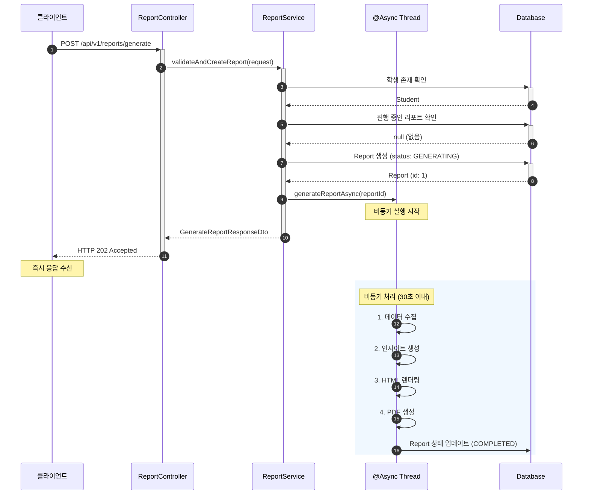

# 리포트 생성 요청 API 구현

- **Type**: Functional
- **Key**: BE-REPORT-003
- **REQ / Epic**: REQ-FUNC-002
- **Service**: ReAcademix Backend
- **Priority**: High
- **Dependencies**: BE-AUTH-002, BE-DATA-001~005, BE-INSIGHT-001, BE-REPORT-002

## 📌 Description

리포트 생성 요청을 받아 처리하는 API를 구현합니다. 학생 ID와 기간을 받아 리포트 생성 프로세스를 시작하고, 비동기로 처리하여 즉시 응답을 반환합니다.

## ✅ Acceptance Criteria

### API 구현
- [ ] `POST /api/v1/reports/generate` 엔드포인트 구현
- [ ] `GenerateReportRequestDto` 클래스 생성
- [ ] `GenerateReportResponseDto` 클래스 생성
- [ ] 비동기 처리 구현 (`@Async`)

### 비즈니스 로직
- [ ] 학생 존재 여부 확인 (404)
- [ ] 중복 요청 처리 (이미 생성 중인 리포트)
- [ ] 리포트 생성 프로세스 시작
- [ ] 진행 상태 설정 (GENERATING → COMPLETED/FAILED)

### 성능 및 테스트
- [ ] API 응답 시간 1초 이내 (생성 시작 응답)
- [ ] 리포트 생성 30초 이내
- [ ] 단위 테스트 작성
- [ ] 통합 테스트 작성

---

## 📋 API 명세서

### 1. Endpoint

| 항목 | 내용 |
|------|------|
| **HTTP Method** | `POST` |
| **URI** | `/api/v1/reports/generate` |
| **Content-Type** | `application/json` |
| **인증 필요** | ✅ |

### 2. Request Body

```json
{
  "studentId": 1,
  "startDate": "2025-01-01",
  "endDate": "2025-01-31"
}
```

### 3. Response Body

#### 3.1 성공 응답 (202 Accepted)

```json
{
  "success": true,
  "data": {
    "reportId": 1,
    "status": "GENERATING",
    "message": "리포트 생성이 시작되었습니다.",
    "estimatedTime": "30초 이내"
  }
}
```

---

## 🔄 Sequence Diagram



---

## 💻 구현 코드

### GenerateReportRequestDto.java

```java
package com.reacademix.reacademix_backend.dto.request;

import jakarta.validation.constraints.NotNull;
import lombok.*;

import java.time.LocalDate;

@Getter
@Builder
@NoArgsConstructor
@AllArgsConstructor
public class GenerateReportRequestDto {

    @NotNull(message = "학생 ID는 필수입니다.")
    private Long studentId;

    @NotNull(message = "시작일은 필수입니다.")
    private LocalDate startDate;

    @NotNull(message = "종료일은 필수입니다.")
    private LocalDate endDate;
}
```

### GenerateReportResponseDto.java

```java
package com.reacademix.reacademix_backend.dto.response;

import lombok.*;

@Getter
@Builder
@NoArgsConstructor
@AllArgsConstructor
public class GenerateReportResponseDto {
    private Long reportId;
    private String status;
    private String message;
    private String estimatedTime;

    public static GenerateReportResponseDto generating(Long reportId) {
        return GenerateReportResponseDto.builder()
            .reportId(reportId)
            .status("GENERATING")
            .message("리포트 생성이 시작되었습니다.")
            .estimatedTime("30초 이내")
            .build();
    }
}
```

### ReportController.java

```java
@PostMapping("/generate")
@Operation(summary = "리포트 생성 요청", description = "학생 성과 리포트 생성을 요청합니다.")
public ResponseEntity<ApiResponse<GenerateReportResponseDto>> generateReport(
        @Valid @RequestBody GenerateReportRequestDto request,
        @AuthenticationPrincipal User currentUser) {
    
    log.info("리포트 생성 요청: studentId={}, period={} ~ {}", 
        request.getStudentId(), request.getStartDate(), request.getEndDate());
    
    GenerateReportResponseDto response = reportService.requestReportGeneration(request, currentUser);
    
    return ResponseEntity.status(HttpStatus.ACCEPTED)
        .body(ApiResponse.success(response));
}
```

### ReportService.java (비동기 처리)

```java
@Service
@RequiredArgsConstructor
@Slf4j
public class ReportService {

    private final ReportRepository reportRepository;
    private final StudentRepository studentRepository;
    private final ReportTemplateService templateService;
    private final ReportPdfService pdfService;
    
    @Transactional
    public GenerateReportResponseDto requestReportGeneration(
            GenerateReportRequestDto request, User currentUser) {
        
        // 1. 학생 존재 확인
        Student student = studentRepository.findById(request.getStudentId())
            .orElseThrow(() -> new ResourceNotFoundException("Student", "id", request.getStudentId()));
        
        // 2. 중복 요청 확인 (이미 생성 중인 리포트)
        boolean exists = reportRepository.existsByStudentIdAndStatus(
            request.getStudentId(), ReportStatus.GENERATING);
        if (exists) {
            throw new BusinessException(ErrorCode.BUSINESS_004, "이미 리포트 생성이 진행 중입니다.");
        }
        
        // 3. Report 엔티티 생성
        Report report = Report.builder()
            .student(student)
            .createdBy(currentUser)
            .reportStartDate(request.getStartDate())
            .reportEndDate(request.getEndDate())
            .status(ReportStatus.GENERATING)
            .build();
        report = reportRepository.save(report);
        
        // 4. 비동기 생성 시작
        generateReportAsync(report.getId());
        
        return GenerateReportResponseDto.generating(report.getId());
    }
    
    @Async
    @Transactional
    public void generateReportAsync(Long reportId) {
        log.info("비동기 리포트 생성 시작: reportId={}", reportId);
        
        Report report = reportRepository.findById(reportId).orElseThrow();
        
        try {
            // 데이터 수집 → 인사이트 생성 → HTML 렌더링 → PDF 생성
            // ... (BE-REPORT-002 참조)
            
            report.markAsCompleted(filePath, fileSize, insights);
            reportRepository.save(report);
            
            log.info("리포트 생성 완료: reportId={}", reportId);
            
        } catch (Exception e) {
            log.error("리포트 생성 실패: reportId={}, error={}", reportId, e.getMessage());
            report.markAsFailed();
            reportRepository.save(report);
        }
    }
}
```

---

## 📝 구현 체크리스트

- [ ] DTO 생성
- [ ] Controller 구현
- [ ] Service 구현 (비동기)
- [ ] 중복 요청 처리
- [ ] 테스트 작성

---

## ⏱ 일정(Timeline)

- **Start**: 2025-12-19
- **End**: 2025-12-24
- **Lane**: Backend Core

## 🔗 Traceability

- Related SRS: REQ-FUNC-002
- Related Epic: Report Generation
