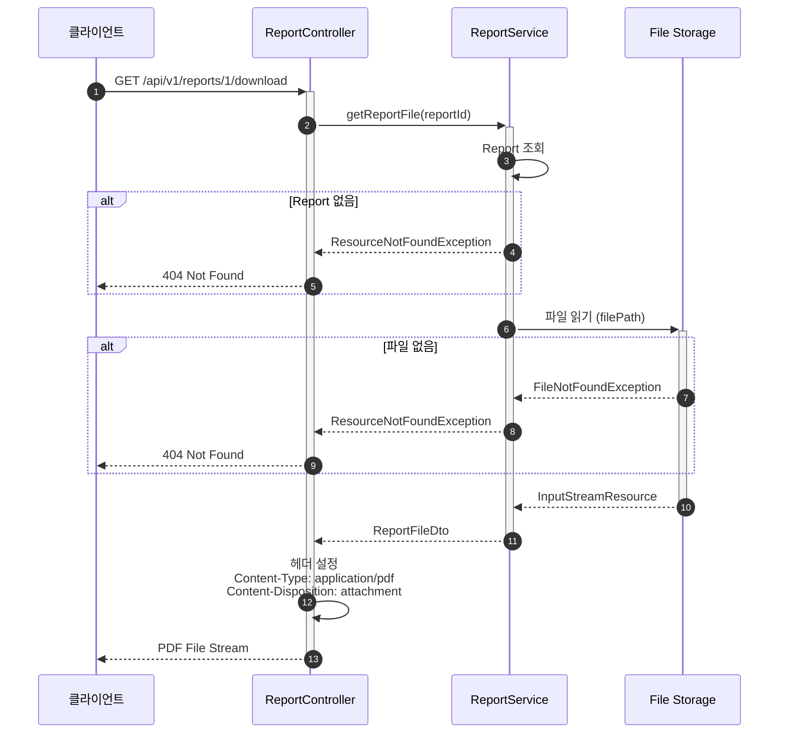

# 리포트 다운로드 API 구현

- **Type**: Functional
- **Key**: BE-REPORT-006
- **REQ / Epic**: REQ-FUNC-012
- **Service**: ReAcademix Backend
- **Priority**: High
- **Dependencies**: BE-AUTH-002, BE-REPORT-003

## 📌 Description

생성된 리포트 PDF를 다운로드할 수 있는 API를 구현합니다.

## ✅ Acceptance Criteria

### API 구현
- [ ] `GET /api/v1/reports/{reportId}/download` 엔드포인트 구현
- [ ] PDF 파일 스트림 반환
- [ ] Content-Type, Content-Disposition 헤더 설정

### 에러 처리
- [ ] 존재하지 않는 reportId → 404
- [ ] 파일 없음 → 404
- [ ] 권한 없음 → 403

### 테스트
- [ ] 단위 테스트 작성

---

## 📋 API 명세서

| 항목 | 내용 |
|------|------|
| **HTTP Method** | `GET` |
| **URI** | `/api/v1/reports/{reportId}/download` |
| **Response Type** | `application/pdf` |
| **인증 필요** | ✅ |

---

## 🔄 Sequence Diagram



---

## 💻 구현 코드

### ReportController.java

```java
@GetMapping("/{reportId}/download")
@Operation(summary = "리포트 다운로드", description = "리포트 PDF 파일을 다운로드합니다.")
public ResponseEntity<Resource> downloadReport(@PathVariable Long reportId) {
    log.info("리포트 다운로드 요청: reportId={}", reportId);

    ReportFileDto fileDto = reportService.getReportFile(reportId);

    return ResponseEntity.ok()
        .header(HttpHeaders.CONTENT_TYPE, MediaType.APPLICATION_PDF_VALUE)
        .header(HttpHeaders.CONTENT_DISPOSITION, 
            "attachment; filename=\"" + fileDto.getFileName() + "\"")
        .header(HttpHeaders.CONTENT_LENGTH, String.valueOf(fileDto.getFileSize()))
        .body(fileDto.getResource());
}
```

### ReportService.java

```java
public ReportFileDto getReportFile(Long reportId) {
    Report report = reportRepository.findById(reportId)
        .orElseThrow(() -> new ResourceNotFoundException("Report", "id", reportId));

    if (report.getFilePath() == null) {
        throw new ResourceNotFoundException("Report file", "reportId", reportId);
    }

    Path filePath = Paths.get(report.getFilePath());
    if (!Files.exists(filePath)) {
        throw new ResourceNotFoundException("Report file", "path", report.getFilePath());
    }

    try {
        InputStreamResource resource = new InputStreamResource(
            new FileInputStream(filePath.toFile()));

        String fileName = String.format("%s_리포트_%s.pdf",
            report.getStudent().getName(),
            report.getReportEndDate());

        return ReportFileDto.builder()
            .resource(resource)
            .fileName(fileName)
            .fileSize(Files.size(filePath))
            .build();

    } catch (IOException e) {
        throw new BusinessException(ErrorCode.BUSINESS_001, "파일 읽기 실패");
    }
}
```

---

## ⏱ 일정(Timeline)

- **Start**: 2025-12-25
- **End**: 2025-12-27
- **Lane**: Backend Core

## 🔗 Traceability

- Related SRS: REQ-FUNC-012
- Related Epic: Report Generation
